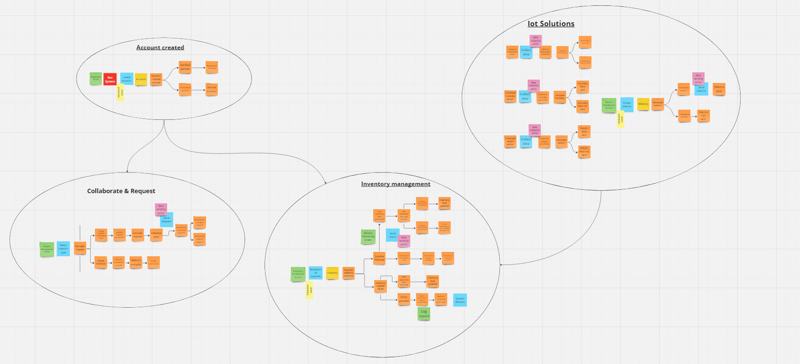
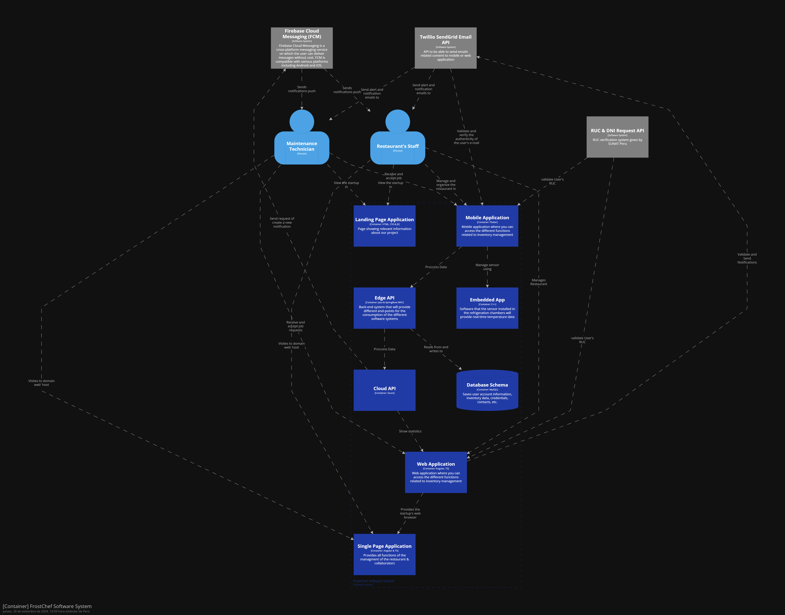
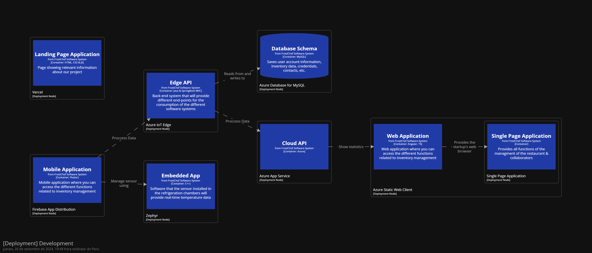
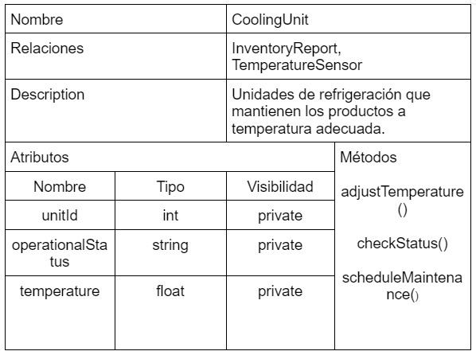
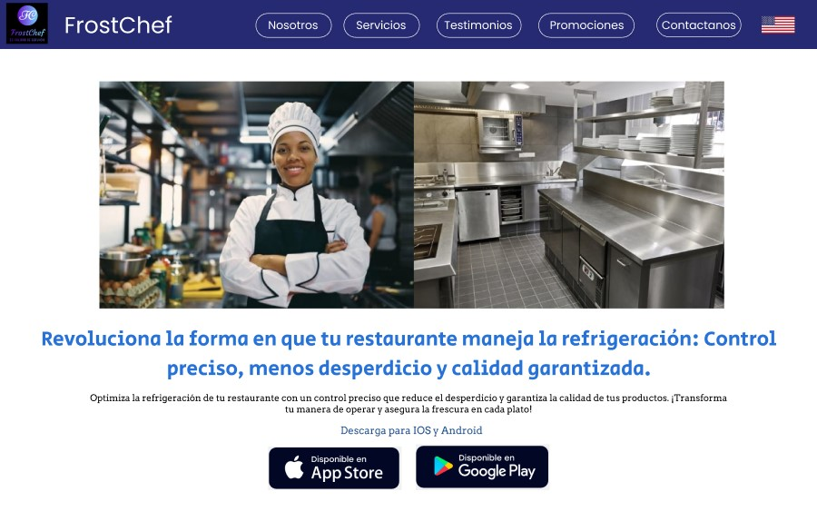
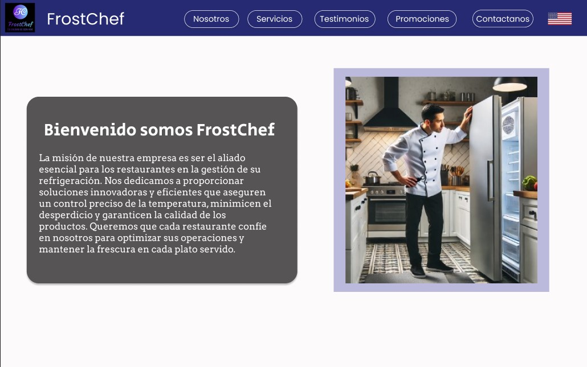
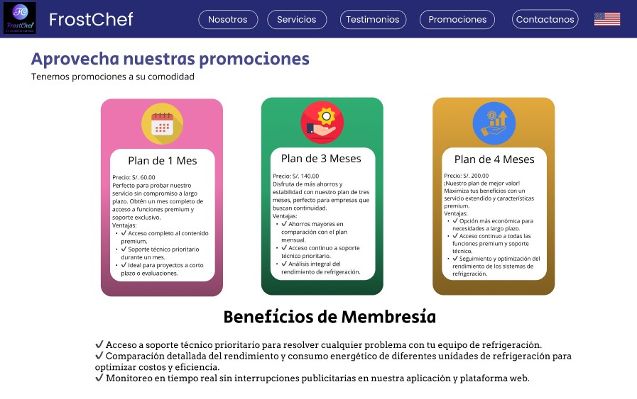

<p align="center">
  
</p>

<h3 align="center"> Universidad Peruana de Ciencias Aplicadas</h3> 
<h4 align="center"> Ingeniería de Software  </h4>
<h4 align="center"> Desarrollo de Soluciones IOT </h4>
<h4 align="center"> Informe de Trabajo Parcial  </h4>


<strong>Startup:</strong> IoTecnicos

<h3>Team Members</h3>

<ul>
  <li>Díaz Gonzales, Víctor Yordi (u20211c384)</li>
  <li>Navarro Chacon, Juan Jose (U20201f316)</li>
  <li>Márquez, Piero Stefano (U201816402)</li>
  <li>Patrocinio Escalante, Leonardo Walt (U20201705)</li>
  <li>Sánchez Ramírez, Diego Antonio (U202021367)</li>
  <li>Zamora Rivera, Ismael Sebastian (u202116671)</li>
</ul>

#### Sección: WS71
#### Profesor: Angel Augusto Velasquez Nuñez 
#### Producto: FrostChef                       
#### Ciclo: 2024-02
<h4 align="center "> Septiembre, 2024</h4>  

_____________________

## Registro de versiones del informe 

<table>
<thead>
  <tr>
    <th>Versión </th>
    <th>Fecha</th>
    <th>Autor</th>
    <th>Descripción de modificación</th>
  </tr>
</thead>
<tbody>
  <tr>
    <td>V1.0</td>
    <td>18/08/2024</td>
    <td>Victor</td>
    <td>Se agregaron las siguientes secciones: 
   Contenido,Student Outcome,Descripcion de la StartUp
  </td>
  </tr>
    <tr>
    <td>V1.1.0</td>
    <td>18/08/2024</td>
    <td>Jose</td>
    <td>Se agregaron las siguientes secciones: 
   Perfiles de Integrantes del equipo,Analisis Competitivo,Registro de Entrevistas,User Task Matrix
  </td>
  </tr>
  <tr>
    <td>V1.1.1</td>
    <td>19/08/2024</td>
    <td>Diego</td>
    <td>Se agregaron las siguientes secciones: 
   Student Outcome,Antecedentes y Problematica,Segmentos Objetivos,Estrategias y tacticas Frente a Competidores,Registro de Entrevistas,Empathy Mapping
  </td>
  </tr>
    <tr>
    <td>V1.1.2</td>
    <td>20/08/2024</td>
    <td>Leonardo</td>
    <td>Se agregaron las siguientes secciones: 
  Student Outcome, Lean UX Problem Statements,Diseño de Entrevistas,Registro de Entrevistas,As-Is Scenario Mapping
  </td>
  </tr>
  <tr>
    <td>V1.1.3</td>
    <td>21/08/2024</td>
    <td>Jose</td>
    <td>Se agregaron las siguientes secciones: 
  Student Outcome, Lean UX Assumptions ,Lean UX Canvas ,Analisis de Entrevistas,Ubiquitous Language
  </td>
  </tr>
      <tr>
    <td>V1.1.4</td>
    <td>24/08/2024</td>
    <td>Victor</td>
    <td>Se agregaron las siguientes secciones: 
  Student Outcome,Lean UX Hypothesis Statements,User Personas,To-Be Scenario Mapping
  </td>
  </tr>
   <tr>
    <td>V1.2.0</td>
    <td>26/08/2024</td>
    <td>Piero</td>
    <td>Se agregaron las siguientes secciones: 
   User Stories,Impact Mapping,Strategic Level Domain-Driven Design,Tactical-Level Domain-Driven Design
  </td>
  </tr>
  <tr>
    <td>V1.2.1</td>
    <td>16/09/2024</td>
    <td>Jose</td>
    <td>Se agregaron las siguientes secciones: 
    User Stories,Strategic Level Domain-Driven Design,Tactical-Level Domain-Driven Design
  </td>
  </tr>
    <tr>
    <td>V1.2.2</td>
    <td>17/08/2024</td>
    <td>Leonardo</td>
    <td>Se agregaron las siguientes secciones: 
  User Stories,Strategic Level Domain-Driven Design,Tactical-Level Domain-Driven Design
  </td>
  </tr>
  <tr>
    <td>V1.2.3</td>
    <td>19/08/2024</td>
    <td>Victor</td>
    <td>Se agregaron las siguientes secciones: 
  Student Outcome, Lean UX Assumptions ,Lean UX Canvas ,Analisis de Entrevistas,Ubiquitous Language,User Stories,Product Backlog,Strategic Level Domain-Driven Design,Tactical-Level Domain-Driven Design
  </td>
  </tr>
  <tr>
    <td>V1.2.4</td>
    <td>25/08/2024</td>
    <td>Diego</td>
    <td>Se agregaron las siguientes secciones: 
  User Stories,Strategic Level Domain-Driven Design,Tactical-Level Domain-Driven Design
  </td>
  </tr>  
  <tr>
    <td>V 1.3</td>
    <td>05/09/2024</td>
    <td>Piero</td>
    <td>Se agrego el contenido que faltaba en la TB1 y se aplico del Capítulo I hasta el Capítulo IV las correcciones</td>
  </tr>
  <tr>
    <td>V 2.0</td>
    <td>06/09/2024</td>
    <td>Jose </td>
    <td>Se agregaron las siguientes secciones al Contenido :
    Capítulo V, Capítulo VI, Avance de Conclusiones, Bibliografía y Anexos</td>
  </tr>
    <tr>
    <td>V 2.1.0</td>
    <td>09/09/2024</td>
    <td>Diego</td>
    <td>General Style Guideline,Searching Systems,Applications Wireflow Diagrams,Source Code Management</td>
  </tr>
    <tr>
    <td>V 2.1.1</td>
    <td>11/09/2024</td>
    <td>Victor</td>
    <td> Web,Mobile and Iot Style Guidelines,Navigation Systems,Applications Mock-Ups,Software Development Environment Configuration</td>
  </tr>
    <tr>
    <td>V 2.1.2</td>
    <td>12/09/2024</td>
    <td>Leonardo</td>
    <td>Se agregaron las siguientes secciones:
       Organization Systems,Landing Page Wireframe,Applications User Flow Diagrams,Source Code Style Guide & Conventions </td>
  </tr>
     <tr>
    <td>V 2.1.3</td>
    <td>015/09/2024</td>
    <td>Piero</td>
    <td>Se agregaron las siguientes secciones:
      Labeling Systems,Landing page Mock-UP,Applications Prototyping,Sofware Deployment Configuration
    </td>
  </tr>

</tbody>
</table>

# Project Report Collaboration Insights


## Project Report


Link: https://github.com/Los-IoTecnicos/IoTecnico-Informe/tree/main

TB1: El equipo ha cumplido con éxito los puntos solicitados para la entrega. Durante el proceso de adaptación al entorno documental, enfrentamos algunos desafíos al estructurar y convertir el archivo. Sin embargo, a pesar de estos inconvenientes, estamos satisfechos de haber alcanzado los objetivos propuestos.

TP: En esta segunda entrega, el equipo ha mejorado significativamente en la creación del informe utilizando Markdown, aprovechando la versatilidad de esta herramienta para integrar código HTML. Nos complace informar que hemos cumplido plenamente con los puntos requeridos en el entregable. Asimismo, cabe resaltar el progreso notable tanto en la optimización de la página de inicio como en el desarrollo de la aplicación web.

### Analiticos para el TB1


### Analiticos para el TP


## Contenido 
- [Capítulo I: Introducción](/README.md#capítulo-i-introducción)
  - [1.1. Startup Profile](/README.md#11-startup-profile)
    - [1.1.1. Descripción de la Startup](/README.md#111-descripción-de-la-startup)
    - [1.1.2. Perfiles de integrantes del equipo](/README.md#112-perfiles-de-integrantes-del-equipo)
  - [1.2. Solution Profile](/README.md#12-solution-profile)
    - [1.2.1 Antecedentes y problemática](/README.md#121-antecedentes-y-problemática)
    - [1.2.2 Lean UX Process](/README.md#122-lean-ux-process)
      - [1.2.2.1. Lean UX Problem Statements](/README.md#1221-lean-ux-problem-statements)
      - [1.2.2.2. Lean UX Assumptions](/README.md#1222-lean-ux-assumptions)
      - [1.2.2.3. Lean UX Hypothesis Statements](/README.md#1223-lean-ux-hypothesis-statements)
      - [1.2.2.4. Lean UX Canvas](/README.md#1224-lean-ux-canvas)
  - [1.3. Segmentos objetivo](/README.md#13-segmentos-objetivo)
- [Capítulo II: Requirements Elicitation \& Analysis](/README.md#capítulo-ii-requirements-elicitation--analysis)
  - [2.1. Competidores](/README.md#21-competidores)
    - [2.1.1. Análisis competitivo](/README.md#211-análisis-competitivo)
    - [2.1.2. Estrategias y tácticas frente a competidores](/README.md#212-estrategias-y-tácticas-frente-a-competidores)
  - [2.2. Entrevistas](/README.md#22-entrevistas)
    - [2.2.1. Diseño de entrevistas](/README.md#221-diseño-de-entrevistas)
    - [2.2.2. Registro de entrevistas](/README.md#222-registro-de-entrevistas)
    - [2.2.3. Análisis de entrevistas](/README.md#223-análisis-de-entrevistas)
  - [2.3. Needfinding](/README.md#23-needfinding)
    - [2.3.1. User Personas](/README.md#231-user-personas)
    - [2.3.2. User Task Matrix](/README.md#232-user-task-matrix)
    - [2.3.3. Empathy Mapping](/README.md#233-empathy-mapping)
    - [2.3.4. As-is Scenario Mapping](/README.md#234-as-is-scenario-mapping)
  - [2.4. Ubiquitous Language](/README.md#24-ubiquitous-language)
- [Capítulo III: Requirements Specification](/README.md#capítulo-iii-requirements-specification)
  - [3.1. To-Be Scenario Mapping](/README.md#31-to-be-scenario-mapping)
  - [3.2. User Stories](/README.md#32-user-stories)
  - [3.3. Impact Mapping](/README.md#33-impact-mapping)
  - [3.4. Product Backlog](/README.md#34-product-backlog)
- [Capítulo IV: Solution Software Design](/README.md#capítulo-iv-solution-software-design)
  - [4.1. Strategic-Level Domain-Driven Design](/README.md#41-strategic-level-domain-driven-design)
    - [4.1.1. EventStorming](/README.md#411-eventstorming)
      - [4.1.1.1 Candidate Context Discovery](/README.md#4111-candidate-context-discovery)
      - [4.1.1.2.  Domain Message Flows Modeling](/README.md#4112-domain-message-flows-modeling)
      - [4.1.1.3. Bounded Context Canvases](/README.md#4113-bounded-context-canvases)
    - [4.1.2. Context Mapping](/README.md#412-context-mapping)
    - [4.1.3. Software Architecture](/README.md#413-software-architecture)
    - [4.1.3.1. Software Architecture System Landscape Diagram](/README.md#4131-software-architecture-system-landscape-diagram)
    - [4.1.3.2. Software Architecture Context Level Diagrams](/README.md#4132-software-architecture-context-level-diagrams)
    - [4.1.3.3. Software Architecture Container Level Diagrams](/README.md#4133-software-architecture-container-level-diagrams)
    - [4.1.3.4. Software Architecture Deployment Diagrams](/README.md#4134-software-architecture-deployment-diagrams)
  - [4.2. Tactical-Level Domain-Driven Design](/README.md#42-tactical-level-domain-driven-design)
- [Capítulo V: Solution UI/UX Design](/README.md#capítulo-v-solution-ui-ux-design)
  - [5.1. Style Guidelines](/README.md#51-style-guidelines)
    - [5.1.1. General Style Guideline](/README.md#511-general-style-guideline)
    - [5.1.2. Web, Mobile and IoT Style Guidelines](/README.md#512-web-mobile-and-iot-style-guidelines)
  - [5.2. Information Architecture](/README.md#52-information-architecture)
    - [5.2.1. Organization Systems](/README.md#521-organization-systems)
    - [5.2.2. Labeling Systems](/README.md#522-labeling-systems)
    - [5.2.3. SEO Tags and Meta Tags](/README.md#523-seo-tags-and-meta-tags)
    - [5.2.4. Searching Systems](/README.md#524-searching-systems)
    - [5.2.5. Navigation Systems](/README.md#525-navigation-systems)
  - [5.3. Landing Page UI Design](/README.md#53-landing-page-ui-design)
    - [5.3.1. Landing Page Wireframe](/README.md#531-landing-page-wireframe)
    - [5.3.2. Landing Page Mock-up](/README.md#532-landing-page-mock-up)
  - [5.4. Applications UX/UI Design](/README.md#54-applications-ux-ui-design)
    - [5.4.1. Applications Wireframes](/README.md#541-applications-wireframes)
    - [5.4.2. Applications Wireflow Diagrams](/README.md#542-applications-wireflow-diagrams)
    - [5.4.3. Applications Mock-ups](/README.md#543-applications-mock-ups)
    - [5.4.4. Applications User Flow Diagrams](/README.md#544-applications-user-flow-diagrams)
  - [5.5. Applications Prototyping](/README.md#53-applications-prototyping)
  - [6.1. Software Configuration Management](/README.md#61-software-configuration-management)
    - [6.1.1. Software Development Environment Configuration](/README.md#611-software-development-environment-configuration)
    - [6.1.2. Source Code Management](/README.md#612-source-code-management)
    - [6.1.3. Source Code Style Guide & Conventions](/README.md#613-source-code-style-guide--conventions)
    - [6.1.4. Software Deployment Configuration](/README.md#614-software-deployment-configuration)
  - [6.2. Landing Page, Services & Applications Implementation](/README.md#62-landing-page-services--applications-implementation)
    - [6.2.1. Sprint 1](/README.md#621-sprint-1)
      - [6.2.1.1 Sprint Planning 1](/README.md#6211-sprint-planning-1)
      - [6.2.1.2. Sprint Backlog 1](/README.md#6212-sprint-backlog-1)
      - [6.2.1.3. Development Evidence for Sprint Review](/README.md#6213-development-evidence-for-sprint-review)
      - [6.2.1.4. Testing Suite Evidence for Sprint Review](/README.md#6214-testing-suite-evidence-for-sprint-review)
      - [6.2.1.5. Execution Evidence for Sprint Review](/README.md#6215-execution-evidence-for-sprint-review)
      - [6.2.1.6. Services Documentation Evidence for Sprint Review](/README.md#6216-services-documentation-evidence-for-sprint-review)
      - [6.2.1.7. Software Deployment Evidence for Sprint Review](/README.md#6217-software-deployment-evidence-for-sprint-review)
      - [6.2.1.8. Team Collaboration Insights during Sprint](/README.md#6218-team-collaboration-insights-during-sprint)


## Student Outcome 
<table>
  <thead>
    <tr>
      <th>Criterio específico</th>
      <th>Acciones realizadas</th>
      <th>Conclusiones</th>
    </tr>
  </thead>
  <tbody>
    <tr>
      <td>Trabaja en equipo para
      proporcionar liderazgo en
      forma conjunta</td>
      <td>Márquez, Piero Stefano <br/>
            TB1:<br/>
            Organicé y gestioné los documentos clave, incluyendo la publicación del video de las entrevistas y la descripción del startup. Además, desarrollé estrategias y tácticas competitivas para posicionarnos frente a los competidores, y participé activamente en el diseño, análisis y registro de entrevistas. También trabajé en la creación y priorización del product backlog, asegurando que todas las tareas estuvieran alineadas con los objetivos del proyecto. Por último, colaboré en los capítulos 3 y 4 del proyecto, contribuyendo de manera significativa a su desarrollo y asegurando el avance según lo planificado.</br>
            TP</br>
            Organice la correcion de la primera versidel trabajo tb1 y me encargue de las correciones completas de todo el capitulo tres mejorando las user stories y el product backlong siguiendo las indicaciones del profesor.Tambien se fomento en el grupo tener una comunicacion clara y rapida ante cualquier duda o consulta que tenga algun integrante del equipo se usaron canales como Whatsapp para mensaje y discord para llamadas. Haciendo reuniones interdiarias para dialogar sobre los avances.</br></br>
            Patrocinio Escalante, Leonardo Walt</br>
            TB1:</br>
            Desarrollé el perfil de la solución, utilizando el Lean UX Canvas para asegurar que todos los aspectos del producto estuvieran alineados con las necesidades del usuario y los objetivos del negocio. Realicé el mapeo del User Journey y la creación de Empathy Maps para comprender a profundidad las emociones y comportamientos de los usuarios en cada interacción con el sistema. A través de escenarios As-Is y To-Be, capturé el estado actual y futuro de los procesos, lo que nos ayudó a visualizar las mejoras necesarias. Implementé el lenguaje ubicuo para garantizar una comunicación clara entre todos los involucrados en el proyecto, y llevé a cabo sesiones de EventStorming y modelado de flujos de mensajes de dominio para definir cómo los eventos clave y los mensajes dentro del sistema interactúan de manera eficiente, asegurando que el diseño fuera coherente y adaptable.
            TP:</br>
            </br></br>
            Díaz Gonzales, Víctor Yordi</br>
            TB1:</br>
            Desarrollé y gestioné las user stories, asegurando que cada una reflejara las necesidades del proyecto y del usuario final. Además, implementé el enfoque de Tactical-Level Domain-Driven Design, lo que nos permitió identificar y organizar los distintos dominios y contextos acotados, como el Bounded Context: Account, mejorando la estructura del sistema. También trabajé en la definición de la Interface Layer y la Infrastructure Layer, facilitando una comunicación clara entre los distintos componentes del sistema. Para finalizar, llevé a cabo sesiones de EventStorming, lo que nos ayudó a identificar eventos clave y procesos dentro del sistema, logrando una visión integral del flujo de trabajo y sus interacciones.</br>
            TP:</br>
            Nuestro equipo mantuvo una colaboración constante, apoyándonos mutuamente en cada etapa del proyecto. Ante cualquier consulta o duda, trabajamos juntos para encontrar soluciones, lo que permitió que cada miembro completara sus tareas individuales de manera efectiva. Este trabajo en equipo nos llevó a entregar un proyecto final bien estructurado y satisfactorio tanto en calidad como en cumplimiento de los plazos.</br>
            </br></br>
            Sánchez Ramírez, Diego Antonio</br>
            TB1:</br>
            Lideré el diseño de la arquitectura de software, asegurando que la solución fuera escalable y eficiente. Durante este proceso, llevé a cabo sesiones de EventStorming para mapear los eventos clave dentro del sistema, lo que nos permitió identificar y estructurar mejor los flujos de trabajo. Además, participé en actividades de needfinding, profundizando en las necesidades reales de los usuarios y asegurando que el diseño estuviera alineado con sus expectativas. También realicé un análisis de competidores, evaluando las soluciones actuales en el mercado para identificar oportunidades de mejora y asegurar que nuestro producto tuviera una ventaja competitiva sólida.</br>
            TP:</br>
            Coordine con el equipo para pode realizar los diferentes puntos de este trabajo parcial, por ejemplo en el intercambio de ideas para la realización de los diagramas de arquitectura de software utilizando Structurizr.
            </br></br>
            Navarro Chacon, Juan Jose</br>
            TB1:</br>
            Trabajé en la definición de las suposiciones de Lean UX, generando declaraciones de hipótesis que nos permitieron validar rápidamente ideas y ajustar el diseño con base en resultados tangibles. Realicé un análisis competitivo para entender cómo nuestra solución se posiciona frente a los competidores, identificando oportunidades de mejora. Desarrollé user stories y creé una matriz de tareas de usuario para mapear las interacciones clave en el sistema. Además, organicé sesiones de EventStorming para modelar los eventos críticos y asegurar que el flujo de información dentro del sistema fuera claro. Utilicé los Bounded Context Canvases y el Context Mapping para definir y visualizar las interacciones entre los diferentes dominios, asegurando que los límites del sistema fueran bien comprendidos y la solución estuviera bien estructurada.</br>
            TP:</br>
            Organizamos reuniones para discutir y
            distribuir los temas de esta entrega. A
            cada integrante se le asignó una tarea
            específica que fue completada dentro
            del plazo establecido.</br>
            </br></br>
            Zamora Rivera, Ismael Sebastian</br>
            TB1:</br>
            Durante el desarrollo del proyecto y la fase de identificación del producto, surgieron diversas dificultades. Estos inconvenientes aparecieron debido a los desafíos propios del proceso de trabajo, así como a la evaluación del producto final, lo que requirió un análisis más detallado para implementar las soluciones necesarias.</br>
            TP</br>
            Se identificaron diferentes problemas durante el desarrollo del proyecto, y se hicieron las correcciones correspondientes basadas en el feedback recibido de la entrega anterior. Para esta fase, se elaboró el diseño UX/UI, creando el wireframe y el mockup de la aplicación.</br>
      </td>
      <td>TB1</br>
      En conclusión, un enfoque colaborativo y multidisciplinario es clave en el desarrollo de soluciones de ingeniería de software. Los estudiantes han destacado la importancia de integrar diversas disciplinas y conocimientos para mejorar cada fase del proceso, desde el diseño inicial y el análisis competitivo hasta la interacción con los usuarios y la arquitectura de software. Este enfoque no solo garantiza que los productos finales sean técnicamente robustos y alineados con las necesidades del mercado, sino que también resalta la importancia de la colaboración y la comunicación efectiva entre áreas especializadas para superar desafíos complejos y alcanzar soluciones innovadoras. Este modelo interdisciplinario no solo eleva la calidad del desarrollo de productos, sino que también prepara a los futuros ingenieros para liderar proyectos en entornos más integrados y tecnológicamente avanzados.
      </td>
    </tr>
    <tr>
      <td>Crea un entorno colaborativo e
      inclusivo, establece metas,
      planifica tareas y cumple
      objetivos.</td>
      <td>Márquez, Piero Stefano <br/>
      TB1:</br>
      Durante la primera entrega, organicé y gestioné documentos clave, como el video de entrevistas y la descripción del startup. También participé en el diseño y priorización del product backlog, asegurando que todas las tareas estuvieran alineadas con los objetivos. Gracias a una planificación clara, el equipo avanzó de manera colaborativa en los capítulos 3 y 4, cumpliendo con los plazos establecidos.</br>
      TP:</br>
      En la segunda entrega, corregí la primera versión de TB1 y mejoré el capítulo 3, enfocándome en las user stories y el product backlog según las indicaciones del profesor. Fomenté una comunicación fluida dentro del equipo mediante WhatsApp y Discord, con reuniones interdiarias que ayudaron a planificar tareas y cumplir objetivos de manera inclusiva.</br>
      </br></br>
      Patrocinio Escalante, Leonardo Walt</br>
      TB1:</br>
      Nos apoyamos mutuamente revisando los escenarios As-Is y To-Be, logrando identificar mejoras y asegurar la adaptación del diseño al contexto del negocio.</br>
      TP:</br>
      Nos apoyamos para resolver dudas técnicas y unificar el estilo del código, facilitando el desarrollo efectivo y en equipo.</br>
      </br></br>
      Díaz Gonzales, Víctor Yordi</br>
      TB1:</br>
      Durante el desarrollo del proyecto, analizamos diversas soluciones técnicas para implementar las funcionalidades requeridas. A través de la investigación y la discusión en equipo, seleccionamos las tecnologías más adecuadas que se ajustaran tanto a los objetivos del proyecto como a las limitaciones de tiempo y recursos.</br>
      TP:</br>
      Nos enfocamos en construir un entorno de trabajo en equipo que permitiera la participación activa de todos. La planificación de tareas se realizó de forma coordinada, permitiendo cumplir los objetivos de manera eficaz. Este enfoque nos ayudó a alcanzar nuestras metas mientras fomentábamos la colaboración y el apoyo entre los integrantes del grupo.
      </br></br>
      Sánchez Ramírez, Diego Antonio</br>
      TB1:</br>
      Realizamos reuniones de grupo mediante distintos medios, como Discord o de manera presencial en las sesiones del curso, establecimos limites de fecha de entrega y cumplimiento de objetivos para la base del proyecto</br>
      TP:</br>
      Realizar como el anterior entregable, reuniones para poder corregir los fallos que tuvimos en dicho entregable. Se considero reforzar mas la planeación de metas y objetivos, ademas de la comunicación, para poder realizar un buen trabajo en conjunto.
      </br></br>
      Navarro Chacon, Juan Jose</br>
      TB1:</br>
      La colaboración y la comunicación
      fueron elementos clave durante este
      proyecto. Trabajamos juntos en tareas
      específicas, evaluamos los resultados y
      abordamos los desacuerdos de manera
      constructiva, siempre con el objetivo de
      mejorar el desempeño del grupo.</br>
      TP:</br>
      Nos apoyamos mutuamente ante cada consulta de cada integrante del equipo, lo cual nos permitió realizar de manera efectiva nuestras  tareas asignadas, tanto individual como grupal y así poder realizar un trabajo satisfactorio.</br>
      </br></br>
      Zamora Rivera, Ismael Sebastian</br>
      TB1:</br>
      Durante el desarrollo del proyecto, analizamos diversas soluciones técnicas para implementar las funcionalidades requeridas. A través de la investigación y la discusión en equipo, seleccionamos las tecnologías más adecuadas que se ajustaran tanto a los objetivos del proyecto como a las limitaciones de tiempo y recursos.</br>
      TP</br>
      Fomentamos un ambiente donde cada miembro pudo participar activamente y compartir ideas, lo que promovió una colaboración efectiva, Asimismo Eetablecimos metas concretas al inicio, lo que facilitó una mejor organización y división de las responsabilidades. Al planificar cada tarea con precisión, logramos cumplir con los objetivos de manera eficiente y alcanzar los resultados esperados dentro del tiempo previsto.</br>
      </td>
      <td>El equipo consolidó un entorno altamente colaborativo e inclusivo. Se reforzó la comunicación efectiva mediante herramientas como WhatsApp y Discord, manteniendo reuniones interdiarias que facilitaron la coordinación y resolución de dudas. Cada miembro del equipo contribuyó activamente, estableciendo metas concretas y organizando las tareas de manera precisa, lo que permitió un trabajo fluido y alineado con los objetivos del proyecto. Además, la mejora en la planificación y distribución de responsabilidades, sumada al apoyo mutuo, fue clave para cumplir con los plazos y lograr los resultados esperados. El equipo mostró una notable capacidad para trabajar en conjunto, corregir errores y cumplir los objetivos establecidos de manera eficiente.</td>
    </tr>
  </tbody>
</table>


# 1.1. Startup Profile


## 1.1.1. Descripción de la Startup

<p align=justify> 
Este proyecto busca implementar un sistema avanzado de refrigeración para restaurantes, integrando máquinas de enfriamiento con software especializado y sensores de temperatura conectados a un microprocesador. El sistema garantiza un control preciso de las temperaturas de los insumos y una gestión eficiente del inventario. Funciona mediante monitoreo en tiempo real, ajustes automáticos de temperatura, y programación de ciclos de enfriamiento. Además, gestiona el inventario registrando entradas y salidas de productos, y proporciona alertas de vencimiento. Los reportes históricos y el análisis de tendencias permiten mejorar continuamente el sistema para mantener la calidad óptima de los alimentos.

**Misión:**

En IOTécnicos, nuestra misión es revolucionar la industria de la refrigeración para restaurantes mediante soluciones tecnológicas avanzadas. Nos dedicamos a integrar máquinas de enfriamiento con software especializado y sensores de temperatura conectados a microprocesadores. Nuestro objetivo es garantizar un control preciso de las temperaturas de los insumos y una gestión eficiente del inventario, todo mientras proporcionamos alertas de vencimiento y reportes históricos. Así, contribuimos a mantener la calidad óptima de los alimentos y a mejorar la experiencia de los clientes en los restaurantes.

**Visión:**

Nos visualizamos como la principal referencia en tecnología de refrigeración para restaurantes. Aspiramos a crear un mundo donde cada establecimiento gastronómico cuente con sistemas inteligentes que optimicen el manejo de sus insumos y garanticen la seguridad alimentaria. Queremos transformar la forma en que los restaurantes se relacionan con la refrigeración, brindando eficiencia, confiabilidad y tranquilidad a nuestros clientes.
</p>


 
## 1.1.2. Perfiles de integrantes del equipo


| Díaz Gonzales, Víctor Yordi  - u20211C384 |  |
|----------|----------|
|Actualmente ando estudiando la carrera de Ingeniería de Software. Mi pasión por la programación empezó a temprana edad, donde actualmente me permite investigar, analizar y solucionar problemas de la vida cotidiana. Mi objetivo es desarrollar software de calidad que den soluciones innovadoras a la población. Cabe enfatizar que busco la colaboración activa en equipo para llegar a tener éxito en las metas o proyectos. | |
|||

|  Márquez, Piero Stefano - u201816402 |  |
|----------|----------|
|Soy estudiante de 8to ciclo en la carrera Ingeniería de Software. Me considero alguien bastante práctico, directo y honesto. Puedo manejar diversos lenguajes y frameworks ya que un objetivo a corto plazo sería convertirme en un Full Stacks. Siento que aprendo rápido y no tengo problemas con trabajar con diferentes lenguajes o entornos.| |
|||

| Navarro Chacon, Juan Jose - u20201f316 |  |
|----------|----------|
|Soy estudiante de la carrera Ingeniería de Software, actualmente estoy cursando el 8vo ciclo. Me considero una persona divertida, empática, responsable, creativa, honesta y sobre todo organizada en los planes que deseo realizar. Para el trabajo que vamos a realizar puedo aportar con el desarrollo del sistema, ya que tengo conocimientos ciertos lenguajes, además de ser responsable| |
|||

| Patrocinio Escalante, Leonardo Walt -  u202017075 |  |
|----------|----------|
|Me considero una persona creativa, responsable y ordenada. Tengo experiencia trabajando en equipo, escucho las ideas de mis compañeros y me desempeño bien para el avance de los trabajos.| |
|||


| Sánchez Ramírez, Diego Antonio - u202021367 |  |
|----------|----------|
|Soy un estudiante de la carrera de Ing. De Software en la Universidad de Ciencias Aplicadas (UPC). Estoy familiarizado con los lenguajes de programación C + + y HTML5, CSS y JS. Estoy en vías de aprender otros lenguajes para ser un ingeniero flexible a cualquier necesidad o problema que se presente.| |
|||

| Zamora Rivera, Ismael Sebastian - u202116671 |  |
|----------|----------|
|Me llamo Ismael Sebastian Zamora Rivera. Tengo 20 años y estudio Ingeniería de Software. He adquirido experiencia en lenguajes de programación como C++, Python, HTML y SQL, lo que me ha permitido desarrollar diversos proyectos. Además, he participado en proyectos colaborativos que me han ayudado a fortalecer mis habilidades interpersonales y adaptarme a diferentes situaciones. | |
|||

# 1.2. Solution Profile


## 1.2.1 Antecedentes y problemática

<u>**Problemática**</u>
<p align=justify> 
En los últimos años, la industria de la restauración ha experimentado un crecimiento considerable, acompañado de un incremento en las expectativas de los consumidores respecto a la calidad y seguridad de los alimentos. Según Paucar Luna et al. (2022), muchos empresarios están invirtiendo en restaurantes peruanos como resultado del auge gastronómico del país, pero deben esperar a que el Estado peruano los declare patrimonio cultural nacional y se establezcan normas de seguridad y calidad. Esto significa que deben abordar desde el lanzamiento y funcionamiento de nuevas empresas hasta la importancia de una legislación unívoca para las pequeñas y medianas empresas. La frescura y correcta conservación de los insumos se han convertido en aspectos clave para garantizar la satisfacción del cliente y el cumplimiento de las normativas sanitarias. Sin embargo, a pesar de los avances en tecnología de refrigeración, muchos restaurantes aún enfrentan desafíos en el control de las temperaturas de sus insumos, lo que puede llevar a desperdicios, pérdidas económicas y riesgos para la salud de los comensales. Este problema se agrava cuando la gestión de inventarios no es eficiente, ocasionando que se adquieran más productos de los necesarios o que se utilicen insumos en mal estado. Por lo tanto, surge la necesidad de un sistema que no solo monitoree y regule las temperaturas de los insumos, sino que también optimice la gestión del inventario.
</p>

**What (Qué):** El problema es la falta de un sistema integral en los restaurantes que permita un control preciso de las temperaturas de los insumos, junto con una gestión eficiente del inventario.

**Why (Por qué):** Es necesario garantizar la calidad y seguridad de los alimentos, minimizar el desperdicio, y optimizar los recursos, lo cual impacta directamente en la rentabilidad del restaurante y la satisfacción del cliente.

**Who (Quién):** Los principales afectados son los dueños y administradores de restaurantes que buscan mejorar la eficiencia operativa y cumplir con las normativas sanitarias, así como los empleados responsables del manejo de insumos.

**When (Cuándo):** Este problema es continuo y puede manifestarse en cualquier momento del año, especialmente durante picos de demanda o en condiciones ambientales adversas.

**Where (Dónde):** La problemática se presenta en restaurantes de cualquier tamaño y ubicación, pero es más crítica en aquellos con alta rotación de insumos perecederos.

**How (Cómo):** Actualmente, los restaurantes enfrentan dificultades para monitorear las temperaturas en tiempo real y carecen de herramientas que integren este monitoreo con la gestión de inventarios, lo que lleva a ineficiencias operativas y posibles incumplimientos sanitarios.

**How Much (Cuánto):** La falta de un sistema adecuado puede resultar en pérdidas económicas significativas debido al desperdicio de alimentos, multas por incumplimiento de normativas y pérdida de clientes debido a la baja calidad de los productos.

## 1.2.2 Lean UX Process.

### 1.2.2.1. Lean UX Problem Statements.

En esta seccion se presenta un problem statement del proyecto, la cual nos ayuda a enfocar o proyectar nuestra solucion e identificar los segmentos objetivos: 

En el sector de restaurantes, el personal enfrenta desafíos importantes relacionados con el control de calidad de los insumos y la gestión eficiente de inventarios. Además, los técnicos de mantenimiento necesitan un sistema que les facilite el acceso a solicitudes de trabajo de manera ágil y sencilla.

Los productos y servicios existentes no logran resolver adecuadamente estas necesidades, dejando una oportunidad para optimizar tanto la gestión interna de los restaurantes como la interacción entre el personal y los técnicos.

Nuestro producto, FrostChef, está diseñado para abordar estas carencias al ofrecer una plataforma que mejora el control de calidad de insumos, optimiza la gestión de inventarios, y proporciona a los técnicos de mantenimiento un portal eficiente para gestionar solicitudes de trabajo.

Nos enfocaremos inicialmente en el personal de restaurantes y los técnicos de mantenimiento, quienes enfrentan estos problemas diariamente.

Sabremos que hemos tenido éxito cuando el personal de los restaurantes reporte una mayor eficiencia en la gestión de inventarios, que esto se vea reflejado en ahorro de costes, y los técnicos reduzcan el tiempo de respuesta en un 50% a las solicitudes de mantenimiento.

### 1.2.2.2. Lean UX Assumptions.

### **User Assumptions**

Para esta sección, crearemos supuestos de cómo serían nuestros segmentos objetivos para poder tener una idea principal de sus características y poder refutarlos luego con una investigación y análisis más profundos:

#### **Segmentos Objetivos**

#### **Personal de Restaurante**

- **Edad**: Persona mayor en un rango de 22-50 años.  
- **Estado civil**: Soltero o casado.
- **Trabajo**: Pueden ser gerentes, personal de cocina, recepcionistas o mozos.  
  - La carga de trabajo puede variar según el cargo que ejercen (6-8 horas de trabajo).
  
- **Necesidades**:
  - Poder pagar los estudios, de ellos mismos o de sus hijos.
  - Cubrir los gastos del hogar.
  
- **Obstáculos**:
  - Altas cargas de trabajo en horarios variables.
  - Limitaciones en la gestión de inventarios y control de insumos debido a la falta de herramientas tecnológicas automatizadas.
  
---

#### **Técnico de Mantenimiento**

- **Edad**: Persona en un rango de 25-55 años.
- **Estado civil**: Soltero, casado o con hijos.
- **Trabajo**: Especialistas en mantenimiento de equipos de refrigeración, aire acondicionado y sistemas relacionados.
  - Trabajan de forma independiente o para empresas, con jornadas que pueden variar según las solicitudes de los clientes.

- **Necesidades**:
  - Tener acceso a trabajos constantes y mejor remunerados.
  - Reducir los tiempos de diagnóstico de fallas para incrementar la eficiencia en sus intervenciones.
  
- **Obstáculos**:
  - Dificultad para encontrar clientes o restaurantes que necesiten sus servicios de forma eficiente.
  - Falta de herramientas tecnológicas para llevar un control adecuado de sus trabajos y historial de servicios.


### **User's Outcomes & Benefits**

Para definir los beneficios que nuestros usuarios y clientes van a obtener mediante nuestro producto, realizaremos las siguientes preguntas clave:

#### ¿Qué es lo que mis clientes van a conseguir si utilizan mi producto o servicio?

**Primer segmento: Personal de restaurantes**  
El personal de restaurantes podrá:
- Conseguir una **gestión eficiente de inventarios** que les permitirá mantener control sobre sus insumos, evitando pérdidas por caducidad o mal manejo.
- Tener un **control automatizado de las temperaturas** de sus refrigeradoras y cámaras de almacenamiento, asegurando que los alimentos se mantengan en condiciones óptimas.
- Optimizar la **gestión energética**, reduciendo el consumo innecesario de electricidad mediante la regulación automática de temperaturas.

**Segundo segmento: Técnicos de mantenimiento**  
Los técnicos de mantenimiento podrán:
- Acceder a una **bolsa de trabajo** en la que encontrarán solicitudes de mantenimiento de restaurantes cercanos a su ubicación, facilitando la búsqueda de oportunidades laborales.
- Tener acceso a un sistema de **diagnóstico rápido ante fallos** en los equipos de refrigeración, lo que les permitirá identificar y solucionar problemas con mayor eficiencia.
- Llevar un **historial de trabajos realizados**, lo que les permitirá hacer seguimiento de sus intervenciones anteriores, facilitando futuras reparaciones.
- Establecer una **vinculación directa con negocios**, lo que podría fomentar relaciones a largo plazo y garantizar un flujo constante de trabajos.

#### ¿Qué beneficios podrían ellos ganar al usarlo?

Nuestra solución ofrece los siguientes beneficios:

**Segmento objetivo: Personal de restaurante**
- **Registro eficiente de espacios de inventario**: Mantener un control más preciso de los insumos disponibles.
- **Control automatizado de temperaturas**: Evitar fluctuaciones de temperatura que podrían comprometer la calidad de los alimentos.
- **Monitoreo de temperaturas en tiempo real**: Recibir alertas cuando la temperatura de los refrigeradores se desvíe de los rangos permitidos, evitando la pérdida de insumos.

**Segmento objetivo: Técnico de mantenimiento**
- **Mayor bolsa de trabajo**: Tendrán acceso a múltiples oportunidades de empleo en su área de especialización.
- **Diagnóstico rápido ante fallos**: Reducir el tiempo de inactividad de los equipos y agilizar los procesos de mantenimiento.
- **Historial de trabajos realizados**: Facilitará el seguimiento de problemas recurrentes y mejorará la eficiencia de futuras reparaciones.
- **Vinculación con negocios**: Establecer relaciones laborales duraderas con restaurantes que necesitan mantenimiento continuo.

#### ¿Qué comportamientos podrían observarse si ellos cumplen sus objetivos?

Para ambos segmentos, se podrían observar los siguientes comportamientos:

- **Personal de restaurante**: Mayor eficiencia operativa y ahorro en costos, ya que un mejor control de inventarios y temperaturas reducirá el desperdicio de alimentos y el consumo energético.
- **Técnicos de mantenimiento**: Mayor número de trabajos realizados y mejor gestión de su tiempo, al poder seleccionar las solicitudes más convenientes según su ubicación y especialización.

### **Business Assumptions**

Somos una empresa que busca dar soluciones alineadas con las últimas tecnologías disponibles en el mundo. De carácter abierto y recién conformado, contamos con poca experiencia en el rubro de la problemática que estamos eligiendo. Sin embargo, nuestro objetivo es innovar en el mercado objetivo con una solución disruptiva que se aleja de lo tradicional en Perú. Además, adoptaermos un enfoque de aprendizaje continuo mediante ciclos de prueba y validación rápida. Esto significa que nuestras metas serían:

- Testear nuestras hipótesis con prototipos funcionales mínimos (MVP) en los primeros clientes para obtener feedback constante y realizar iteraciones rápidas.
  
- Observar y medir el comportamiento de nuestros usuarios en escenarios reales de uso para ajustar nuestras soluciones según sus necesidades.
  
- Estar abiertos al cambio y ajustar nuestras prioridades conforme vayamos recolectando datos de uso, manteniendo siempre el enfoque en la mejora continua y la reducción de riesgos a través de experimentación.

### **Business Outcomes & Benefits**

Para lograr los resultados esperados por nuestros clientes y usuarios, realizaremos un **User Journey: Pirate Metrics** que nos permitirá identificar los puntos críticos de interacción entre el usuario y el sistema, asegurándonos de mejorar continuamente la experiencia y los beneficios ofrecidos.

#### Adquisición
- Restaurantes: Los restaurantes serán atraídos por la posibilidad de implementar una solución integral que les permita monitorear en tiempo real la temperatura de los insumos almacenados en refrigeradores y cámaras de almacenamiento. Esto se logrará mediante la integración de sensores IoT que registran y reportan las condiciones de temperatura constantemente, lo cual les ayudará a evitar pérdidas por fallos en la cadena de frío y reducir costos operativos al optimizar el uso de energía.
- Técnicos de mantenimiento: Los técnicos se sentirán atraídos por la posibilidad de acceder a una plataforma donde podrán encontrar fácilmente trabajos de mantenimiento en restaurantes locales que requieran soporte en sus equipos de refrigeración y otros electrodomésticos. Esto les abrirá una nueva bolsa de trabajo que centraliza las solicitudes de servicio, brindándoles una oportunidad única de incrementar sus ingresos de manera constante.

#### Retención
- Restaurantes: Para retener a los restaurantes, se les ofrecerá un sistema de monitoreo continuo de los sensores, enviando alertas automáticas cuando las temperaturas se desvíen de los rangos establecidos. Esta funcionalidad de prevención de fallos será clave para mantener la fidelidad de los usuarios, ya que evitará que sufran pérdidas por mal estado de los insumos.
- Técnicos de mantenimiento: Los técnicos serán retenidos gracias al acceso a una base de datos de historial de mantenimiento, que les permitirá llevar un registro de los trabajos realizados. Además, la plataforma garantizará un flujo constante de oportunidades laborales cercanas, lo cual fomentará la lealtad hacia la solución al hacer su día a día más eficiente y rentable.
#### Activación
- Restaurantes: La activación se logrará al demostrar rápidamente el valor de los sensores de temperatura mediante un proceso de instalación sencillo y la entrega inmediata de alertas y reportes en tiempo real. Al implementar el sistema, los restaurantes podrán visualizar de manera clara los beneficios del control automatizado, como la reducción de riesgos en la conservación de insumos.
 Técnicos de mantenimiento: Los técnicos podrán activar su perfil y empezar a recibir solicitudes de trabajo de manera inmediata, con notificaciones automáticas sobre los restaurantes que necesiten sus servicios. Al ofrecer una plataforma fácil de usar, los técnicos podrán rápidamente empezar a trabajar y ver los beneficios en forma de ingresos adicionales.
#### Ingresos
- Restaurantes: Los restaurantes generarán ingresos al reducir las pérdidas de insumos por mal almacenamiento o fallos en el equipo de refrigeración, optimizando así su operación. Además, la plataforma permitirá optimizar el consumo energético al regular automáticamente las temperaturas, generando ahorros significativos.
- Técnicos de mantenimiento: Los técnicos podrán aumentar sus ingresos al tener acceso a una mayor cantidad de trabajos en su área local, permitiendo optimizar sus tiempos y especializarse en intervenciones rápidas y eficientes. El acceso a la plataforma les garantizará oportunidades laborales constantes, lo que se traducirá en un flujo de ingresos más predecible.
#### Recomendación
- Restaurantes: Los restaurantes satisfechos recomendarán la solución a otros negocios del rubro, destacando los beneficios del monitoreo de temperatura automatizado y la capacidad de evitar pérdidas por insumos dañados. Además, resaltarán la facilidad de uso de la plataforma y los ahorros energéticos obtenidos.
- Técnicos de mantenimiento: Los técnicos que encuentren valor en la plataforma recomendarán a otros colegas debido a la facilidad para encontrar trabajo y a la posibilidad de recibir solicitudes en tiempo real. La vinculación directa con los restaurantes también les permitirá establecer relaciones laborales duraderas, lo cual incentivará la recomendación del sistema a otros profesionales.
 
 

### 1.2.2.3. Lean UX Hypothesis Statements.

### 1. Monitoreo y Control de Temperatura

- **Creemos que lograremos**: Un control de temperatura constante en las unidades de refrigeración, reduciendo riesgos a la seguridad alimentaria y mejorando la calidad de los alimentos.
- **Si**: El personal del restaurante (gerentes y personal de cocina).
- **Obtiene**: La capacidad de monitorear y mantener temperaturas óptimas en sus unidades de refrigeración de manera más constante, evitando fluctuaciones de temperatura.
- **Con**: Un sistema que proporciona monitoreo en tiempo real, ajustes automáticos de temperatura y alertas proactivas.

---

### 2. Gestión de Inventarios

- **Creemos que lograremos**: Mejor control de inventarios, reducción de errores y mejora en la rentabilidad.
- **Si**: El personal del restaurante (gerentes, personal de cocina y responsables de inventarios).
- **Obtiene**: Un manejo más preciso y en tiempo real del inventario, reduciendo desperdicios y minimizando errores.
- **Con**: Una interfaz intuitiva para la gestión de inventarios en tiempo real que facilita el seguimiento de existencias y automatiza las actualizaciones.

---

### 3. Mantenimiento de Sensores

- **Creemos que lograremos**: Procesos de mantenimiento más eficientes y mayor confiabilidad en el sistema de refrigeración.
- **Si**: Los técnicos de mantenimiento.
- **Obtiene**: La capacidad de calibrar, diagnosticar y mantener los sensores de temperatura de manera más eficiente, asegurando lecturas precisas.
- **Con**: Una interfaz dedicada para la calibración, diagnóstico y mantenimiento de los sensores.

---

### 4. Usabilidad y Adopción

- **Creemos que lograremos**: Alta adopción por parte de los usuarios y uso efectivo del sistema con una formación mínima.
- **Si**: Todos los tipos de usuarios (empleados, técnicos y administradores).
- **Obtiene**: Interfaz del sistema fácil de usar e intuitiva, que requiere poca o ninguna formación extensiva.
- **Con**: Un diseño centrado en el usuario que tenga en cuenta los diferentes niveles de habilidad y necesidades específicas.

---

### 5. Integración y Compatibilidad

- **Creemos que lograremos**: Una integración fluida con el hardware existente, reduciendo costos de transición y fomentando la adopción.
- **Si**: Los restaurantes que usan diversos modelos de unidades de refrigeración y sensores.
- **Obtiene**: La capacidad de implementar el nuevo sistema sin necesidad de costosas actualizaciones de hardware.
- **Con**: Un sistema compatible con una amplia gama de modelos de unidades de refrigeración y sensores.

---

### 1.2.2.4. Lean UX Canvas.


 
# 1.3. Segmentos objetivo.

1.  Personal de Restaurantes: 

Rango de Edad: 22 a 50 años.

Ocupaciones: Cocineros, ayudantes de cocina, encargados de compras, gerentes de restaurantes.

Ubicación: Principalmente en zonas urbanas y metropolitanas de Lima, Perú.

Nivel Educativo: Desde educación secundaria completa hasta educación técnica en gastronomía o administración
.
Experiencia Laboral: Entre 2 y 15 años en la industria de la gastronomía o gestión de restaurantes.

Tecnología Utilizada: Uso frecuente de herramientas básicas de gestión de inventario y POS (Point of Sale), smartphones con aplicaciones para monitoreo y control de inventarios, y software de gestión de restaurantes.

Descripción
Este grupo incluye a empleados y miembros del equipo administrativo que se beneficiarán enormemente de la implementación del sistema de refrigeración avanzado. Les proporcionará herramientas efectivas para realizar un seguimiento detallado de la calidad de los insumos, garantizando que los alimentos se mantengan a las temperaturas adecuadas. Además, facilitará una gestión más eficiente del inventario, permitiendo una mejor planificación y reducción de desperdicios. Con el sistema, tendrán acceso a datos precisos y alertas oportunas, lo que les permitirá tomar decisiones informadas y mantener altos estándares en la conservación de alimentos.

2.  Personal de Mantenimiento del Software: 

Rango de Edad: 30 a 50 años.

Ocupaciones: Tecnicos y personal de mantenimiento de equipos de refrigeración y aire acondicionado

Ubicación: Principalmente en zonas urbanas y metropolitanas de Lima, Perú.

Nivel Educativo:  educación técnica en electricidad y mecánica.
.
Experiencia Laboral: Entre 5 y 15 años en la industria de la gastronomía o gestión de restaurantes.

Tecnología Utilizada: 
Herramientas Técnicas: Multímetros, pinzas amperimétricas, termómetros infrarrojos, detectores de fugas de refrigerante, manómetros de refrigeración, soldadores, bombas de vacío, y herramientas mecánicas como alicates, destornilladores, llaves ajustables, y cortatubos.
Equipos de Diagnóstico: Escáneres digitales para diagnóstico de sistemas de refrigeración y aire acondicionado, y analizadores de sistemas HVAC (Heating, Ventilation, and Air Conditioning).

Descripción
Este equipo es crucial para el buen funcionamiento del sistema de refrigeración. Su rol implica gestionar y mantener el software que controla el sistema, asegurándose de que todos los componentes operen de manera fluida y eficiente. Son responsables de resolver cualquier problema técnico que pueda surgir, ya sea un fallo en los sensores, problemas de conectividad, o errores en el software. Su tarea es garantizar que el sistema esté siempre actualizado y funcionando sin contratiempos, proporcionando soporte técnico y realizando ajustes cuando sea necesario para mantener la estabilidad y el rendimiento óptimo del sistema. 


# IoTecnico-Informe
## Capítulo II: Requirements Elicitation & Analysis

### 2.1. Competidores

En esta sección, como equipo, identificamos y describimos a los principales competidores directos e indirectos con modelos de negocio basados en productos digitales similares. Este análisis competitivo nos permite conocer mejor a nuestros competidores, evaluar nuestras fortalezas y ventajas competitivas en el mercado objetivo, e identificar áreas en las que podemos innovar para obtener una ventaja aún mayor.

#### 2.1.1. Análisis competitivo

En esta sección, como equipo, realizamos un análisis competitivo para conocer mejor a nuestros competidores directos e indirectos. Este análisis nos permite evaluar nuestras fortalezas y ventajas competitivas en el mercado objetivo, así como identificar áreas en las que podemos innovar para obtener una ventaja aún mayor.

|                       | Competitive Analysis Landsacape                                                          |
| --------------------- | ---------------------------------------------------------------------------------------- |
| ¿Por qué llevar  a cabo este análisis? |Para evaluar nuestras fortalezas y ventajas competitivas en el mercado objetivo en comparación con nuestros competidores, así como identificar áreas en las que podemos innovar para obtener una ventaja aún mayor. |   

|                     |                                                       | FrostChef                                                                     | Rational                                                                                                                                                                   | Fri Cold                                                                                                                                                             | Sensitech                                                                                                                                                      |
| ------------------- | ----------------------------------------------------- | ------------------------------------------------------------------------------ | --------------------------------------------------------------------------------------------------------------------------------------------------------------------------- | ------------------------------------------------------------------------------------------------------------------------------------------------------------------- | ------------------------------------------------------------------------------------------------------------------------------------------------------------- |
| Perfil              | Overview                                              |Implementar un sistema avanzado de refrigeración para restaurantes que integra enfriamiento, software especializado y sensores conectados, mejorando el control de temperatura y la gestión de inventarios en tiempo real |Rational ofrece sistemas de cocción inteligente con control preciso de temperatura y gestión del inventario de alimentos, optimizando el proceso de cocción y almacenamiento. | FRI COLD brinda soluciones integrales e innovación dentro del rubro de refrigeración industria, se dedica a instalación y mantenimiento de sistemas de refrigeración a gran escala ( fábricas, hoteles, sucursales, etc). |Sensitech proporciona soluciones avanzadas de monitoreo de cadena de frío, que incluyen sensores y software para asegurar la calidad de los alimentos durante el transporte y almacenamiento. |
|                     | Ventaja competitiva ¿Qué valor ofrece a los clientes? | Seguimiento en el control preciso de la temperatura, gestión eficiente del inventario, y mantenimiento simplificado de sensores, lo que reduce riesgos y optimiza operaciones                                       | Integración de tecnología avanzada para cocción con ajustes automáticos basados en el tipo de alimento.                               | FRICOLD se especializa en refrigeración industrial, lo que le da una ventaja en proyectos a gran escala, como instalaciones de cámaras frigoríficas.                                      | Especialización en cadena de frío con soluciones integradas que abarcan desde el transporte hasta el almacenamiento.                                                                                                                         |
| Perfil de Marketing | Mercado objetivo                                      | Restaurantes de todos los tamaños                                            | Restaurantes de alta gama, hoteles y catering.          | Restaurantes con grandes sucursales, fabricas, plantas, etc.                      | Empresas de transporte de alimentos, grandes cadenas de supermercados, y almacenes de distribución.  |
|                     | Estrategias de marketing   | Utilización de SEO, SEM y redes sociales para alcanzar a propietarios de restaurantes y responsables de operaciones.   |Promociones y contenido educativo y Demostraciones en ferias y exposiciones  | Cuenta con un historial sólido en el diseño y ejecución de proyectos de refrigeración, lo que genera confianza en clientes del sector alimentario           |Participación en ferias industriales y marketing dirigido a grandes empresas del sector alimentario.  |
| Perfil de Producto  | Productos & Servicios   | Sistema de control de temperatura y Gestión de inventario.     | Sistemas de Cocción Inteligente y Soporte y Mantenimiento| Proyectos a medida para la conservación y almacenamiento de alimentos. Mantenimiento preventivo y correctivo de equipos de refrigeración  | Sensores de temperatura, software de monitoreo, y servicios de consultoría para la optimización de la cadena de frío. |
|                     | Precios & Costos | Ofrecer el sistema como un servicio basado en suscripción para cubrir el costo del software y actualizaciones. | Compra única con costos adicionales para mantenimiento  | Gratuita                                                                                                                                                            | Precios basados en soluciones personalizadas; generalmente, más altos debido a su enfoque en empresas grandes. |
|                     | Canales de distribución (Web y/o Móvil)               |Web y Móvil   | Web       | Web, Email, Movil y Tienda Fisica.  | Web  |
| Análisis SWOT       | Fortalezas                                            | Monitoreo y ajustes automáticos de temperatura en tiempo real y tecnologia avanzada                        |Tecnología de cocción avanzada.    | RICOLD se especializa en refrigeración industrial, lo que le da una ventaja en proyectos a gran escala, como instalaciones de cámaras frigoríficas  | Experiencia en la cadena de frío, soluciones integrales, y buena reputación en el sector|
|                     | Debilidades                                           | Poca notoriedad debido a ser una startup y requiere de equipos tecnológicos y puede enfrentar problemas si hay fallos técnicos.  | Su costo puede ser alto para restaurantes pequeños.  | Su enfoque puede estar más en proyectos de gran escala, lo que podría limitar su penetración en negocios más pequeños que buscan soluciones rápidas y económicas   | Costos elevados y soluciones menos accesibles para pequeñas empresas.                                                                                                                     |
|                     | Oportunidades                                         |Aumento en la demanda de soluciones que mejoren la eficiencia operativa                                             | Nuevos mercados internacionales                |                                 | Crecimiento en el sector de la logística de alimentos y expansión en mercados emergentes.     |
|                     | Amenazas       | Otros sistemas de gestión de temperatura e inventario pueden ofrecer características similares y con mayor establecimiento en el mercado                        |   Preferencias cambiantes en tecnología de cocina.                                                           |                                                                                                   | Competencia de soluciones más económicas y la presión sobre los precios de los servicios.                                                                                                                     |

#### 2.1.2. Estrategias y tácticas frente a competidores

1. **Estrategia de Diferenciación Tecnológica**
   - **Objetivo:** Aprovechar las fortalezas de tu sistema de gestión de temperatura en tiempo real y la integración avanzada de sensores para diferenciarte de los competidores más establecidos.
   - **Tácticas:**
     - **Innovación Continua:** Invertir en mejoras de los algoritmos de ajuste automático de temperatura para ofrecer una experiencia más eficiente y precisa, algo que competidores como FRI COLD o Sensitech podrían no estar desarrollando con la misma rapidez.
     - **Desarrollo de una Plataforma Modular:** Crear una solución flexible y modular que permita a los restaurantes pequeños adoptar solo lo que necesitan (pago por funciones específicas), lo que podría contrarrestar el costo elevado de sistemas más completos como los de Rational.
     - **Integración con IoT y Big Data:** Ampliar las capacidades de tu sistema para que no solo controle la temperatura, sino que también recoja datos históricos de rendimiento para análisis predictivo, mejorando la eficiencia a largo plazo de los restaurantes.

2. **Estrategia de Costo Competitivo y Accesibilidad**
   - **Objetivo:** Combatir las percepciones de costos elevados en startups y atraer a pequeños y medianos restaurantes que podrían ver a tus competidores como demasiado caros o inaccesibles.
   - **Tácticas:**
     - **Modelo de Suscripción Escalonada:** Implementar un modelo de suscripción que permita a los restaurantes más pequeños pagar una tarifa mensual asequible por las funciones básicas, con la opción de ampliar los servicios a medida que crecen. Esto puede competir directamente con los modelos de compra única de Rational.
     - **Ofertas Promocionales:** Realizar campañas promocionales que ofrezcan descuentos o periodos de prueba gratuitos para capturar a los usuarios que no pueden permitirse pagar el precio inicial elevado de soluciones como las de Sensitech o FRI COLD.
     - **Financiamiento a Pequeñas Empresas:** Establecer alianzas con entidades financieras para ofrecer planes de financiamiento a pequeños restaurantes, haciéndolo más accesible que los sistemas costosos de la competencia.

3. **Estrategia de Penetración en Nuevos Mercados**
   - **Objetivo:** Aprovechar la oportunidad de crecimiento en mercados internacionales y emergentes, donde la competencia aún no ha establecido una presencia fuerte.
   - **Tácticas:**
     - **Expansión en Mercados Emergentes:** Identificar mercados emergentes donde la competencia no está tan presente, como pequeñas ciudades o países en desarrollo con alta demanda de optimización operativa en la cadena de frío.
     - **Localización del Producto:** Adaptar el software y hardware a las necesidades específicas de estos mercados, ofreciendo versiones de bajo costo que puedan ser escaladas a medida que las empresas crecen.
     - **Colaboración con Gobiernos Locales y ONGs:** Crear alianzas con organismos locales para implementar soluciones piloto, obteniendo visibilidad en estos mercados y generando confianza entre los clientes potenciales.

4. **Estrategia de Marketing Digital y Creación de Marca**
   - **Objetivo:** Superar la baja notoriedad del startup mediante tácticas de marketing digital que generen confianza y aumenten la visibilidad de la marca.
   - **Tácticas:**
     - **SEO y SEM Dirigidos a Nichos:** Desarrollar una estrategia de marketing digital enfocada en propietarios de restaurantes y operadores de cadenas pequeñas, utilizando campañas en redes sociales, anuncios pagados y contenido educativo que resalten los beneficios únicos de tu sistema en comparación con la competencia.
     - **Localización del Producto:** Publicar estudios de caso, videos tutoriales y guías prácticas que muestren cómo tu sistema mejora la eficiencia operativa de los restaurantes. Esto ayudará a educar al mercado sobre los beneficios, diferenciándote de competidores como FRI COLD que dependen más de grandes proyectos y marketing dirigido a empresas grandes.
     - **Presencia en Ferias y Eventos:** Participar en ferias de la industria alimentaria, especialmente en aquellos eventos donde compiten Rational y Sensitech, ofreciendo demostraciones en vivo para atraer clientes que buscan soluciones tecnológicas innovadoras y accesibles.
    
5. **Estrategia de Servicio al Cliente y Soporte Técnico**
   - **Objetivo:** Aprovechar la debilidad de los competidores que ofrecen soluciones de alto costo y poco mantenimiento continuo, destacando un enfoque de servicio más personalizado y accesible
   - **Tácticas:**
     - **Soporte Técnico en Tiempo Real:** Ofrecer soporte técnico en tiempo real, disponible a través de aplicaciones móviles, chatbots o líneas telefónicas, para solucionar problemas de hardware y software de manera inmediata.
     - **Mantenimiento Predictivo y Preventivo:** Implementar soluciones de mantenimiento predictivo para los clientes, monitoreando el estado de los equipos y enviando alertas automáticas cuando sea necesario realizar revisiones o cambios. Esto puede ser un diferenciador clave frente a los competidores que no ofrecen esta funcionalidad.
     - **Feedback Continuo del Cliente:** Crear un sistema de retroalimentación continua para los usuarios, donde puedan sugerir mejoras o reportar problemas, permitiendo una evolución constante del producto en función de las necesidades del mercado.
    
6. **Estrategia de Alianzas Estratégicas** 
   - **Objetivo:** Aprovechar las oportunidades de colaboración para aumentar la base de clientes y el valor percibido del sistema.
   - **Tácticas:** 
     - **Alianzas con Proveedores de Tecnología:** Colaborar con proveedores de sensores y hardware IoT para ofrecer soluciones integradas más potentes que se adapten a las necesidades de los restaurantes.
     - **Integración con Sistemas POS y de Inventario:** Establecer integraciones con otros sistemas de punto de venta (POS) y gestión de inventario que ya estén presentes en los restaurantes. Esta integración podría aumentar el valor de tu producto y facilitar la adopción.
     - **Estrategia de Partners:** Crear un programa de partners que permita a otros integradores o proveedores de tecnología vender o distribuir tu sistema, aumentando tu presencia en nuevos mercados.

### 2.2. Entrevistas

En esta sección, como equipo, abordamos la investigación tomando como base la recolección de información a través de entrevistas a representantes de los segmentos objetivo.

#### 2.2.1. Diseño de entrevistas

En esta sección, incluimos la relación de preguntas principales y complementarias para entrevistas, dirigidas a cada uno de los segmentos. Es importante aplicar buenas prácticas para el diseño de entrevistas y considerar qué tipo de información principal y complementaria necesitamos recolectar para construir los arquetipos, incluyendo características demográficas y otras como personalidad, habilidades, marcas e influencias, dispositivos de preferencia, canales digitales de interacción, objetivos, frustraciones, biografía o background.

**Preguntas Generales:**

- ¿Cuál es tu nombre y apellido?
- ¿Cuántos años tienes?
- ¿En qué distrito resides actualmente?
- ¿A qué te dedicas actualmente?
- ¿Qué dispositivos electrónicos utilizas con mayor frecuencia en tu día a día (computadora de escritorio, laptop, smartphone, tablet, etc)?
- ¿Qué tipo de marcas son las que más consumes en relación a tecnologías (Android, Apple, Microsoft, etc)?
- ¿Cuáles son tus principales objetivos personales y profesionales en los próximos años?
- ¿Cómo crees que la tecnología o el software puede ayudarte a alcanzar estos objetivos?
- ¿Cuál es la mayor frustración que has experimentado al utilizar tecnología o software en tu trabajo o vida diaria?
- ¿Hay alguna marca de tecnología o empresa que admires o que consideres que influye en tus decisiones a la hora de elegir soluciones tecnológicas?
- ¿Sigues a algún líder o empresa de la industria tecnológica que crees que está marcando tendencia en tu campo?

**Preguntas para personal de mantenimiento de software:**

- ¿Cuántos años de experiencia tienes en el mantenimiento de sistemas de refrigeración o aire acondicionado, y en qué medida has trabajado con software especializado que controle estos sistemas?
- Cuando surgen problemas de conectividad o fallos en el software de los sistemas de refrigeración, ¿cómo sueles abordarlos? ¿Podrías compartir un ejemplo de un problema crítico que hayas resuelto y cuál fue el resultado?
- ¿Qué haces para asegurar que el software de control de temperatura esté siempre actualizado y compatible con el hardware del sistema de refrigeración?
- ¿Qué métodos utilizas para probar el software de control de temperatura antes de implementarlo en el entorno operativo, y cómo aseguras que funcione correctamente bajo distintas condiciones?
- ¿Cómo te mantienes al tanto de las últimas tendencias en tecnología de refrigeración y software?
- ¿Prefieres utilizar una interfaz en PC o un dispositivo móvil (tablet o teléfono) para manejar el software de control de temperatura?
- ¿Qué te parece nuestra solución actual y tienes alguna sugerencia para mejorarla?

**Preguntas para el personal del restaurante:**

- ¿Cuánto tiempo llevas trabajando en la industria de los restaurantes y qué tipo de equipo de refrigeración utilizan en sus instalaciones?
- ¿Cómo gestionan actualmente la refrigeración y monitorean la temperatura de los sistemas en tiempo real? ¿Con qué frecuencia deben ajustar la temperatura o realizar mantenimiento?
- ¿Tienen un protocolo para fallos en los sistemas de refrigeración y cómo manejan estos incidentes cuando ocurren?
- ¿Cómo gestionan el inventario para evitar que los productos caduquen y han tenido pérdidas por problemas de refrigeración?
- ¿Qué características les gustaría ver en un sistema de refrigeración ideal para su restaurante y cómo creen que mejoraría su operación?
- ¿Qué tan abiertos están a adoptar nuevas tecnologías, y prefieren gestionar el inventario desde una PC o un dispositivo móvil?
- ¿Qué les ha parecido nuestra solución hasta ahora? ¿Tienen alguna recomendación o inquietud?

#### 2.2.2. Registro de entrevistas

Para cada segmento, realizamos de 3 a 5 entrevistas. Indicamos la información de nombres, apellidos, edad, distrito, un screenshot de un cuadro de video y el URL del video subido en Microsoft Stream, incluyendo el timing donde inicia la entrevista y su duración. Registramos las entrevistas en video como evidencia y redactamos un resumen descriptivo de las respuestas del entrevistado, incluyendo todas las características objetivas y subjetivas necesarias para la construcción de los arquetipos.

**Técnico de aire acondicionado/sistema de refrigeración**

Entrevista 1:
- **Nombre completo:** Gerardo Nunez
- **Edad:** 55 años
- **Distrito:** San Miguel
- **Screenshot del video:**

  
  
- **URL del video en Microsoft Stream:** https://upcedupe-my.sharepoint.com/:v:/g/personal/u201816402_upc_edu_pe/EahJSXaHYklIgnmEWVAu3iQB2tDMiFDWFMZHhio3ZmCejA?e=PIyIwF&nav=eyJyZWZlcnJhbEluZm8iOnsicmVmZXJyYWxBcHAiOiJTdHJlYW1XZWJBcHAiLCJyZWZlcnJhbFZpZXciOiJTaGFyZURpYWxvZy1MaW5rIiwicmVmZXJyYWxBcHBQbGF0Zm9ybSI6IldlYiIsInJlZmVycmFsTW9kZSI6InZpZXcifX0%3D
- **Timing de la entrevista:** 0:00 -14:55
- **Duración de la entrevista:** 14 minutos 55 segundos

**Resumen:**

Gerardo Núñez, de 55 años, vive en el distrito de San Miguel y trabaja como técnico independiente en aire acondicionado. Con 26 años de experiencia, ha trabajado en la reparación y mantenimiento de sistemas de refrigeración, lo que le ha permitido desarrollar un enfoque meticuloso en la resolución de problemas. Durante la entrevista, mencionó que utiliza dispositivos tecnológicos como su smartphone Android y una laptop Microsoft en su vida cotidiana, aunque no están directamente relacionados con su trabajo. Entre las marcas que prefiere, destacó su admiración por Fluke, York y LG.

Al ser preguntado sobre su proceso de diagnóstico, Gerardo explicó que primero revisa el software del sistema para detectar posibles fallas. Si no encuentra problemas allí, se enfoca en los sensores, ya que en muchas ocasiones las lecturas erróneas provienen de ellos. Finalmente, inspecciona el equipo físico para identificar cualquier fallo en el hardware. Un ejemplo reciente de un problema crítico que resolvió involucraba un mal funcionamiento del sensor en un sistema de refrigeración, el cual pudo detectar gracias a una revisión detallada.
Uno de los mayores desafíos que enfrenta en su trabajo es tener que revisar manualmente cada sensor en instalaciones grandes, lo que puede ser tedioso y consumir mucho tiempo. Aunque ha implementado métodos para agilizar este proceso, comentó que no siempre son suficientes. En cuanto a sus frustraciones tecnológicas, mencionó sus horarios irregulares, la falta de comunicación clara en algunos trabajos, y las limitaciones presupuestarias que a veces impiden el acceso a las herramientas más modernas.

Cuando le presentamos nuestra propuesta, mostró gran interés en la posibilidad de recibir diagnósticos directamente en su dispositivo móvil Android. Según él, esto le ahorraría mucho tiempo y le permitiría trabajar de manera más eficiente. También valoró la idea de recibir notificaciones automáticas en tiempo real, lo que le ayudaría a actuar rápidamente en caso de fallas críticas, especialmente en situaciones que involucran productos refrigerados delicados, donde el tiempo de respuesta es crucial.

Al finalizar la entrevista, Gerardo sugirió una mejora adicional para nuestra solución: la instalación de más sensores en puntos críticos de los sistemas de refrigeración. Esto, según él, no solo aceleraría el diagnóstico de fallas, sino que también mejoraría la eficiencia general en la reparación y mantenimiento de los equipos.


**Personal de Restaurante**

Entrevista 1:
- **Nombre completo:** Gabriela Gijón Yupanqui Terrones
- **Edad:** 20 años
- **Distrito:** Puente Piedra
- **Screenshot del video:**

  
  
- **URL del video en Microsoft Stream:** https://upcedupe-my.sharepoint.com/:v:/g/personal/u201816402_upc_edu_pe/EahJSXaHYklIgnmEWVAu3iQB2tDMiFDWFMZHhio3ZmCejA?e=PIyIwF&nav=eyJyZWZlcnJhbEluZm8iOnsicmVmZXJyYWxBcHAiOiJTdHJlYW1XZWJBcHAiLCJyZWZlcnJhbFZpZXciOiJTaGFyZURpYWxvZy1MaW5rIiwicmVmZXJyYWxBcHBQbGF0Zm9ybSI6IldlYiIsInJlZmVycmFsTW9kZSI6InZpZXcifX0%3D
- **Timing de la entrevista:** 14:56 - 23:09
- **Duración de la entrevista:** 8 minutos 13 segundos

**Resumen:** 
  
  La entrevista realizada a Gabriela Gijón Yupanqui Terrones, una joven de 20 años, nos comenta que actualmente vive en el distrito de Puente Piedra. Gabriela tiene 8 meses de experiencia como ayudante de cocina. En su día a día, el dispositivo que más usa es su smartphone con sistema operativo Android, y ocasionalmente utiliza una laptop. Prefiere marcas tecnológicas como Samsung y Huawei.

En cuanto a sus objetivos personales y profesionales, Gabriela aspira a convertirse en chef profesional y abrir su propio restaurante en los próximos años. Considera que la tecnología puede ayudarle a alcanzar estos objetivos facilitando la gestión del inventario, mejorando la eficiencia en la cocina y ofreciendo herramientas de aprendizaje en línea. Sin embargo, ha experimentado frustraciones con la conectividad y la falta de integración entre diferentes sistemas tecnológicos en su trabajo.

Gabriela admira a empresas como Google y Microsoft por sus innovaciones y soluciones tecnológicas, y sigue a líderes como Sundar Pichai y Satya Nadella por su visión y liderazgo en la industria. En su trabajo, Gabriela utiliza dos equipos de refrigeración: uno para verduras y frutas, y otro para carnes, pollos y pescados. Actualmente, monitorean la temperatura manualmente y ajustan los equipos según sea necesario, realizando mantenimiento periódico para asegurar el buen funcionamiento.

Tienen un protocolo básico para manejar fallos en los sistemas de refrigeración, que incluye la revisión y reparación inmediata de los equipos. Utilizan métodos convencionales para gestionar el inventario y han tenido algunas pérdidas debido a problemas de refrigeración. Gabriela sugiere que un sistema de refrigeración ideal debería ofrecer monitoreo en tiempo real, alertas automáticas y una interfaz fácil de usar.

Gabriela está abierta a adoptar nuevas tecnologías y prefiere gestionar el inventario desde un dispositivo móvil por su conveniencia. Al presentarle nuestra solución tecnológica, la consideró una idea muy innovadora y beneficiosa, especialmente para la gestión del inventario en restaurantes. Además, sugirió que la aplicación debería enviar notificaciones cuando un producto esté próximo a vencer.


  

Entrevista 2:
- **Nombre completo:** Gabriel Abarca
- **Edad:** 23 años 
- **Distrito:** San Martín de Porres 
- **Screenshot del video:**

  
  
- **URL del video en Microsoft Stream:** https://upcedupe-my.sharepoint.com/:v:/g/personal/u201816402_upc_edu_pe/EahJSXaHYklIgnmEWVAu3iQB2tDMiFDWFMZHhio3ZmCejA?e=PIyIwF&nav=eyJyZWZlcnJhbEluZm8iOnsicmVmZXJyYWxBcHAiOiJTdHJlYW1XZWJBcHAiLCJyZWZlcnJhbFZpZXciOiJTaGFyZURpYWxvZy1MaW5rIiwicmVmZXJyYWxBcHBQbGF0Zm9ybSI6IldlYiIsInJlZmVycmFsTW9kZSI6InZpZXcifX0%3D
- **Timing de la entrevista:** 23:10 - 29:05
- **Duración de la entrevista:** 5 minutos 55 segundos

**Resumen:** 

Gabriel Abarca, de 23 años y residente de San Martín de Porres, trabaja como cocinero y tiene 7 meses de experiencia en la industria de restaurantes. Utiliza principalmente su smartphone Android y su laptop Microsoft, y sus marcas preferidas son Android y Microsoft. En cuanto a su navegador, suele usar Chrome y se mantiene conectado mediante WhatsApp y Facebook.

Gabriel explicó que en su restaurante cuentan con varios equipos de refrigeración para distintos alimentos, como verduras, carnes y salsas. En caso de fallos, transfieren el contenido a otros equipos en funcionamiento, siguiendo un protocolo básico. Mencionó que la gestión del inventario se hace manualmente y han experimentado pérdidas debido a fallos en la refrigeración.

Para Gabriel, un sistema de refrigeración ideal debe ser fácil de usar y ofrecer monitoreo en tiempo real y alertas automáticas. Está abierto a nuevas tecnologías y prefiere gestionar el inventario desde su smartphone por la facilidad de acceso. Considera que la tecnología es clave para mejorar la eficiencia operativa en el restaurante.

Cuando conoció nuestra solución, comentó que sería beneficiosa para reducir las visitas de mantenimiento y reparaciones, lo que generalmente implica costos adicionales y retrasos. También enfatizó la importancia de una comunicación clara entre el equipo del restaurante y los proveedores de tecnología para asegurar la correcta implementación de nuevas soluciones.


Entrevista 3:
- **Nombre completo:** Yuceli Yamile Villanueva Fernandez
- **Edad:** 21 años 
- **Distrito:** Independencia
- **Screenshot del video:**

  
  
- **URL del video en Microsoft Stream:** https://upcedupe-my.sharepoint.com/:v:/g/personal/u201816402_upc_edu_pe/EahJSXaHYklIgnmEWVAu3iQB2tDMiFDWFMZHhio3ZmCejA?e=PIyIwF&nav=eyJyZWZlcnJhbEluZm8iOnsicmVmZXJyYWxBcHAiOiJTdHJlYW1XZWJBcHAiLCJyZWZlcnJhbFZpZXciOiJTaGFyZURpYWxvZy1MaW5rIiwicmVmZXJyYWxBcHBQbGF0Zm9ybSI6IldlYiIsInJlZmVycmFsTW9kZSI6InZpZXcifX0%3D
- **Timing de la entrevista:** 29:06 – 34:53
- **Duración de la entrevista:** 5 minutos 47 segundos

**Resumen:** 

Yuceli Yamile Villanueva, de 21 años, vive en Independencia y tiene 2 años de experiencia en la industria de los restaurantes. En su trabajo, gestionan tres equipos de refrigeración, cada uno para diferentes productos: uno para frutas y verduras, otro para carnes y mariscos, y un tercero para emergencias. Yamile mencionó que han tenido pérdidas por fallos en los equipos de refrigeración, lo que resalta la necesidad de mejorar la eficiencia.

Yamile utiliza un smartphone Android y prefiere navegar por internet con Google Chrome, manteniéndose conectada a través de WhatsApp y Facebook. En su vida diaria, prefiere comprar electrodomésticos de la marca Electrolux, valorando la calidad que esta marca le ofrece.

A nivel profesional, está interesada en mejorar sus habilidades de gestión de restaurantes y considera que la adopción de nuevas tecnologías es fundamental para su crecimiento.

En cuanto a la gestión del inventario, Yamile destacó la importancia de evitar que los productos caduquen y sugirió que un sistema ideal debe ofrecer monitoreo en tiempo real y alertas automáticas. Además, mencionó que está abierta a nuevas tecnologías y que preferiría gestionar el inventario desde un dispositivo móvil, ya que le parece más conveniente y eficiente.

Cuando le presentamos nuestra solución, Yamile mostró un gran interés, destacando que simplificaría la operación del restaurante y mejoraría la gestión de los sistemas de refrigeración. La solución le pareció prometedora para reducir el desperdicio de alimentos y mejorar la calidad del servicio.


Entrevista 4:
- **Nombre completo:** Reynaldo Arevalo
- **Edad:** 49 años
- **Distrito:** Miraflores
- **Screenshot del video:**
  
  

- **URL del video en Microsoft Stream:** https://upcedupe-my.sharepoint.com/:v:/g/personal/u201816402_upc_edu_pe/EahJSXaHYklIgnmEWVAu3iQB2tDMiFDWFMZHhio3ZmCejA?e=PIyIwF&nav=eyJyZWZlcnJhbEluZm8iOnsicmVmZXJyYWxBcHAiOiJTdHJlYW1XZWJBcHAiLCJyZWZlcnJhbFZpZXciOiJTaGFyZURpYWxvZy1MaW5rIiwicmVmZXJyYWxBcHBQbGF0Zm9ybSI6IldlYiIsInJlZmVycmFsTW9kZSI6InZpZXcifX0%3D
- **Timing de la entrevista:** 34:54 - 50:07
- **Duración de la entrevista:** 15 minutos 13 segundos

**Resumen:** 

Reynaldo Arévalo, de 49 años, es gerente del restaurante Vaca Loca en Miraflores, con 17 años de experiencia en el sector gastronómico. A lo largo de su carrera, Reynaldo ha pasado por diversas áreas de la operación de un restaurante, lo que le ha permitido adquirir un amplio conocimiento sobre la logística y el manejo de inventarios. Actualmente, implementa el sistema FIFO (First In-First Out) para minimizar el desperdicio de productos.

En su día a día, utiliza principalmente su smartphone Android y navega por internet usando Chrome, conectándose con su equipo a través de WhatsApp. Aunque está abierto a adoptar nuevas tecnologías, Reynaldo enfatizó que cualquier solución debe ofrecer un beneficio operativo claro y no complicar los procesos existentes. A reynaldo le gusta comprar sus electrodomésticos en la tienda La Curacao, ya que valora la calidad y el servicio que encuentre allí.

Reynaldo mencionó que en su restaurante ya cuentan con un lector de temperatura que monitorea los equipos de refrigeración las 24 horas del día, por lo que no ve una necesidad urgente de implementar un sistema de monitoreo adicional. Sin embargo, está dispuesto a explorar opciones que puedan reducir costos operativos y mejorar la eficiencia, siempre que sean fáciles de integrar y no requieran cambios drásticos en la rutina del personal.

Tras conocer nuestra solución, Reynaldo comentó que estaría dispuesto a evaluarla si realmente ofrece mejoras significativas en la operación y se alinea con su objetivo de mejorar la eficiencia operativa del restaurante.

Entrevista 5:
- **Nombre completo:** Esmeralda Aliaga Patano
- **Edad:** 21 años
- **Distrito:** Surco
- **Screenshot del video:**

  
  
- **URL del video en Microsoft Stream:** https://upcedupe-my.sharepoint.com/:v:/g/personal/u201816402_upc_edu_pe/EahJSXaHYklIgnmEWVAu3iQB2tDMiFDWFMZHhio3ZmCejA?e=PIyIwF&nav=eyJyZWZlcnJhbEluZm8iOnsicmVmZXJyYWxBcHAiOiJTdHJlYW1XZWJBcHAiLCJyZWZlcnJhbFZpZXciOiJTaGFyZURpYWxvZy1MaW5rIiwicmVmZXJyYWxBcHBQbGF0Zm9ybSI6IldlYiIsInJlZmVycmFsTW9kZSI6InZpZXcifX0%3D
- **Timing de la entrevista:** 50:08 – 1:02:15
- **Duración de la entrevista:** 12 minutos 07 segundos

**Resumen:** 

Esmeralda Aliaga, de 21 años, es administradora de un restaurante en el distrito de Surco, Lima, con 3 años de experiencia en la industria. En su restaurante, utilizan tres equipos de refrigeración: uno para frutas y verduras, otro para carnes y mariscos, y un tercero para emergencias. Esmeralda se encarga de gestionar las operaciones diarias, incluyendo el manejo de los sistemas de refrigeración.

Esmeralda menciona que utiliza con frecuencia su smartphone iPhone y su laptop para coordinar las operaciones del restaurante, prefiriendo herramientas tecnológicas que sean intuitivas y fáciles de usar. En cuanto a la tecnología, utiliza Safari como navegador y se comunica principalmente a través de Instagram y WhatsApp.

Durante la entrevista, Esmeralda comentó que la simplicidad en la operación es clave para la adopción de nuevas tecnologías, ya que su equipo tiene diferentes niveles de familiaridad con la tecnología. Cree que cualquier solución nueva debe ser fácil de implementar y mejorar la eficiencia sin complicar la gestión diaria.

Esmeralda mostró mucho interés en nuestra solución, destacando que las características de monitoreo en tiempo real y alertas automáticas serían muy útiles. Considera que la facilidad de uso es un factor determinante para adoptar nuevas tecnologías en su restaurante y que la solución podría ser una gran opción para optimizar las operaciones sin comprometer la calidad del servicio.


#### 2.2.3. Análisis de entrevistas

En esta sección, realizamos un análisis por cada segmento objetivo, identificando con sustento estadístico (porcentajes) todas las características objetivas y subjetivas que representan los aspectos más comunes de cada segmento y que son necesarios para la construcción de los arquetipos. La fuente de información para este análisis proviene de las entrevistas registradas, evidenciando que cada característica tiene relación con las entrevistas y los resúmenes realizados.

**Segmento: Técnicos de aire acondicionado/sistema de refrigeración**

En este segmento, analizamos las respuestas de los técnicos de aire acondicionado y sistemas de refrigeración para identificar sus preferencias y desafíos más comunes. A continuación, se presentan las imágenes que resumen los hallazgos clave de las entrevistas.

**Análisis 1: Preferencia de diagnóstico remoto**

A continuación, se muestra la preferencia de los técnicos por el diagnóstico remoto en los sistemas de refrigeración.


**Análisis 2: Revisión de sensores como principal problema**

La siguiente imagen ilustra la percepción de los técnicos sobre la revisión de sensores como el principal problema en el mantenimiento.


**Análisis 3: Experiencia en revisar grandes instalaciones**

La imagen a continuación muestra la experiencia de los técnicos en la revisión de grandes instalaciones de refrigeración.


**Análisis 4: Ahorro de tiempo con sistema de notificaciones**

La siguiente imagen destaca la opinión de los técnicos sobre el ahorro de tiempo que proporcionaría un sistema de notificaciones.


**Análisis 5: Valoración de nuestra propuesta**

A continuación, se presenta la valoración de nuestra propuesta por parte de los técnicos entrevistados.


**Análisis 6: Interés en la implementación de más sensores**

La imagen muestra el interés de los técnicos en la implementación de más sensores en los sistemas de aire acondicionado.


**Segmento: Personal de restaurante**

En este segmento, analizamos las respuestas del personal de restaurante para entender mejor sus necesidades y preferencias en cuanto a la gestión de refrigeración e inventarios. A continuación, se presentan las imágenes que resumen los hallazgos clave de las entrevistas.

**Análisis 1: Uso de múltiples equipos de refrigeración**

A continuación, se muestra el uso de múltiples equipos de refrigeración en los restaurantes según el personal entrevistado.


**Análisis 2: Método de gestión de inventarios tradicional**

La siguiente imagen ilustra los métodos de gestión de inventarios utilizados por el personal de restaurante.


**Análisis 3: Disposición a probar un nuevo sistema de refrigeración**

La imagen a continuación muestra la disposición del personal de restaurante a probar nuevos sistemas de refrigeración.


**Análisis 4: Preferencia de facilidad de uso**

La siguiente imagen destaca la preferencia del personal de restaurante por sistemas de refrigeración fáciles de usar.


**Análisis 5: Interés en optimización de procesos**

A continuación, se presenta el interés del personal de restaurante en la optimización de procesos mediante nuestra solución propuesta.


**Conclusión del segmento: Técnicos de aire acondicionado/sistema de refrigeración**

El análisis de este segmento revela una fuerte preferencia por tecnologías que faciliten el diagnóstico remoto y la revisión de sensores, así como un interés significativo en soluciones que optimicen el tiempo de respuesta y proporcionen un monitoreo detallado. La valoración positiva de nuestra propuesta y el interés en la implementación de más sensores refuerzan la viabilidad de nuestras soluciones en este mercado.

**Conclusión del segmento: Personal de restaurante**

El análisis de este segmento muestra una clara necesidad de soluciones que puedan gestionar múltiples equipos de refrigeración y mejorar la gestión de inventarios. La disposición a probar nuevas tecnologías y la preferencia por sistemas fáciles de usar indican que nuestra propuesta tiene un alto potencial de aceptación. Además, el interés en la optimización de procesos refuerza la relevancia de nuestra solución en este mercado.

**Conclusión General**

En resumen, ambos segmentos muestran una fuerte preferencia por soluciones tecnológicas avanzadas que faciliten el diagnóstico, monitoreo y gestión de sistemas de refrigeración. La aceptación unánime de nuestra propuesta y el interés significativo en la implementación de nuevas tecnologías refuerzan la viabilidad y relevancia de nuestras soluciones en estos mercados. La adopción de estas tecnologías no sólo optimizará las operaciones y reducirá los tiempos de inactividad, sino que también mejorará la eficiencia y satisfacción general de los usuarios.


### 2.3. Needfinding

En esta sección, como equipo, explicamos y presentamos los artefactos resultantes del proceso de análisis de la información recolectada. Aquí se incluyen secciones internas para User Personas, User Task Matrix, User Journey Maps, Empathy Mapping y As-Is Scenario Mapping.

#### 2.3.1. User Personas

En esta sección, incluimos la elaboración de las fichas de User Persona. La sección inicia con una introducción explicando la relación entre los artefactos a presentar y las principales características que se están tomando en cuenta del análisis de entrevistas y de la competencia. Se elabora una ficha de User Persona por cada segmento objetivo. Consideramos las mejores prácticas y todos los ítems necesarios para especificar un arquetipo. Utilizamos la herramienta indicada para este tipo de artefacto.

##### Segmento objetivo: Técnico de aire acondicionado/sistema de refrigeración

En este segmento, nos enfocamos en Diego, un técnico comprometido y detallista que se enorgullece de mantener los sistemas de refrigeración y aire acondicionado en óptimas condiciones. Es reconocido por su puntualidad y habilidades para resolver problemas rápidamente.


##### Segmento objetivo: Personal de restaurante

En este segmento, nos enfocamos en Carlos, un gerente de restaurante con 20 años de experiencia en el rubro de la cocina. Carlos trabaja y reside en el centro de Lima y presenta algunos inconvenientes al momento de realizar el control de la temperatura de los productos.


#### 2.3.2. User Task Matrix

En este análisis, consideramos dos segmentos principales: el Personal de Restaurantes y el Personal de Mantenimiento del Software. Cada uno de estos segmentos tiene tareas específicas que deben realizar para alcanzar sus objetivos, y estas tareas varían en frecuencia e importancia según el rol.


| Task/User Persona                          | Personal de Restaurantes |                          | Personal de Mantenimiento del Software |                          |
|--------------------------------------------|--------------------------|--------------------------|----------------------------------------|--------------------------|
|                                            | Frecuencia               | Importancia              | Frecuencia                             | Importancia              |
| Monitorear Temperatura Manualmente         | Alta                     | Alta                     | Baja                                   | Media                    |
| Ajustar Configuración de Temperatura       | Media                    | Alta                     | Baja                                   | Media                    |
| Registrar Entradas y Salidas de Inventario | Alta                     | Alta                     | Baja                                   | Baja                     |
| Generar Reportes de Inventario             | Media                    | Alta                     | Baja                                   | Baja                     |
| Inspeccionar Equipos de Refrigeración       | Alta                     | Alta                     | Media                                  | Alta                     |
| Diagnosticar Problemas de Equipos          | Media                    | Alta                     | Alta                                   | Alta                     |
| Realizar Mantenimiento Preventivo          | Baja                     | Media                    | Alta                                   | Alta                     |
| Actualizar Manualmente el Software         | Baja                     | Media                    | Alta                                   | Alta                     |
| Visualizar Historial de Temperaturas e Inventario | Media                | Alta                     | Baja                                   | Media                    |

##### Tareas con Mayor Frecuencia e Importancia

- **Monitorear Temperatura Manualmente**: Es una tarea de alta frecuencia e importancia para el Personal de Restaurantes, que debe mantener las condiciones óptimas para la seguridad alimentaria. Para el Personal de Mantenimiento, aunque la frecuencia es baja, es importante para asegurar la fiabilidad del sistema.
- **Registrar Entradas y Salidas de Inventario y Generar Reportes de Inventario**: Estas tareas son esenciales para el Personal de Restaurantes, con alta frecuencia e importancia, ya que afectan directamente la gestión del inventario y la reducción de desperdicios. Para el Personal de Mantenimiento, estas tareas tienen baja frecuencia e importancia ya que se enfocan más en el mantenimiento técnico.
- **Inspeccionar Equipos de Refrigeración**: Es una tarea importante para ambos segmentos, con alta frecuencia e importancia para el Personal de Restaurantes y media frecuencia pero alta importancia para el Personal de Mantenimiento, que necesita asegurar el correcto funcionamiento de los equipos.

##### Diferencias y Coincidencias

- **Diagnosticar Problemas de Equipos**: Es una tarea relevante para ambos segmentos, pero con mayor frecuencia e importancia para el Personal de Mantenimiento, que debe resolver problemas técnicos. Para el Personal de Restaurantes, esta tarea es menos frecuente pero sigue siendo importante.
- **Realizar Mantenimiento Preventivo**: Esta tarea es crítica para el Personal de Mantenimiento, que debe realizar mantenimiento regular para asegurar el buen funcionamiento del sistema. Para el Personal de Restaurantes, tiene baja frecuencia e importancia ya que no está directamente involucrado en el mantenimiento técnico.
- **Visualizar Historial de Temperaturas e Inventario**: Es relevante para el Personal de Restaurantes para evaluar el rendimiento y tomar decisiones informadas, mientras que para el Personal de Mantenimiento tiene menor frecuencia e importancia.


#### 2.3.3. User Journey Mapping

Como equipo, hemos creado User Journey Maps para cada una de nuestras User Personas, centrándonos en las experiencias actuales de los usuarios sin la intervención de nuestra solución. Estos mapas nos permiten comprender mejor el proceso end-to-end que atraviesan diferentes segmentos. Hemos analizado en profundidad las etapas, emociones y oportunidades de mejora en el recorrido del personal de mantenimiento del software y del personal del restaurante. Al visualizar estos journeys, podemos identificar áreas críticas que requieren atención y áreas donde podemos implementar mejoras significativas.

##### Segmento Objetivo: Personal de Mantenimiento del Software

En este segmento, nos enfocamos en el personal de mantenimiento del software. El User Journey Map describe el proceso de supervisión, diagnóstico, investigación, resolución de problemas, actualización y optimización del sistema. A continuación, se muestra una imagen que ilustra las etapas, experiencias e ideas/oportunidades del personal de mantenimiento en el escenario actual.


##### Segmento Objetivo: Personal del Restaurante

En este segmento, nos enfocamos en el personal del restaurante. El User Journey Map describe el proceso de monitoreo de insumos, identificación de fluctuaciones de temperatura, investigación de causas, toma de acciones inmediatas, registro de incidentes y preparación para inspecciones. A continuación, se muestra una imagen que ilustra las etapas, experiencias e ideas/oportunidades del personal del restaurante en el escenario actual.


#### 2.3.4. Empathy Mapping

En esta sección, nos enfocamos en el personal de Mantenimiento del Software y Personal del Restaurante. A través del Empathy Map, buscamos entender sus necesidades, emociones y desafíos, explorando lo que deben hacer, lo que ven y oyen, y cómo piensan y sienten.

### Segmento Objetivo: Personal de Mantenimiento del Software

En este segmento, nos enfocamos en los técnicos y especialistas en mantenimiento de software. El Empathy Map describe sus responsabilidades, necesidades y experiencias en el contexto actual, sin nuestra solución.


### Segmento Objetivo: Personal del Restaurante

En este segmento, nos enfocamos en los empleados de cocina y almacén en restaurantes. El Empathy Map describe sus responsabilidades, necesidades y experiencias en el contexto actual, sin nuestra solución.


#### 2.3.5. As-is Scenario Mapping

En esta sección, presentamos el proceso de As-Is Scenario Mapping, donde, como equipo, hemos mapeado los escenarios actuales de cada User Persona. Utilizando la herramienta indicada, hemos delineado las fases, acciones, pensamientos y sentimientos de los usuarios en sus contextos laborales. A través de un proceso que incluyó preparación, lluvia de ideas, y revisión, identificamos las etapas clave y etiquetamos tanto las áreas positivas como las negativas, así como aquellas que requieren un mayor entendimiento. Este análisis nos ayuda a comprender mejor las experiencias actuales del personal de mantenimiento del software y del personal del restaurante, permitiéndonos identificar oportunidades de mejora en sus procesos.

### Segmento Objetivo: Personal de Mantenimiento del Software

En este segmento, nos enfocamos en el personal de mantenimiento del software. El As-Is Scenario Mapping describe el proceso actual de revisión de alertas, diagnóstico y reparación de fallos, y actualización del sistema. A continuación, se muestra una imagen que ilustra las etapas, acciones, pensamientos y sentimientos del personal de mantenimiento en el escenario actual.


### Segmento Objetivo: Personal del Restaurante

En este segmento, nos enfocamos en el personal del restaurante. El As-Is Scenario Mapping describe el proceso actual de ingreso de insumos al almacén, verificación manual de temperaturas y registro manual del inventario. A continuación, se muestra una imagen que ilustra las etapas, acciones, pensamientos y sentimientos del personal del restaurante en el escenario actual.


### 2.4. Ubiquitous Language

En esta sección, hemos elaborado un glosario de términos y conceptos clave utilizados en el dominio del negocio relacionado con la gestión de refrigeración y el manejo de inventarios en restaurantes. Este glosario está diseñado para asegurar una comunicación clara y sin ambigüedades entre todos los miembros del equipo y los interesados, facilitando así el entendimiento de los problemas y soluciones que estamos abordando. Al centrarnos en el lenguaje común del dominio, buscamos alinear nuestros esfuerzos y mejorar la colaboración en el desarrollo de nuestra solución tecnológica.

- **Ingredient (Ingrediente)**:
  - Definición: Cualquier material o producto alimenticio utilizado en la preparación de platos dentro de un restaurante, que debe mantenerse a una temperatura específica para garantizar su frescura y seguridad.

- **Temperature Sensor (Sensor de Temperatura)**:
  - Definición: Dispositivo que mide y monitorea la temperatura de los ingredientes en los sistemas de refrigeración del restaurante.

- **Refrigeration Unit (Unidad de Refrigeración)**:
  - Definición: Sistema o equipo utilizado para almacenar ingredientes a temperaturas controladas, manteniendo su frescura y previniendo el crecimiento bacteriano.

- **Inventory Management (Gestión de Inventarios)**:
  - Definición: Proceso de seguimiento y control de los ingredientes disponibles en el restaurante, asegurando que los niveles de stock sean adecuados y que los insumos estén dentro de su vida útil.

- **Temperature Monitoring (Monitoreo de Temperatura)**:
  - Definición: Acción de supervisar continuamente la temperatura de los ingredientes almacenados, asegurando que se mantenga dentro de los rangos seguros.

- **Anomaly Detection (Detección de Anomalías)**:
  - Definición: Proceso de identificar desviaciones de las temperaturas normales que podrían indicar un fallo en el sistema de refrigeración o un riesgo potencial para la calidad de los ingredientes.

- **Corrective Action (Acción Correctiva)**:
  - Definición: Medidas tomadas para solucionar problemas identificados en el sistema de refrigeración o en la calidad de los ingredientes, como ajustar la temperatura o mover ingredientes a otra unidad de refrigeración.

- **Inventory Replenishment (Reabastecimiento de Inventario)**:
  - Definición: Proceso de añadir nuevos ingredientes al inventario para asegurar que haya suficientes insumos disponibles para la operación del restaurante.

- **Reorder Point (Punto de Reorden)**:
  - Definición: Nivel de inventario en el que se debe realizar un nuevo pedido para reabastecer el stock y evitar quedarse sin productos.

- **Temperature Compliance (Cumplimiento de Temperatura)**:
  - Definición: Aseguramiento de que los ingredientes se mantengan dentro de los rangos de temperatura establecidos para garantizar su calidad y seguridad.

- **Quality Assurance (Aseguramiento de la Calidad)**:
  - Definición: Conjunto de procesos destinados a garantizar que los ingredientes y productos alimenticios cumplan con los estándares de calidad y seguridad establecidos.

- **Expiration Alerts (Alertas de Vencimiento)**:
  - Definición: Notificaciones generadas por el sistema para informar sobre la proximidad de la fecha de caducidad de los ingredientes, facilitando su uso oportuno.

- **Cold Chain Management (Gestión de la Cadena de Frío)**:
  - Definición: Proceso de mantener la cadena de suministro de productos refrigerados en condiciones óptimas, asegurando que se mantenga la temperatura adecuada desde el proveedor hasta el restaurante.

- **Stock Rotation (Rotación de Inventario)**:
  - Definición: Estrategia para gestionar el uso de ingredientes, asegurando que los productos más antiguos se utilicen primero para evitar desperdicios.

## Capítulo III: Requirements Specification

Esta sección permite que el equipo realice, en base al análisis de la información obtenida en las investigaciones, la especificación de los requisitos de los productos digitales. La sección inicia con una introducción e incluye secciones internas para el To-Be Scenario Mapping, los User Stories, Impact Map y Product Backlog.

### 3.1. To-Be Scenario Mapping

En esta sección, como equipo, introducimos y resumimos el proceso realizado, presentando una captura de los To-Be Scenario Mapping elaborados en la herramienta indicada para cada User Persona. Se incluyen las filas Phases, Doing, Thinking y Feeling. El proceso de realización pasó por las etapas de preparación, lluvia de ideas individual, revisión e identificación de fases como columnas, nombrar las fases, comparar el mapa con el As-Is Scenario Mapping e identificar cambios que podría ofrecer el To-Be Scenario Mapping.

#### Segmento Objetivo: Personal de Restaurante

En este segmento, nos enfocamos en el personal de restaurante. El To-Be Scenario Mapping describe cómo el sistema mejorará la gestión de insumos, la supervisión de temperaturas y la gestión del inventario. A continuación, se muestra una imagen que ilustra los pasos, acciones, pensamientos y sentimientos del personal de restaurante en el nuevo escenario.


#### Segmento Objetivo: Personal de Mantenimiento del Software
En este segmento, nos enfocamos en el personal de mantenimiento del software. El To-Be Scenario Mapping describe cómo el sistema mejorará el monitoreo, diagnóstico y actualización del software. A continuación, se muestra una imagen que ilustra los pasos, acciones, pensamientos y sentimientos del personal de mantenimiento en el nuevo escenario.


### 3.2. User Stories

En esta sección, como equipo, presentamos y describimos los User Stories elaborados para el proyecto. Cada User Story sigue la estructura en tercera persona y tiempo presente, asegurando que se alineen con las necesidades del negocio y los usuarios finales. El proceso de creación incluyó la identificación de los roles clave, sus objetivos específicos, y la redacción de los Criterios de Aceptación siguiendo la metodología Gherkin, garantizando que cada historia sea clara, comprobable y relevante para el desarrollo del sistema.


| EPIC ID | Título                                       | Descripción                                                                                                                                        |
|---------|----------------------------------------------|----------------------------------------------------------------------------------------------------------------------------------------------------|
| EP001   | Monitoreo y Control de Temperatura           | Incluye todas las historias relacionadas con la supervisión, ajuste y mantenimiento de la temperatura.                                             |
| EP002   | Gestión de Inventarios                       | Cubre el registro, reporte y análisis del inventario.                                                                                              |
| EP003   | Mantenimiento del Sistema                    | Abarca la actualización y el historial de mantenimiento del sistema.                                                                               |
| EP004   | Usabilidad y Accesibilidad                   | Enfocado en la facilidad de uso y accesibilidad para los usuarios del sistema.                                                                     |
| EP005   | Experiencia del Visitante en la Landing Page | Ofrecer una experiencia fluida y atractiva en la Landing Page que permite al visitante obtener información y realizar acciones de manera sencilla. |
| EP006   | Gestión de Restaurantes | Funcionalidades para crear, actualizar, eliminar y consultar información de restaurantes, incluyendo la autenticación y autorización de usuarios. |
| EP007   | Gestión de Equipos de Refrigeración | Permite crear y gestionar equipos de refrigeración, monitorear su estado, reportar fallos técnicos y gestionar sus configuraciones. |
| EP008   |  Integración con Dispositivos IoT |Integración y monitoreo de dispositivos IoT con los equipos de refrigeración, permitiendo control eficiente y acciones basadas en datos en tiempo real. |
| EP009   |  Gestión de Inventarios |Gestión de inventarios de restaurantes, desde el registro de productos hasta el monitoreo del stock y alertas por escasez. |
| EP010   |  Gestión a través de Aplicación Móvil |Enfocada en la supervisión y gestión del sistema a través de la aplicación móvil, permitiendo al personal realizar ajustes, recibir alertas y tener acceso al estado del inventario y equipos desde cualquier lugar. |
| EP011   |  Integración y Gestión de Dispositivos IoT |Incluir todas las funcionalidades relacionadas con la gestión de dispositivos IoT conectados a los equipos de refrigeración, permitiendo el monitoreo remoto y control en tiempo real para asegurar la eficiencia y buen funcionamiento del sistema. |

| User Story ID | Título                                              | Descripción                                                                                                                                                                                                                           | Criterios de Aceptación                                                                                                                                                                                                                                                                                                                                                                                                                                                                                                                                                     | Epic ID |
|---------------|-----------------------------------------------------|---------------------------------------------------------------------------------------------------------------------------------------------------------------------------------------------------------------------------------------|-----------------------------------------------------------------------------------------------------------------------------------------------------------------------------------------------------------------------------------------------------------------------------------------------------------------------------------------------------------------------------------------------------------------------------------------------------------------------------------------------------------------------------------------------------------------------------|---------|
| US001         | Monitoreo en Tiempo Real                            | El personal de restaurantes ajusta la configuración de temperatura en las unidades de refrigeración para adaptarla según el tipo de producto y las necesidades específicas de almacenamiento.                                         | Escenario 1: Dado que el usuario está gestionando la configuración de las unidades de refrigeración, cuando ajusta la temperatura de una unidad específica, entonces el sistema procesa el ajuste y confirma la actualización realizada. <br> Escenario 2: Dado que el usuario ingresa una temperatura fuera del rango permitido, cuando el sistema detecta la entrada no válida, entonces muestra un mensaje de error con el rango de temperatura permitido.                                                                                                               | EP001   |
| US002         | Ajuste de Configuración de Temperatura              | El personal de restaurantes recibe alertas cuando la temperatura de una unidad de refrigeración se desvía de los parámetros óptimos para tomar medidas correctivas inmediatas y garantizar la seguridad de los alimentos.             | Escenario 1: Dado que la temperatura de una unidad de refrigeración supera el rango establecido, cuando el sistema detecta esta desviación, entonces envía una alerta automática al correo electrónico del personal responsable y muestra la alerta en la aplicación. <br> Escenario 2: Dado que la temperatura de una unidad de refrigeración cae por debajo del rango óptimo, cuando el sistema envía la alerta, entonces esta se muestra en la pantalla principal para una rápida visualización.                                                                         | EP001   |
| US003         | Alertas de Temperatura                              | El personal de restaurantes recibe alertas cuando la temperatura de una unidad de refrigeración se desvía de los parámetros óptimos para tomar medidas correctivas inmediatas y garantizar la seguridad de los alimentos.             | Escenario 1: Dado que la temperatura de una unidad de refrigeración supera el rango establecido, cuando el sistema detecta esta desviación, entonces envía una alerta automática al correo electrónico del personal responsable y muestra la alerta en la aplicación. <br> Escenario 2: Dado que la temperatura de una unidad de refrigeración cae por debajo del rango óptimo, cuando el sistema detecta esta desviación, entonces el sistema notifica al usuario de manera oportuna para tomar las medidas necesarias.                                                    | EP001   |
| US004         | Calibración de Sensores                             | El personal de mantenimiento del software calibra los sensores de temperatura para asegurar que las lecturas sean precisas y el sistema funcione correctamente.                                                                       | Escenario 1: Dado que el usuario accede a la interfaz de calibración de sensores, cuando selecciona un sensor y sigue el procedimiento de calibración, entonces el sistema ajusta los valores del sensor y confirma la calibración correcta. <br> Escenario 2: Dado que el sensor seleccionado está fuera del rango de ajuste, cuando el sistema detecta el problema, entonces proporciona instrucciones adicionales para resolver el problema o sugiere la sustitución del sensor.                                                                                         | EP001   |
| US005         | Diagnóstico de Problemas de Sensores                | El personal de mantenimiento del software diagnostica problemas con los sensores de temperatura para identificar y resolver problemas rápidamente, minimizando el tiempo de inactividad del sistema.                                  | Escenario 1: Dado que un sensor muestra lecturas inexactas, cuando el usuario utiliza la herramienta de diagnóstico, entonces el sistema identifica posibles fallos y genera un informe detallado sobre el estado del sensor. <br> Escenario 2: Dado que un sensor presenta fallos recurrentes, cuando el sistema realiza un diagnóstico completo, entonces proporciona pasos específicos para resolver el problema y recomendaciones para el mantenimiento preventivo.                                                                                                     | EP001   |
| US006         | Alertas de Fallos del Sistema                       | El personal de mantenimiento del software recibe alertas cuando hay fallos en el sistema o problemas técnicos para intervenir de inmediato y evitar afectaciones en el funcionamiento del sistema.                                    | Escenario 1: Dado que el sistema detecta un fallo técnico importante, cuando este ocurre, entonces el sistema envía una alerta instantánea con los detalles del problema y posibles causas al equipo de mantenimiento. <br> Escenario 2: Dado que el sistema experimenta fallos menores, cuando se detectan, entonces el sistema envía una advertencia al equipo de mantenimiento con sugerencias para una rápida resolución.                                                                                                                                               | EP001   |
| US007         | Registro de Inventario                              | El personal de restaurantes registra las entradas y salidas de productos en el inventario para llevar un control preciso del stock y evitar el desperdicio de alimentos.                                                              | Escenario 1: Dado que el usuario registra una nueva entrada de producto en el inventario, cuando ingresa la información requerida, entonces el sistema actualiza el nivel de stock y confirma la actualización. <br> Escenario 2: Dado que el usuario está registrando una salida de producto, cuando ingresa la cantidad retirada del inventario, entonces el sistema actualiza el nivel de stock y genera un informe con los detalles de la transacción.                                                                                                                  | EP002   |
| US008         | Generación de Reportes de Inventario                | El personal de restaurantes genera reportes de inventario para analizar las tendencias y tomar decisiones informadas sobre el manejo del inventario.                                                                                  | Escenario 1: Dado que el usuario necesita generar un reporte de inventario mensual, cuando selecciona el periodo y los parámetros del reporte, entonces el sistema genera el reporte con la información detallada de entradas, salidas y stock. <br> Escenario 2: Dado que el usuario quiere analizar las tendencias de consumo de productos, cuando selecciona la opción de reporte de tendencias, entonces el sistema proporciona un análisis gráfico de las variaciones del inventario durante un periodo seleccionado.                                                  | EP002   |
| US009         | Consulta del Historial de Inventario                | El personal de restaurantes consulta el historial de temperaturas e inventario para revisar el desempeño pasado y hacer ajustes proactivos en la gestión de alimentos y productos.                                                    | Escenario 1: Dado que el usuario está revisando el historial de un producto en el inventario, cuando accede a la información histórica del producto, entonces el sistema muestra el registro con detalles de entradas y salidas. <br> Escenario 2: Dado que el usuario quiere consultar el historial de temperaturas para evaluar el impacto en el inventario, cuando selecciona una unidad de refrigeración y un rango de fechas, entonces el sistema muestra un gráfico con el historial de temperaturas y eventos relacionados que afectaron el inventario.              | EP002   |
| US010         | Actualización de Software y Hardware                | El personal de mantenimiento del software actualiza el software y hardware del sistema de refrigeración para mantenerlo actualizado con las últimas mejoras y correcciones, garantizando un funcionamiento óptimo.                    | Escenario 1: Dado que el sistema tiene una nueva versión de software disponible, cuando el usuario selecciona la opción de actualización en el panel de mantenimiento, entonces el sistema realiza la actualización y muestra un mensaje de confirmación al completarse. <br> Escenario 2: Dado que el sistema requiere una actualización de hardware en una unidad de refrigeración, cuando el sistema detecta la necesidad y notifica al personal, entonces se programan las actualizaciones y se proporcionan instrucciones detalladas para la sustitución del hardware. | EP003   |
| US011         | Acceso al Historial de Mantenimiento                | El personal de mantenimiento del software accede al historial de mantenimiento y diagnósticos del sistema para revisar las intervenciones pasadas y planificar las tareas de mantenimiento futuras de manera efectiva.                | Escenario 1: Dado que el usuario revisa el historial de mantenimiento de un sistema específico, cuando accede a la sección de historial, entonces el sistema muestra una lista detallada de todas las intervenciones, incluyendo fechas, tipo de mantenimiento y resultados. <br> Escenario 2: Dado que el usuario necesita planificar tareas de mantenimiento preventivo, cuando consulta el historial de diagnósticos y fallos recurrentes, entonces el sistema proporciona recomendaciones para el mantenimiento preventivo basado en los patrones de fallos.            | EP003   |
| US012         | Interfaz Intuitiva para el Personal de Restaurantes | El personal de restaurantes utiliza una interfaz intuitiva y fácil de usar para gestionar la temperatura y el inventario, lo que les permite operar el sistema sin necesidad de una formación extensa y minimizar errores operativos. | Escenario 1: Dado que el usuario utiliza la interfaz para gestionar la temperatura y el inventario, cuando navega por las diferentes secciones del sistema, entonces encuentra que el diseño es amigable y le guía eficazmente a través de las acciones necesarias. <br> Escenario 2: Dado que el usuario necesita realizar una tarea específica, como ajustar temperaturas o registrar inventario, cuando utiliza las funciones de ayuda del sistema, entonces recibe instrucciones claras y concisas que le permiten completar la tarea con un mínimo de errores.         | EP004   |
| US013         | Navegación Intuitiva                                | El visitante navega de manera intuitiva en la Landing Page para encontrar fácilmente la información que está buscando sin confusión ni dificultad.                                                                                    | Escenario 1: Dado que el visitante está buscando información sobre las características del producto o servicio, cuando selecciona la información de interés, entonces el sistema proporciona acceso a las diferentes secciones con la información solicitada. <br> Escenario 2: Dado que el visitante busca información específica, cuando utiliza el buscador integrado, entonces recibe resultados relevantes y accede rápidamente a la información que necesita.                                                                                                         | EP005   |
| US014         | Detalles de los Planes de Servicio                  | El visitante ve detalles claros y comparativos sobre los diferentes planes de servicio ofrecidos por la startup para poder elegir el que mejor se adapte a sus necesidades.                                                           | Escenario 1: Dado que el visitante está en la Landing Page, cuando accede a la sección de "Planes y Precios", entonces encuentra una tabla o gráfico comparativo que muestra las características, beneficios y precios de cada plan de servicio. <br> Escenario 2: Dado que el visitante está considerando suscribirse a un plan, cuando hace clic en "Ver Más" en la sección de un plan específico, entonces se despliega un detalle más exhaustivo del plan, incluyendo características adicionales, casos de uso recomendados y testimonios de clientes.                 | EP005   |
| US015         | Testimonios y Casos de Éxito                        | El visitante ve testimonios de clientes y casos de éxito relacionados con los planes de servicio para evaluar la eficacia y satisfacción de otros usuarios.                                                                           | Escenario 1: Dado que el visitante está en la Landing Page, cuando accede a la sección de testimonios y casos de éxito, entonces puede leer opiniones y experiencias de clientes que han utilizado los diferentes planes de servicio. <br> Escenario 2: Dado que el visitante está considerando un plan de servicio específico, cuando visualiza la sección de testimonios relacionados con ese plan, entonces encuentra testimonios relevantes y casos de éxito que demuestran cómo el plan ha beneficiado a otros clientes.                                               | EP005   |
| US016         | Monitoreo en Tiempo Real Mobile                        | El personal de mantenimiento de software supervisa en tiempo real la temperatura de las unidades de refrigeración a través de la aplicación móvil, lo que permite realizar ajustes rápidos desde cualquier lugar.                                                                           | Escenario 1: Dado que el personal de mantenimiento desea monitorear la temperatura, cuando inicia sesión en la aplicación móvil, entonces puede visualizar la temperatura de cada unidad en tiempo real. <br> Escenario 2: Dado que el usuario desea hacer un ajuste, cuando selecciona una unidad de refrigeración, entonces puede modificar su temperatura y confirmar los cambios realizados.                                               | EP010   |
| US017         | Alertas de Productos de Vencimiento Mobile                        | El personal de cocina recibe alertas en la aplicación móvil cuando los productos del inventario están cerca de su fecha de vencimiento, permitiendo tomar acciones para evitar el desperdicio de alimentos.                                                                           | Escenario 1: Dado que el usuario desea evitar desperdicios, cuando un producto se encuentra a pocos días de su fecha de vencimiento, entonces la aplicación envía una alerta al personal. <br> Escenario 2: Dado que el personal necesita actuar rápidamente, cuando recibe la alerta, entonces puede visualizar una lista de productos por vencer y tomar las acciones necesarias.                                               | EP010   |
| US018         | Consulta de Historial Mobile                        | El personal de mantenimiento de software consulta el historial de temperaturas e inventario a través de la aplicación móvil para revisar el desempeño pasado y hacer ajustes proactivos en la gestión de alimentos y productos.                                                                           | Escenario 1: Dado que el usuario desea analizar el historial, cuando accede a la sección de historial en la aplicación, entonces puede visualizar los registros de temperatura e inventario de los últimos meses. <br> Escenario 2: Dado que el usuario desea hacer ajustes proactivos, cuando revisa el historial, entonces identifica patrones de comportamiento que le permiten realizar ajustes preventivos.                                               | EP010   |
| US019         | Interfaz Intuitiva Mobile                        | El personal de mantenimiento de software utiliza una interfaz intuitiva en la aplicación móvil para gestionar la temperatura y el inventario, permitiendo operar el sistema sin necesidad de una formación extensa y minimizando errores.                                                                           | Escenario 1: Dado que el personal necesita operar rápidamente, cuando abre la aplicación, entonces la interfaz muestra opciones claras y accesibles para gestionar la temperatura e inventario. <br> Escenario 2: Dado que el personal no requiere formación extensa, cuando navega por la aplicación, entonces no necesita instrucciones adicionales para usar las funciones principales.                                               | EP010   |
| US020         | Ajuste de Configuración Mobile                        | El personal de mantenimiento de software ajusta la configuración de temperatura en las unidades de refrigeración a través de la aplicación móvil para adaptarla según el tipo de producto y las necesidades específicas de almacenamiento.                                                                           | Escenario 1: Dado que el personal desea ajustar la configuración, cuando selecciona una unidad de refrigeración, entonces puede cambiar la temperatura de acuerdo con los requerimientos del producto. <br> Escenario 2: Dado que el ajuste debe ser preciso, cuando realiza una modificación, entonces el sistema valida y confirma el cambio.| EP010   |
| US021         | API de gestión de restaurantes                        | La API permite gestionar la información de los restaurantes, permitiendo realizar operaciones CRUD (crear, leer, actualizar, eliminar) para mantener la información actualizada.                                                                           | Escenario 1:  Dado que el usuario necesita agregar un nuevo restaurante, cuando realiza una solicitud POST con la información correcta, entonces el restaurante se registra exitosamente. <br> Escenario 2: Dado que el usuario desea actualizar la información de un restaurante, cuando realiza una solicitud PUT con los datos actualizados, entonces la información se guarda correctamente. <br> Escenario 3: Dado que el usuario desea consultar los restaurantes, cuando realiza una solicitud GET, entonces recibe la información de todos los restaurantes registrados.| EP006   |
| US022         | Autenticación y autorización de usuarios                        | Implementa la autenticación y autorización de usuarios utilizando JWT para proteger el acceso a la API y garantizar que solo usuarios autorizados puedan interactuar con el sistema.                                                                           | Escenario 1: Dado que un usuario desea acceder a la API, cuando realiza una solicitud de inicio de sesión con credenciales válidas, entonces el sistema devuelve un token JWT válido. <br> Escenario 2: Dado que un usuario intenta acceder sin autorización, cuando realiza una solicitud sin el token JWT, entonces el sistema devuelve un error de acceso no autorizado.| EP006   |
| US023         | API de equipos de refrigeración                        | La API permite gestionar los equipos de refrigeración, incluyendo operaciones CRUD, gestión del estado del equipo y reportes de fallos, para mantener un control efectivo sobre los equipos.                                                                           | Escenario 1: Dado que el usuario necesita registrar un equipo de refrigeración, cuando realiza una solicitud POST, entonces el equipo se añade al sistema. <br> Escenario 2: Dado que el usuario necesita actualizar el estado de un equipo, cuando realiza una solicitud PUT con la información del estado, entonces el estado se actualiza correctamente. <br> Escenario 3: Dado que el usuario desea reportar un fallo, cuando realiza una solicitud POST con los detalles del problema, entonces se genera un reporte de fallo para el equipo correspondiente.| EP007   |
| US024         |  Integración con dispositivos IoT                        | Crea endpoints para monitorear y gestionar dispositivos IoT conectados a los equipos de refrigeración, permitiendo la integración y el control eficiente de dichos dispositivos.                                                                           | Escenario 1:Dado que el usuario necesita monitorear un dispositivo IoT, cuando realiza una solicitud GET al endpoint correspondiente, entonces recibe información en tiempo real del estado del dispositivo. <br> Escenario 2: Dado que el usuario desea ajustar parámetros de un dispositivo IoT, cuando realiza una solicitud PUT, entonces el dispositivo actualiza sus configuraciones con éxito.| EP008   |
| US025         | API de gestión de inventarios                        | La API permite gestionar los inventarios de insumos de los restaurantes, realizando operaciones CRUD para mantener el registro actualizado de los productos en inventario.                                                                           | Escenario 1: Dado que el usuario necesita registrar un nuevo producto en el inventario, cuando realiza una solicitud POST con los detalles del producto, entonces el sistema añade el producto al inventario. <br> Escenario 2: Dado que el usuario desea actualizar la cantidad de un producto, cuando realiza una solicitud PUT, entonces la cantidad del producto se actualiza correctamente. <br> Escenario 3: Dado que el usuario necesita eliminar un producto, cuando realiza una solicitud DELETE, entonces el sistema elimina el producto del inventario. | EP009   |
| US026         | Visualización de Equipos de refrigeración Mobile                        | El personal del restaurante visualiza los equipos de refrigeración en la sección "Equipment" de la aplicación móvil, lo que les permite conocer su estado y capacidad de almacenamiento.                                                                           | Escenario 1: Dado que el usuario desea conocer el estado de los equipos de refrigeración, cuando accede a la sección "Equipment", entonces visualiza el estado de cada equipo. <br> Escenario 2: Dado que el usuario necesita conocer la capacidad de almacenamiento, cuando selecciona un equipo, entonces la aplicación muestra la información detallada de su capacidad.| EP010   |
| US027         | Reporte de Errores en Equipos de refrigeración Mobile                        | El personal del restaurante reporta errores técnicos en los equipos de refrigeración desde la aplicación móvil, permitiendo la notificación de problemas para asegurar su reparación oportuna.                                                                           | Escenario 1: Dado que el usuario detecta un problema en un equipo, cuando selecciona "Reportar Error" en la aplicación, entonces se genera un reporte de error técnico. <br> Escenario 2: Dado que el usuario necesita asegurar la reparación oportuna, cuando se genera el reporte, entonces el sistema envía una notificación al equipo de mantenimiento.| EP010   |
| US028         | Notificaciones de la aplicación mobile                        | El personal del restaurante recibe notificaciones sobre el estado de los equipos de refrigeración y productos próximos a vencer, lo cual les permite actuar rápidamente si surge un problema.                                                                           | Escenario 1: Dado que el usuario necesita ser notificado de cambios importantes, cuando el estado de un equipo cambia, entonces el sistema envía una notificación al móvil del usuario. <br> Escenario 2: Dado que el usuario necesita evitar el vencimiento de productos, cuando un producto está próximo a vencer, entonces se envía una notificación para tomar acción.| EP010   |
| US029         | Registro de Inventario Mobile                        | El personal del restaurante añade nuevos productos que ingresan al negocio a través del inventario en la aplicación móvil, asegurando un registro adecuado y actual del stock disponible.                                                                           | Escenario 1: Dado que el usuario necesita registrar un nuevo producto, cuando accede a la sección de inventario, entonces puede introducir los detalles del producto y añadirlo. <br> Escenario 2: Dado que el usuario desea confirmar el registro, cuando guarda el producto, entonces el sistema muestra una notificación de confirmación indicando que el producto se ha añadido correctamente.| EP005   |
| US030         | Visualización de Inventario Mobile                        | El personal del restaurante visualiza la lista de productos añadidos al inventario a través de la aplicación móvil, lo que les permite revisar el stock disponible y sus características en cualquier momento.                                                                           | Escenario 1: Dado que el usuario desea visualizar el inventario, cuando accede a la sección de inventario en la aplicación, entonces puede ver la lista completa de productos con sus detalles. <br> Escenario 2: Dado que el usuario necesita información detallada, cuando selecciona un producto, entonces el sistema muestra la cantidad disponible y la fecha de vencimiento, si aplica.| EP010   |
| US031         | Despliegue y Conectividad                        | El personal de mantenimiento de software asegura la correcta conectividad y despliegue de la aplicación web y móvil, garantizando el funcionamiento ininterrumpido del sistema en el entorno de producción.                                                                           | Escenario 1: Dado que el usuario necesita desplegar la aplicación, cuando realiza el despliegue, entonces el sistema pasa las verificaciones de conectividad y estabilidad en el entorno de producción. <br> Escenario 2: Dado que el usuario necesita garantizar la conectividad, cuando realiza pruebas de conexión, entonces todos los módulos de la aplicación responden adecuadamente sin interrupciones.| EP005   |
| US032         | Agregar un Equipo de Refrigeración                        | El personal de mantenimiento de software agrega un nuevo equipo de refrigeración al sistema, permitiendo su registro y gestión dentro de la plataforma.                                                                           | Escenario 1: Dado que el usuario necesita añadir un equipo nuevo, cuando accede a la sección de equipos y selecciona "Agregar", entonces el sistema permite ingresar los detalles del equipo y guardarlos. <br> Escenario 2: Dado que el usuario desea confirmar el registro, cuando guarda los datos del equipo, entonces el sistema muestra una notificación confirmando que el equipo ha sido añadido exitosamente.| EP005   |
| US033         | Verificar Posible Descomposición de un Producto                        | El personal del restaurante detecta posibles alimentos que están comenzando a descomponerse, permitiendo retirar esos productos del inventario para evitar que afecten a otros insumos.                                                                           | Escenario 1: Dado que el usuario desea verificar la calidad de los productos, cuando accede a la sección de inventario, entonces puede ver una notificación si el sistema detecta posibles signos de descomposición. <br> Escenario 2: Dado que el usuario necesita actuar rápidamente, cuando recibe la notificación, entonces puede identificar los productos afectados y retirarlos del inventario.| EP011   |
| US034         | Lector de Códigos de Barras                        | El personal del restaurante analiza los productos mediante el lector de códigos de barras en la aplicación móvil, lo cual permite registrar un producto en el inventario de manera más sencilla y eficiente.                                                                           | Escenario 1:Dado que el usuario desea registrar un producto rápidamente, cuando escanea el código de barras del producto, entonces el sistema muestra automáticamente la información del producto y permite agregarlo al inventario. <br> Escenario 2: Dado que el usuario necesita confirmar el registro, cuando acepta la información del producto, entonces el sistema lo añade al inventario y muestra una notificación de éxito.| EP011   |

### 3.3. Impact Mapping

En esta sección, como equipo, presentamos el Impact Mapping del modelo de negocio digital, elaborado en la herramienta indicada. Identificamos Business Goals siguiendo criterios SMART, junto con Actors (User Personas) relacionados con los objetivos. En la columna Impact, se detallan los cambios de comportamiento esperados de los User Personas, y en Deliverables, las acciones que el negocio digital puede tomar para lograr estos impactos. Finalmente, se incluyen los User Stories en formato "Como [rol], deseo [acción] para [objetivo]" que permiten obtener los Deliverables.


### 3.4. Product Backlog

En esta sección, como equipo, presentamos el Product Backlog desarrollado para el proyecto, donde se priorizan los User Stories según su valor para el negocio. El proceso de organización incluyó la asignación de Story Points y la clasificación de cada historia, asegurando que los elementos más valiosos, como aquellos relacionados con la Landing Page y la experiencia del usuario, se abordarán en los primeros sprints. Para la elaboración del backlog, se siguió un enfoque iterativo, ajustando las prioridades de acuerdo con los objetivos del proyecto y las necesidades de los stakeholders.

| # Orden | User Story ID | Título                                      | Descripción                                                                                                                                | Story Points (1 / 2 / 3 / 5 / 8) |
|---------|---------------|---------------------------------------------|--------------------------------------------------------------------------------------------------------------------------------------------|-----------------------------------|
| 1       | US013          | Navegación Intuitiva                       | Como visitante, deseo navegar de manera intuitiva en la Landing Page para encontrar fácilmente la información que busco.                   | 3                                 |
| 2       | US014          | Detalles de los Planes de Servicio         | Como visitante, deseo ver detalles claros y comparativos sobre los planes de servicio para elegir el que mejor se adapte.                  | 3                                 |
| 3       | US015          | Testimonios y Casos de Éxito               | Como visitante, deseo ver testimonios de clientes y casos de éxito para evaluar la eficacia y satisfacción de otros usuarios.               | 2                                 |
| 4       | US007          | Registro de Inventario                    | Como personal de restaurantes, deseo registrar las entradas y salidas de productos en el inventario para evitar el desperdicio.             | 3                                 |
| 5       | US009          | Consulta del Historial                    | Como personal de restaurantes, deseo consultar el historial de inventario para hacer ajustes proactivos en la gestión de productos.         | 5                                 |
| 6       | US012          | Interfaz Intuitiva                        | Como personal de restaurantes, deseo tener una interfaz fácil de usar para gestionar la temperatura y el inventario sin errores.            | 2                                 |
| 7       | US001          | Monitoreo en Tiempo Real                  | Como personal de restaurantes, deseo ver la temperatura en tiempo real de las unidades de refrigeración para garantizar la seguridad alimentaria. | 5                                 |
| 8      | US004          | Calibración de Sensores                   | Como personal de mantenimiento del software, deseo calibrar los sensores para asegurar lecturas precisas y un funcionamiento correcto.      | 5                                 |
| 9      | US010          | Actualización de Software Iot                | Como personal de mantenimiento del software, deseo actualizar el software del sistema de refrigeración para mejorar su rendimiento.        | 3                                 |
| 10      | US023         | API de equipos de refrigeración                 | La API permite gestionar los equipos de refrigeración, incluyendo operaciones CRUD, gestión del estado del equipo y reportes de fallos, para mantener un control efectivo sobre los equipos.        | 8  
| 11      | US025         | API de gestión de inventarios                 | La API permite gestionar los inventarios de insumos de los restaurantes, realizando operaciones CRUD para mantener el registro actualizado de los productos en inventario.        | 5 
| 12      | US021         | API de gestión de restaurantes                 | La API permite gestionar la información de los restaurantes, permitiendo realizar operaciones CRUD (crear, leer, actualizar, eliminar) para mantener la información actualizada.        | 5 
| 13      | US008          | Generación de Reportes                    | Como personal de restaurantes, deseo generar reportes de inventario para analizar tendencias y tomar decisiones informadas.                | 3                                 |
| 14      | US026         | Visualización de Equipos de refrigeración Mobile                 | El personal del restaurante visualiza los equipos de refrigeración en la sección "Equipment" de la aplicación móvil, lo que les permite conocer su estado y capacidad de almacenamiento.        | 3
| 15      | US027         | Reporte de Errores en Equipos de refrigeración Mobile                 | El personal del restaurante reporta errores técnicos en los equipos de refrigeración desde la aplicación móvil, permitiendo la notificación de problemas para asegurar su reparación oportuna.        | 3
| 16      | US029         | Registro de Inventario Mobile                 | El personal del restaurante añade nuevos productos que ingresan al negocio a través del inventario en la aplicación móvil, asegurando un registro adecuado y actual del stock disponible.        | 3     
| 17      | US028         | Notificaciones de la aplicación mobile                 | El personal del restaurante recibe notificaciones sobre el estado de los equipos de refrigeración y productos próximos a vencer, lo cual les permite actuar rápidamente si surge un problema.        | 2    
| 18      | US030         | Visualización de Inventario Mobile                 | El personal del restaurante visualiza la lista de productos añadidos al inventario a través de la aplicación móvil, lo que les permite revisar el stock disponible y sus características en cualquier momento.        | 2 
| 19      | US019         | Interfaz Intuitiva Mobile                 | El personal de mantenimiento de software utiliza una interfaz intuitiva en la aplicación móvil para gestionar la temperatura y el inventario, permitiendo operar el sistema sin necesidad de una formación extensa y minimizando errores.        | 3 
| 20      | US031         | Despliegue y Conectividad                 | El personal de mantenimiento de software asegura la correcta conectividad y despliegue de la aplicación web y móvil, garantizando el funcionamiento ininterrumpido del sistema en el entorno de producción.        | 5
| 21      | US032         | Agregar un Equipo de Refrigeración                 | El personal de mantenimiento de software agrega un nuevo equipo de refrigeración al sistema, permitiendo su registro y gestión dentro de la plataforma.       | 3  
| 22       | US002          | Historial de Mantenimiento                | El personal de restaurantes recibe alertas cuando la temperatura de una unidad de refrigeración se desvía de los parámetros óptimos para tomar medidas correctivas inmediatas y garantizar la seguridad de los alimentos.            | 3                                 |
| 23       | US005          | Diagnóstico de Problemas de Sensores                   | El personal de mantenimiento del software diagnostica problemas con los sensores de temperatura para identificar y resolver problemas rápidamente, minimizando el tiempo de inactividad del sistema. | 5                                 |
| 24      | US003          | Alertas de Temperatura                   | El personal de restaurantes recibe alertas cuando la temperatura de una unidad de refrigeración se desvía de los parámetros óptimos para tomar medidas correctivas inmediatas y garantizar la seguridad de los alimentos. | 5                                 |
| 25      | US006          | Alertas de Fallos del Sistema             | El personal de mantenimiento del software recibe alertas cuando hay fallos en el sistema o problemas técnicos para intervenir de inmediato y evitar afectaciones en el funcionamiento del sistema.                    | 3                                 |
| 26      | US016          | Monitoreo en Tiempo Real Mobile                   | El personal de mantenimiento de software supervisa en tiempo real la temperatura de las unidades de refrigeración a través de la aplicación móvil, lo que permite realizar ajustes rápidos desde cualquier lugar.                  | 5
| 27      | US017          | Alertas de Productos de Vencimiento Mobile                   | El personal de cocina recibe alertas en la aplicación móvil cuando los productos del inventario están cerca de su fecha de vencimiento, permitiendo tomar acciones para evitar el desperdicio de alimentos.                  | 3
| 28      | US018         | Consulta de Historial Mobile                    | El personal de mantenimiento de software consulta el historial de temperaturas e inventario a través de la aplicación móvil para revisar el desempeño pasado y hacer ajustes proactivos en la gestión de alimentos y productos.                  | 5  
| 29      | US020          | Ajuste de Configuración Mobile                   | El personal de mantenimiento de software ajusta la configuración de temperatura en las unidades de refrigeración a través de la aplicación móvil para adaptarla según el tipo de producto y las necesidades específicas de almacenamiento.                  | 3   
| 30      | US022          | Autenticación y autorización de usuarios                   | Implementar autenticación y autorización de usuarios utilizando JWT para proteger el acceso a la API.                  | 3  
| 31      | US024          | Integración con dispositivos IoT                    | Crear endpoints para monitorear y gestionar dispositivos IoT conectados a los equipos de refrigeración, permitiendo controlar y visualizar sus estados.                  | 8 
| 32      | US028          | Notificaciones de la aplicación mobile                    | El personal del restaurante recibe notificaciones sobre el estado de los equipos de refrigeración y productos próximos a vencer, lo cual les permite actuar rápidamente si surge un problema.                  | 2      
| 33      | US033          | Verificar Posible Descomposición de un Producto                   | CEl personal del restaurante detecta posibles alimentos que están comenzando a descomponerse, permitiendo retirar esos productos del inventario para evitar que afecten a otros insumos.                  | 3  
| 34      | US034          | Lector de Códigos de Barras                    | El personal del restaurante analiza los productos mediante el lector de códigos de barras en la aplicación móvil, lo cual permite registrar un producto en el inventario de manera más sencilla y eficiente.                  | 3 

# Capítulo IV Solution Software Design

## 4.1 Strategic-Level Domain-Driven Design

En esta sección, como equipo, introducimos y explicamos el proceso realizado para tomar decisiones de nivel estratégico aplicando Domain-Driven Design (DDD). Este enfoque nos permitió alinear nuestra arquitectura de software con las necesidades del negocio, asegurando que cada componente del sistema esté optimizado para su propósito específico. A través de DDD, identificamos los dominios clave y establecimos una base sólida para el desarrollo de nuestro sistema avanzado de refrigeración para restaurantes.

### 4.1.1 EventStorming

En esta sección, como equipo, explicamos y evidenciamos el proceso de EventStorming, con el objetivo de plantear una primera aproximación al modelado de nivel general para el dominio del problema. Organizamos una sesión de EventStorming de 1 a 2 horas para concentrar nuestros esfuerzos y evitar extender el proceso innecesariamente. Durante la sesión, realizamos actividades específicas para identificar eventos clave y mapear el flujo de trabajo del sistema. Incluimos capturas de lo elaborado en la herramienta indicada para ilustrar nuestro proceso.

#### 4.1.1.1 Candidate Context Discovery

En esta sección, como equipo, explicamos y evidenciamos el proceso realizado para la sesión de Candidate Context Discovery, partiendo del dominio modelado en EventStorming. Utilizamos técnicas como start-with-value, start-with-simple y look-for-pivotal-events para identificar los bounded contexts. Esta sesión, que no duró más de 2 horas, nos permitió descomponer el timeline en pasos secuenciales y reconocer eventos clave que indican cambios de estado en el proceso de negocio. Complementamos la explicación con capturas de los cambios progresivos del EventStorm.

**Step 1:** *Unstructured Exploration*

Como primer paso en el EventStoring, iniciamos con una sesión de lluvia de ideas para identificar los eventos del dominio relacionados con el negocio analizado. Es fundamental expresar los acontecimientos del dominio en tiempo pasado para describir lo que ha ocurrido.


**Step 2:** *Timelines*

Como segundo paso, revisamos los eventos de dominio generados y los organizamos en el orden en que suceden en el dominio. Es decir, los eventos deben comenzar con un camino exitoso que describa un escenario comercial favorable. Finalmente, una vez completado este camino exitoso, se pueden incorporar escenarios alternativos.


**Step 3:** *Paint Points*

Después de organizar los eventos en una línea de tiempo, utilizamos esta visión general para destacar puntos clave a lo largo del proceso.


**Step 4:** *Pivotal Points*

Una vez que completamos nuestra línea de eventos con los puntos problemáticos, identificamos eventos comerciales clave que señalan un cambio en el contexto o en la fase. A estos los llamamos eventos principales, y los señalamos con una barra vertical que divide los eventos anteriores y posteriores a dicho evento.


**Step 5:** *Commands*

Los comandos de esta fase describen cómo ocurrió o se desarrolló el evento. En otras palabras, los comandos se escriben en forma de imperativo y especifican funciones del sistema en lugar de eventos del dominio.


**Step 6:** *Policies*

Nuestra búsqueda actual se centra en reglas de políticas de automatización con la capacidad de llevar a cabo estas instrucciones. Es decir, una política de automatización representa una situación en la que se ejecuta un comando en respuesta a un evento. Entonces, cuando ocurre un evento específico del dominio, el comando se ejecuta automáticamente.


**Step 7:** *Read Models*

El modelo de lectura es la representación de datos específica del dominio que el agente utiliza en esta etapa para determinar si debe ejecutar o no el comando. Por este motivo, definimos una vista de datos para cada comando, incluidas las notificaciones, los informes y los monitores del sistema.


**Step 8:** *External Systems*

En esta etapa finalizamos el modelo con los sistemas externos, es decir, se considera sistema externo a todo sistema que no forme parte del dominio en el que se está trabajando.


**Step 9:** *Aggregates*

Después de la introducción de todos los comandos y eventos, comenzamos a considerar ensamblar ideas similares en agregados que produzcan y reciban eventos.


**Step 10:** *Bounded Contexts*

Luego buscamos agregados que representen funciones estrechamente vinculadas o que estén asociadas en función de regulaciones y que tengan significado entre sí. Es decir, los candidatos naturales para los límites del contexto restringido se producen mediante agrupaciones de agregados.



#### 4.1.1.2 Domain Message Flows Modeling

En esta sección, como equipo, explicamos y evidenciamos el proceso seguido para visualizar cómo deben colaborar los bounded contexts para resolver los casos que se presentan en el negocio para los usuarios del sistema. Aplicamos la técnica de visualización Domain Storytelling para mapear estas interacciones. Complementamos la explicación con capturas en imágenes de los diagramas de Domain Storytelling elaborados, mostrando cómo los diferentes contextos se comunican y colaboran para cumplir con los requisitos del negocio.

  ##### Scenario: Account creation and verification
  
Este diagrama describe el proceso de creación y verificación de una cuenta. Muestra cómo un propietario de restaurante o técnico crea una cuenta a través de un sistema RUC, que luego envía datos personales registrados al sitio web o aplicación móvil. Tras esto, el usuario es registrado, recibe un correo de verificación y finalmente, el sistema confirma la verificación de la cuenta.
  


  ##### Scenario: Collaborate & Request (Technical Issue Request)
El diagrama "Collaborate & Request" muestra el proceso de creación y gestión de una solicitud de soporte técnico. Un propietario de restaurante selecciona el tipo de creación y envía una solicitud a través del sistema de "Collaborate & Request". La solicitud es enviada a una aplicación móvil o web donde un técnico puede leerla y luego aceptarla para proceder con la resolución del problema técnico.


  ##### Scenario: Collaborate & Request (Invitation Creation)
El segundo diagrama, "Collaborate & Request (Invitation Creation)", ilustra el proceso de creación y envío de invitaciones dentro de un sistema. El dueño del restaurante comienza seleccionando el tipo de creación, tras lo cual el sistema (Collaborate & Request) procede a crear una invitación. Luego, el sistema busca los correos electrónicos de los miembros a través de la aplicación web o móvil, y finalmente, las invitaciones se envían a través del sistema.


  ##### Scenario: Temperature & Managment
El siguiente diagrama describe un sistema de gestión de temperatura utilizando una solución IoT. Un dueño de restaurante o técnico inicializa un sensor de temperatura que envía los datos recolectados a la solución IoT. Esta solución procesa los datos, calcula la temperatura y los envía a una aplicación web o móvil para que el usuario pueda acceder a la información. El flujo de datos se muestra a través de eventos y comandos que conectan los diferentes sistemas y permiten la gestión eficiente de la temperatura en tiempo real.


  ##### Scenario: Calculate and send Metrics
El diagrama "Calculate and send Metrics", ilustra el proceso donde un dueño de restaurante interactúa con un sistema IoT para recopilar y enviar métricas a una aplicación web o móvil. A continuación, describo los pasos:
**Collect Metrics:** El dueño del restaurante envía un comando al sistema IoT para recolectar métricas.
**Received Metrics:** El sistema IoT envía las métricas recolectadas a una aplicación web o móvil.
**Calculated Metrics:** La aplicación calcula las métricas recibidas.
**Send Metrics:** La aplicación envía las métricas calculadas.
**Metrics Sent:** Las métricas se reciben en otra instancia de la aplicación.


  ##### Scenario: Start Sensors to Collect Data
El diagrama representa un sistema IoT en el que un **dueño de restaurante** inicializa los sensores para recopilar datos. El proceso comienza cuando el usuario envía un comando al sistema IoT para activar los sensores. Luego, el sistema recopila los datos y los envía a una **aplicación web o móvil**, donde se calculan los parámetros necesarios. Finalmente, los datos calculados se envían de vuelta a la aplicación para que el usuario pueda acceder a ellos.


  ##### Scenario: Inventory Management
El diagrama "Inventory Management" muestra el escenario de gestión de inventarios utilizando una solución IoT. El proceso comienza cuando el **dueño del restaurante** recibe suministros y los agrega al inventario. Una vez que los suministros son añadidos, el sistema de **gestión de inventarios** envía una alerta de bajo inventario al personal a través de la solución IoT. Si se necesita reabastecer, el inventario se actualiza automáticamente y el nivel de inventario se muestra en la **aplicación web o móvil**, donde el dueño puede monitorear la información en tiempo real.


 ##### Scenario: Temperature sensor alert
Este diagrama muestra un escenario de alerta de sensor de temperatura utilizando una solución IoT. El proceso comienza cuando el **dueño del restaurante o técnico** inicia el monitoreo de temperatura. El sistema IoT supervisa la temperatura y, si hay una anomalía, envía una alerta al personal a través de la **aplicación web o móvil**. El personal ajusta la temperatura según sea necesario. Una vez que la temperatura vuelve a estar dentro del rango adecuado, la aplicación actualiza la información para confirmar que el problema ha sido resuelto.


### 4.1.1.3 Bounded Context Canvases

En esta sección, como equipo, diseñamos nuestros candidate bounded contexts, detallando los criterios de diseño. Seleccionamos cada bounded context por orden de importancia y elaboramos su Bounded Context Canvas. Este proceso iterativo incluye los pasos de Context Overview Definition, Business Rules Distillation & Ubiquitous Language Capture, Capability Analysis, Capability Layering (si aplica), Dependencies Capture, y Design Critique. Este enfoque nos permite definir claramente los límites y responsabilidades de cada contexto, asegurando una arquitectura coherente y eficiente.

##### Iot Solutions

El diagrama describe cómo las acciones iniciadas desde la web, la aplicación móvil y la solución IoT recopilan datos, los envían para su análisis y luego calculan métricas que se devuelven a las aplicaciones web y móviles. Comienza con la comunicación entrante, donde se recopilan datos de diversas fuentes. Finalmente, en la comunicación saliente, los datos analizados y las métricas calculadas se envían de vuelta a las aplicaciones para su visualización.


##### Inventory Management

El diagrama describe cómo se controla y actualiza el inventario, permitiendo visualizar si hay exceso o falta de productos, mediante la recepción y actualización de suministros en el sistema. Comienza con la comunicación entrante, donde se reciben suministros y se actualiza el inventario. Finalmente, en la comunicación saliente, los mensajes se envían para confirmar si los suministros fueron recibidos correctamente o si hubo algún error


##### Collaborate & Request

El diagrama describe cómo los propietarios gestionan búsquedas o crean invitaciones, los miembros seleccionan correos electrónicos, los técnicos validan solicitudes o suben documentos, y los colaboradores reciben y envían solicitudes dentro del sistema. Comienza con la comunicación entrante, donde se reciben solicitudes de colaboración o búsqueda. Finalmente, en la comunicación saliente, los mensajes se envían a los colaboradores para completar las solicitudes.


##### Account

El diagrama describe el proceso de creación y verificación de cuentas en un sistema de software. Comienza con la comunicación entrante, donde se reciben solicitudes de creación de cuenta. Finalmente,en la comunicación saliente, los mensajes se envían a un sistema de registro y a un proceso de verificación de cuentas, asegurando que las cuentas sean verificadas y registradas correctamente.


### 4.1.2 Context Mapping

En esta sección, como equipo, explicamos y evidenciamos el proceso de elaboración de un conjunto de context maps, visualizaciones de las relaciones estructurales entre bounded contexts. Revisamos la información recolectada y la utilizamos para producir los diseños candidatos. 

Account Management y Collaborate & Request están interconectados: El contexto de Account Management permite a los usuarios crear invitaciones para colaborar con otros, facilitando así la formación de equipos y la gestión conjunta de tareas. Esta interacción es fundamental para fomentar un entorno de trabajo colaborativo, donde la creación de cuentas y la participación de miembros se vuelven esenciales para el funcionamiento eficaz del sistema.

Además, Account Management se relaciona con Inventory Management: En este contexto, los usuarios pueden acceder al registro de inventario, gestionar niveles de stock y supervisar aspectos críticos como la temperatura de los productos. Esta conexión asegura que los usuarios tengan control total sobre los recursos disponibles, optimizando la eficiencia operativa y permitiendo una rápida toma de decisiones.

Por otro lado, IoT Solutions está vinculado con Inventory Management: La recopilación de datos a través de sensores IoT permite monitorear condiciones como temperatura y humedad, lo que es vital para la gestión adecuada del inventario. Esta relación garantiza que los datos en tiempo real se integren en la administración de inventario, proporcionando alertas y análisis que mejoran la precisión y la capacidad de respuesta ante problemas potenciales.

Estas interacciones reflejan cómo cada bounded context se complementa y apoya, creando un ecosistema cohesivo que optimiza la gestión de cuentas, la colaboración, y el control del inventario a través de soluciones IoT. Este enfoque integrado proporciona a los usuarios una experiencia fluida y efectiva, alineando los procesos de negocio con las necesidades operativas del sistema. A través de este análisis, hemos identificado oportunidades para mejorar la eficiencia y la funcionalidad del sistema en su conjunto.


### 4.1.3 Software Architecture

En esta sección, como equipo, presentamos y explicamos la representación de la Arquitectura de Software para la solución, aplicando el C4 Model y utilizando la herramienta indicada. 

#### 4.1.3.1 Software Architecture System Landscape Diagram

En esta sección, como equipo, presentamos y explicamos el System Landscape Diagram. Este diagrama muestra una vista de alto nivel de todos los sistemas y componentes involucrados en la solución, sus interacciones y cómo se integran para formar el sistema completo.


#### 4.1.3.2 Software Architecture Context Level Diagrams

En esta sección, como equipo, presentamos en imagen el context diagram. Este diagrama muestra el sistema como un recuadro en el centro, rodeado por sus usuarios y otros sistemas con los que interactúa. Utilizamos la herramienta indicada para la elaboración del diagrama y proporcionamos una explicación detallada del mismo, destacando las interacciones clave y los flujos de información entre los diferentes componentes del sistema


#### 4.1.3.3 Software Architecture Container Level Diagrams

En esta sección, como equipo, presentamos y explicamos el Container Diagram. Este diagrama muestra los elementos de alto nivel de la arquitectura de software y cómo se distribuyen las responsabilidades entre ellos. También destacamos las principales decisiones de tecnología y cómo los containers se comunican entre sí, asegurando una integración eficiente y coherente de todos los componentes del sistema.



#### 4.1.3.4 Software Architecture Deployment Diagrams

En esta sección, como equipo, presentamos y explicamos los Deployment Diagrams. Estos diagramas muestran cómo los componentes de software se despliegan en la infraestructura física o virtual, detallando la distribución de los componentes en servidores, contenedores, y otros recursos de infraestructura.



## 4.2 Tactical-Level Domain-Driven Design

En este capítulo, como equipo, explicamos y presentamos nuestra propuesta para la perspectiva táctica del diseño de la solución de software. Incluimos una sección interna por cada bounded context, detallando las clases identificadas y su documentación.

### 4.2.1 Bounded Context: Account
El dominio de Account se centra en gestionar todas las interacciones y operaciones
asociadas con cuentas de usuario. Este dominio es responsable de manejar las cuentas de usuario, tanto para
editar como para actualizar su membresía.

**Diccionario de Clases:**

 En el Diccionario de Clases, hemos incluido 2 clases principales: UsserAccount y Role. Estas clases
 representan los elementos esenciales de nuestra plataforma y definen las entidades y se relaciona con el rol que tendra cada usuario en la plataforma


#### 4.2.1.1 Domain Layer

El Domain Layer de Account contiene la lógica de negocio relacionada con la gestión de cuentas de usuario, como creación, autenticación, roles y permisos.

  Entidades:
- **Account:** Almacena la información básica del usuario, como el correo electrónico, contraseña y roles.
- **Role:** Define los permisos asignados a los usuarios (administrador, técnico, personal de restaurante).
  
  Servicios:
- **AccountService:** Proporciona las operaciones relacionadas con la creación de cuentas, autenticación y gestión de perfiles.
- **RoleService:** Maneja las asignaciones de roles y permisos a cada cuenta.
  
#### 4.2.1.2 Interface Layer

  Descripción: El Interface Layer proporciona las interfaces y controladores que permiten la interacción entre los usuarios y el sistema.
  
  Componentes:
- **AccountController:** Maneja las solicitudes HTTP relacionadas con el inicio de sesión, registro y actualización de perfiles.
- **SessionManager:** Gestiona las sesiones de usuario y el estado de autenticación.
- **ProfileView:** Proporciona las interfaces de usuario para visualizar y actualizar la información de la cuenta.
  
#### 4.2.1.3 Application Layer

  Descripción: El Application Layer coordina las operaciones entre el dominio y la infraestructura, manejando las reglas de negocio para las cuentas de usuario.
  Servicios:
- **AuthenticationService:** Proporciona la autenticación de usuarios, validación de credenciales y generación de tokens.
- **UserProfileService:** Gestiona las interacciones entre la capa de dominio y la interfaz de usuario para actualizar la información de la cuenta.
  
#### 4.2.1.4 Infrastructure Layer
  Descripción: El Infrastructure Layer soporta las operaciones relacionadas con la persistencia de datos, redes y almacenamiento de credenciales de usuarios.
  Componentes:
- **AccountRepository:** Almacena y recupera información de las cuentas desde la base de datos.
- **SecurityManager:** Proporciona la encriptación de contraseñas y seguridad en el acceso a los datos.
- **EmailService:** Maneja las notificaciones por correo, como la recuperación de contraseñas o alertas de seguridad.

#### 4.2.1.5 Bounded Context Software Architecture Component Level Diagrams

En esta sección, se muestra la interacción de los modulos de la aplicación web y sistemas externos en relacion al bounded context.


#### 4.2.3.6.1 Bounded Context Domain Layer Class Diagrams


#### 4.2.3.6.2 Bounded Context Database Design Diagram


### 4.2.2 Bounded Context: Collaborate & Request
En el dominio de Collaborate $ Request se centra en gestionar la logica de negocio para la creacion y gestión de solicitudes al personas tecnico

**Diccionario de Clases:**

En el Diccionario de Clases, hemos incluido 2 clases principales: MaintenanceRequest y Technician. Estas clases
 representan los elementos el funcionamiento de las solicitudes al personal tecnico


#### 4.2.2.1 Domain Layer

  Descripción: Gestiona la lógica de negocio para la creación y gestión de solicitudes de soporte técnico o invitaciones en el sistema.
  
  Entidades:
- **Request:** Representa las solicitudes de soporte enviadas por los usuarios.
- **TechnicianProfile:** Almacena la información de los técnicos asignados a resolver las solicitudes.

  Servicios:
- **RequestService:** Maneja la creación, actualización y seguimiento de las solicitudes de soporte.
- 
#### 4.2.2.2 Interface Layer

  Descripción: Proporciona las interfaces que permiten a los usuarios enviar y gestionar solicitudes de soporte o invitaciones.
  
  Componentes:
- **RequestController:** Controla las interacciones entre el usuario y el sistema para enviar solicitudes.
- **InvitationController:** Permite la creación y envío de invitaciones a través del sistema.
- **TechnicianDashboard:** Visualiza las solicitudes asignadas a cada técnico.
  
#### 4.2.2.3 Application Layer

  Descripción: Coordina las interacciones entre las solicitudes de soporte y los técnicos encargados de resolverlas.
  
  Servicios:
- **RequestManagementService:** Orquesta las operaciones de asignación de solicitudes a los técnicos y realiza seguimiento.
- **InvitationService:** Gestiona la creación y envío de invitaciones dentro del sistema.
  
#### 4.2.2.4 Infrastructure Layer

  Descripción: Gestiona las operaciones relacionadas con el almacenamiento y notificaciones de las solicitudes de soporte.
  
  Componentes:
- **RequestRepository:** Almacena y recupera las solicitudes de soporte.
- **NotificationService:** Envía alertas a los técnicos cuando se asigna una solicitud.
#### 4.2.2.5 Bounded Context Software Architecture Component Level Diagrams

En esta sección, se muestra la interacción de los modulos de la aplicación web y sistemas externos en relacion al bounded context.


#### 4.2.3.6.1 Bounded Context Domain Layer Class Diagrams


#### 4.2.3.6.2 Bounded Context Database Design Diagram


### 4.2.3 Bounded Context: Inventory Management

En el dominio de Inventory Management se centra en gestionar la logica del inventario, control de insumos y alertas.

**Diccionario de Clases:**

En el Diccionario de Clases, hemos incluido 4 clases principales: InventoryItem, InventoryReport, CoolingUnit y TemperatureSensor. Estas clases representan los elementos del funcionamiento del inventario y control de insumos.





#### 4.2.3.1 Domain Layer

  Descripción: Define la lógica de negocio para la gestión del inventario, control de stock y alertas de reabastecimiento.
  
  Entidades:
- **Inventory:** Representa el inventario del restaurante y sus niveles de stock.
- **Item:** Almacena la información de los insumos registrados en el sistema.
  
  Servicios:
- **InventoryService:** Gestiona el control de entradas y salidas de insumos, así como las alertas de bajo stock.

#### 4.2.3.2 Interface Layer

  Descripción: Ofrece interfaces y APIs para gestionar y visualizar el inventario en tiempo real.
  
  Componentes:
- **InventoryController:** Proporciona las interfaces de usuario para gestionar el inventario.
- **InventoryView:** Visualiza los niveles de inventario y las alertas de reabastecimiento.
- **IoTInventoryMonitor:** Integra los sensores IoT para monitorear los niveles de inventario.
  
#### 4.2.3.3 Application Layer

  Descripción: Coordina la gestión de inventarios y las operaciones automáticas como el envío de alertas de bajo stock.
  Servicios:
- **StockMonitoringService:** Monitorea los niveles de stock en tiempo real utilizando los sensores IoT.
- **ReplenishmentService:** Gestiona las órdenes de reabastecimiento cuando se detecta un bajo inventario.
  
#### 4.2.3.4 Infrastructure Layer

  Descripción: Soporta las operaciones de almacenamiento y conectividad con los dispositivos IoT para la gestión del inventario.
  
  Componentes:
- **InventoryRepository:** Almacena los datos de inventario y registros de entradas y salidas.
- **IoTGateway:** Conecta los sensores de inventario con el sistema central para transmitir los datos en tiempo real.
  
#### 4.2.3.5 Bounded Context Software Architecture Component Level Diagrams

En esta sección, se muestra la interacción de los modulos de la aplicación web, Edge API y los sensores  en relacion al bounded context.


#### 4.2.3.6.1 Bounded Context Domain Layer Class Diagrams


#### 4.2.3.6.2 Bounded Context Database Design Diagram


### 4.2.4 Bounded Context: IoT Solutions

En el dominio de IoT Solutions se centra en gestionar la logica del monitoreo y control de sensores IoT que se encuentras en el equipo de refrigeracion.

**Diccionario de Clases:**

En el Diccionario de Clases, hemos incluido 2 clases principales: Sensor y Device. Estas clases representan los elementos del funcionamiento del monitoreo de los sensores IoT.


#### 4.2.4.1 Domain Layer

  Descripción: Gestiona la lógica de negocio relacionada con el monitoreo y control de los sensores IoT instalados en las unidades de refrigeración.
  
  Entidades:
- **IoTSensor:** Representa los sensores de temperatura instalados en los equipos de refrigeración.
- **TemperatureController:** Maneja los ajustes automáticos de las temperaturas en base a los datos recogidos por los sensores.
  
Servicios:
- **IoTMonitoringService:** Monitorea en tiempo real los datos de los sensores IoT y ajusta las temperaturas según sea necesario.
  
#### 4.2.4.2 Interface Layer
  Descripción: Proporciona las interfaces para que los usuarios puedan monitorear y ajustar los datos de los sensores IoT.
  
  Componentes:
- **IoTControlPanel:** Visualiza los datos de los sensores y permite a los usuarios ajustar manualmente las temperaturas.
- **TemperatureDashboard:** Muestra los datos históricos y las tendencias de temperatura para mejorar la toma de decisiones.
  
#### 4.2.4.3 Application Layer

  Descripción: Coordina las interacciones entre los sensores IoT y los controladores de temperatura para mantener la temperatura óptima.
  
  Servicios:
- **TemperatureAdjustmentService:** Coordina los ajustes de temperatura automáticos en base a los datos de los sensores.
- **AlertService:** Envía notificaciones cuando se detectan temperaturas fuera del rango óptimo.
  
#### 4.2.4.4 Infrastructure Layer

  Descripción: Gestiona la conectividad y almacenamiento de los datos generados por los sensores IoT.
  
  Componentes:
- **IoTDataStorage:** Almacena los datos generados por los sensores IoT.
- **SensorGateway:** Conecta los sensores IoT con el sistema central para la transmisión de datos en tiempo real.
  
#### 4.2.4.5 Bounded Context Software Architecture Component Level Diagrams
En esta sección, se muestra la interacción de los modulos de la aplicación web, Edge API y los sensores  en relacion al bounded context.


#### 4.2.3.6.1 Bounded Context Domain Layer Class Diagrams


#### 4.2.3.6.2 Bounded Context Database Design Diagram


# Capítulo V: Solution UI/UX Design

En esta sección, como equipo, abarcamos el planteamiento de la propuesta de UX/UI Design para la experiencia de usuario a través de todos los productos digitales con los que estos interactúan. Tomamos como base el conjunto de User Stories identificados, así como el Impact Map, para diseñar una experiencia de usuario coherente y efectiva.

## 5.1. Style Guidelines

En esta sección, como equipo, sentamos las bases para contar con un repositorio central y organizado de uso común para todo el equipo, que incluye assets, fonts, etc. Esto con el fin de mantener una presentación consistente y enfocada. Se incluyen secciones para General Style Guidelines, Web Style Guidelines y Mobile Style Guidelines.

### 5.1.1. General Style Guidelines

FrostChef se posiciona como una marca innovadora en el mundo culinario, ofreciendo soluciones tecnológicas avanzadas para la gestión de inventarios y el control de temperaturas en restaurantes. Nuestro enfoque es conectar la modernidad con la eficiencia, brindando una plataforma elegante, intuitiva y funcional.

**Misión** 

Simplificar la gestión de inventarios y el control de temperatura en restaurantes con tecnología inteligente, reduciendo desperdicios alimentarios y mejorando la eficiencia operativa.

**Visión** 

Convertirnos en el referente global de soluciones tecnológicas para la industria alimentaria, ofreciendo productos que aseguran calidad y precisión en la conservación de alimentos.

**Público Objetivo** 

Restaurantes de diversos tamaños, desde pequeñas cafeterías hasta grandes cadenas, interesados en optimizar sus procesos logísticos y reducir el desperdicio de alimentos.

**Brand Colors** 

Los colores seleccionados para la marca y el diseño de la página son fundamentales para transmitir el tono moderno y tecnológico que buscamos:

- **Color Primario: #5D58D3** 
  Este tono de morado evoca creatividad, innovación y confianza. Representa la fusión entre tecnología y eficiencia que FrostChef ofrece a sus clientes.
- **Colores Secundarios:** 
  - #8289EF: Este tono más claro de morado crea un contraste suave, brindando armonía en el diseño y una sensación de claridad.
  - #FFFFFF (Blanco): Refuerza la limpieza y simplicidad, permitiendo que los elementos clave de la interfaz sobresalgan.

    
    
- **Otros Colores Relacionados al Diseño:**
  - #5A588C: Un tono intermedio que refuerza la sobriedad y seriedad de la plataforma.
  - #262A73: Un azul oscuro que comunica estabilidad y confianza.
  - #464A8C: Un color de transición que armoniza los elementos visuales y aporta profundidad.
  - #F2EBDF: Un color neutro que proporciona balance y suaviza la paleta.

    

**Typography** 

Hemos seleccionado una tipografía que combina modernidad y elegancia, asegurando legibilidad en todos los dispositivos:

- **Heading Font: Secular One** 
  Los títulos utilizan esta tipografía para crear una sensación impactante y clara. Es una fuente sans-serif moderna que ayuda a destacar secciones clave.
  
  
      
- **Body Font: Arvo** 
  Elegimos Arvo para el texto corporal por su estilo serif, que proporciona un contraste elegante con los títulos. Es una fuente versátil y fácil de leer en diversos tamaños.

  

**Spacing Guidelines**

Para asegurar una experiencia de usuario cómoda y eficiente, seguiremos las siguientes pautas de espaciado:

- **Margen y Relleno:** 
  - Un espacio mínimo de 20 px alrededor de los elementos de contenido.
  - Un espacio de 10 px entre elementos relacionados.
- **Separación de Secciones:**
  - Utilizar un espaciado de 30 px para dividir secciones o elementos distintos, asegurando claridad visual y facilitando la navegación.

**Tone and Communication** 

FrostChef adopta un tono formal, serio y confiable, apropiado para negocios que buscan soluciones tecnológicas robustas para sus operaciones. A la vez, mantiene un enfoque moderno y accesible, alineado con los valores de innovación y eficiencia.

- **Divertido/Serio:** Serio, enfocado en soluciones prácticas.
- **Formal/Casual:** Formal, dado que nuestro target incluye restaurantes que buscan mejorar su eficiencia operativa.
- **Respetuoso/Irreverente:** Respetuoso, destacando la importancia de la conservación y calidad alimentaria.
- **Entusiasta/Sereno:** Sereno, transmitiendo control y precisión en cada aspecto de la gestión.

### 5.1.2. Web, Mobile and IoT Style Guidelines

En esta sección, explicamos e ilustramos las decisiones sobre los estándares visuales y de interacción para responsive web interfaces, mobile application interfaces y IoT application user interfaces. Detallamos cómo se aplican estos estándares para asegurar una experiencia de usuario coherente y efectiva en todas las plataformas.


### Web Style Guidelines

#### Visual Standards

**Color Palette**  

La paleta de colores mantiene la coherencia visual a lo largo de toda la plataforma web de FrostChef, proporcionando una sensación de modernidad y tecnología avanzada:

- **Color Primario:** Púrpura (#5D58D3)
- **Color Secundario:** Lavanda (#8289EF)
- **Color de Fondo:** Marfil (#F2EBDF)
- **Textos:** Blanco (#FFFFFF) y Azul Marino (#262A73)

**Typography** 

- **Heading:** Secular One (Sans-Serif)
  - H1: 48 px
  - H2: 40 px
  - H3: 36 px
  - H4: 32 px
  - H5: 24 px
- **Body:** Arvo (Serif)
  - Body Text Sizes: 20 px, 18 px, 16 px, 14 px

**Images**

Las imágenes utilizadas deben ser de alta calidad, centradas en mostrar el ambiente de trabajo de los restaurantes y el funcionamiento del sistema FrostChef. Deben estar bien alineadas con la temática culinaria y tecnológica. Es recomendable utilizar imágenes con licencia o propias.

**Spacing** 

- **Márgenes y rellenos:** Mínimo de 20 px alrededor de los elementos de contenido.
- **Separación entre elementos relacionados:** 10 px.
- **Separación entre secciones:** 30 px para mantener la claridad visual y facilitar la navegación.

 Example Landing Page:
 


#### Interaction Standards

**Responsive Design** 
La web debe ser completamente receptiva, adaptándose fluidamente desde pantallas grandes (desktop) hasta dispositivos móviles y tablets. Elementos como el menú y las tablas de datos deben reorganizarse para mejorar la usabilidad en pantallas más pequeñas.

**Accessibility**

Implementar un diseño accesible que cumpla con los estándares WCAG (Web Content Accessibility Guidelines). Utilizar contraste alto y asegurar que todos los elementos visuales tengan descripciones en texto alternativo.

**Web Interaction Example**


### Mobile Style Guidelines

#### Visual Standards

**Color Palette**

La paleta de colores mantiene la misma consistencia que la versión web, con pequeños ajustes para una mejor visibilidad en pantallas móviles.

- **Color Primario:** Púrpura (#5D58D3)
- **Color Secundario:** Lavanda (#8289EF)
- **Color de Fondo:** Marfil (#F2EBDF)
- **Textos:** Blanco (#FFFFFF) y Azul Marino (#262A73)

**Typography**

- **Heading:** Secular One
  - Tamaños ajustados para pantallas más pequeñas:
    - H1: 32 px
    - H2: 28 px
    - H3: 24 px
- **Body:** Arvo
  - Tamaños del cuerpo del texto: 16 px, 14 px

#### Interaction Standards

**Touch Interactions** 

Los botones y elementos interactivos deben tener un tamaño mínimo de 44x44 px para garantizar que sean fáciles de tocar con los dedos. Además, los botones deben tener suficiente espacio entre ellos para evitar toques accidentales.

**Gestures**

Implementar gestos comunes como deslizar para eliminar elementos, tirar para refrescar, y zoom en gráficos para mejorar la experiencia en dispositivos móviles.


### IoT Style Guidelines


#### Visual Standards

**Color Palette** 

La paleta de colores es coherente con las otras interfaces, pero con mayor enfoque en el contraste para asegurar una visibilidad clara en dispositivos IoT, que pueden estar en entornos con poca luz o condiciones cambiantes.

- **Primario:** Púrpura (#5D58D3)
- **Secundario:** Lavanda (#8289EF)
- **Indicadores de estado:**
  - Temperatura óptima: #4CAF50 (Verde)
  - Advertencia: #FFEB3B (Amarillo)
  - Error o fallo: #F44336 (Rojo)

**Typography** 

- **Heading:** Secular One
  - Tamaños:
    - H1: 28 px
    - H2: 24 px
- **Body:** Arvo
  - Tamaños del cuerpo del texto: 16 px, 14 px

#### Interaction Standards

**Simple UI** 

Las interfaces de los dispositivos IoT deben ser minimalistas, mostrando solo la información más relevante (por ejemplo, temperaturas actuales, estado de los sensores, alertas). Los botones deben ser grandes y fáciles de localizar.

**Real-Time Feedback**

Las interfaces IoT deben ofrecer actualizaciones en tiempo real sobre el estado del sistema, incluidas alertas de temperatura, fallos de sensores, o problemas en la gestión de inventarios.

## 5.2. Information Architecture

En esta sección, como equipo, planteamos las decisiones y el sustento que dirigen la manera como se organizará el contenido en las experiencias web y móvil, incluyendo el Landing Page y las Aplicaciones. Estas propuestas están orientadas a que los visitantes y usuarios se adapten con facilidad a la funcionalidad de cada producto y puedan encontrar todo aquello que necesiten sin esfuerzo. Incluimos las decisiones sobre los Organization Systems, Labeling Systems, Navigation Systems y Searching Systems.

### 5.2.1. Organization Systems

Organizaremos el contenido de forma estratégica para asegurar que los usuarios puedan navegar fácilmente por las interfaces, encontrar la información relevante y cumplir sus objetivos de manera eficiente. A continuación, explicamos los sistemas de organización seleccionados, así como sus aplicaciones en diferentes áreas del sistema.

#### Organización Visual del Contenido

**Jerárquica (Visual Hierarchy):**
Este enfoque se utilizará principalmente en la Dashboard del sistema, donde los elementos más importantes y críticos se destacarán visualmente. En este caso, la prioridad será resaltar indicadores clave como:

- Temperaturas críticas de los insumos en tiempo real.
- Alertas de inventario que requieran acciones inmediatas.
- Notificaciones de fallos de sensores o problemas técnicos.

Los elementos secundarios, como reportes históricos y tendencias de temperatura, se ubicarán en niveles inferiores para mantener la claridad visual y dar protagonismo a lo más urgente.

**Organización Secuencial (Step-by-Step):**
Este sistema será útil para guiar a los usuarios a través de tareas críticas que requieren un flujo de pasos definidos, como:

- Proceso de ajuste manual de temperatura: Los usuarios seguirán un flujo claro y paso a paso para ajustar los valores de temperatura manualmente cuando sea necesario.
- Registro de productos en inventario: El proceso de entrada de nuevos productos al sistema seguirá una secuencia de pasos que permita registrar características como nombre, cantidad, fecha de caducidad, y ubicación.
- Proceso de configuración inicial del sistema de refrigeración: Este proceso permitirá a los técnicos configurar el sistema siguiendo pasos secuenciales, asegurando que todo esté ajustado correctamente para el monitoreo y control automático.

**Matricial:**
Aplicaremos este enfoque en áreas donde se requiere analizar información interrelacionada de manera eficiente. Ejemplos clave incluyen:

- Reportes de inventario: Los datos se mostrarán de manera matricial, permitiendo comparar entradas y salidas de productos, temperaturas históricas de los insumos, y alertas de vencimiento. Esto facilitará la comprensión de cómo las condiciones de almacenamiento han afectado la vida útil de los productos.
- Calendarios de mantenimiento: Las fechas de mantenimiento programado de los sensores y equipos de refrigeración se mostrarán en una matriz de calendario para que los usuarios puedan visualizar las tareas programadas a lo largo del tiempo y evitar interrupciones en el servicio.

#### Esquemas de Categorización de Contenido

**Alfabético:**
Este esquema se utilizará en casos donde sea útil ordenar listas o información en un orden predecible. Por ejemplo:

- Listado de insumos en inventario: Los insumos se organizarán alfabéticamente para facilitar su búsqueda rápida, permitiendo a los usuarios filtrar por nombre y categoría.
- Catálogo de productos: El listado de todos los productos que el sistema maneja se presentará en orden alfabético para asegurar que la navegación sea rápida y eficiente.

**Cronológico:**
Cuando sea necesario ordenar la información según el tiempo, aplicaremos una organización cronológica. Algunos ejemplos incluyen:

- Historial de temperaturas de insumos: Las temperaturas registradas se mostrarán en orden cronológico para que los usuarios puedan revisar cómo ha fluctuado la temperatura de los productos en un periodo determinado.
- Alertas de caducidad de productos: Las alertas de productos que están por vencer se organizarán según la proximidad de la fecha de caducidad, facilitando que los usuarios actúen en base a la urgencia.

**Por Tópicos:**
La categorización por tópicos permitirá agrupar información según las áreas específicas del sistema. Por ejemplo:

- Gestión de inventarios: Los productos se clasificarán según su tipo (congelados, frescos, secos, etc.) para facilitar la gestión de inventarios y hacer que las alertas sean más contextuales.
- Control de temperatura: Las temperaturas de distintos compartimientos o zonas de almacenamiento se agruparán por tópicos según el tipo de productos que contienen (carne, vegetales, lácteos, etc.).

### 5.2.2. Labeling Systems

Utilizaremos un sistema de etiquetado que prioriza la claridad, simplicidad y la fácil identificación de las funciones clave del sistema. El uso de etiquetas claras y directas mejorará la experiencia del usuario, facilitando la navegación y el acceso a la información relevante sin confusión. A continuación, detallamos las etiquetas seleccionadas y sus asociaciones.

#### Etiquetas Simples y Claras
Optaremos por etiquetas concisas, utilizando un mínimo número de palabras para representar claramente los conjuntos de información, basándonos en términos del dominio de la refrigeración y la gestión de inventarios en restaurantes. Cada etiqueta se asociará directamente a una funcionalidad o conjunto de datos relevante para los usuarios.

#### Asociaciones Coherentes
Cada etiqueta estará asociada de forma lógica y coherente con la información que representa. Esto asegura que los usuarios puedan navegar y acceder a los datos que necesitan con facilidad. Por ejemplo, la etiqueta "Control de Temperatura" agrupará funciones relacionadas exclusivamente con la monitorización y ajustes de temperaturas.

#### Etiquetas Usadas:
- **Temperatura Actual:** Muestra la temperatura en tiempo real de los compartimientos refrigerados donde se almacenan los insumos.
- **Historial de Temperatura:** Sección que presenta un registro cronológico de las temperaturas pasadas de los productos en almacenamiento, útil para análisis de calidad.
- **Alertas de Temperatura:** Etiqueta que indica las notificaciones cuando la temperatura supera los límites establecidos para la conservación óptima de los insumos.
- **Inventario Disponible:** Muestra una lista de todos los productos disponibles en el inventario, incluyendo cantidades, fechas de caducidad y su ubicación en los compartimientos.
- **Agregar Producto:** Etiqueta asociada al botón que permite a los usuarios añadir un nuevo producto al inventario, especificando datos como nombre, cantidad, y fecha de caducidad.
- **Reportes de Inventario:** Sección que ofrece informes detallados sobre el inventario disponible, incluyendo entradas y salidas de productos, así como productos próximos a caducar.
- **Alertas de Vencimiento:** Etiqueta que presenta las notificaciones sobre productos que están por caducar, organizados por fechas próximas.
- **Configuración de Sensores:** Sección donde los usuarios pueden ajustar y calibrar los sensores de temperatura para asegurar mediciones precisas y confiables.
- **Notificaciones de Fallos:** Etiqueta que muestra las alertas relacionadas con fallos en los sensores de temperatura u otros componentes del sistema.
- **Ajustes del Sistema:** Área donde los usuarios pueden personalizar la configuración del sistema, como los límites de temperatura, las alertas de inventario, y las preferencias de notificación.

Al utilizar estas etiquetas simples y coherentes, facilitamos la navegación y mejoramos la eficiencia del sistema, permitiendo a los usuarios realizar sus tareas de monitoreo, gestión de inventarios y ajustes del sistema de forma intuitiva.

### 5.2.3. SEO Tags and Meta Tags

Para mejorar la visibilidad en motores de búsqueda y optimizar la presentación de nuestro Sistema Inteligente de Gestión de Temperatura y Control de Inventarios para Restaurantes, implementaremos una estrategia enfocada en SEO (Search Engine Optimization) para nuestras páginas web y ASO (App Store Optimization) para las aplicaciones móviles. A continuación, se detallan los principales elementos a utilizar para asegurar un buen posicionamiento y claridad en la presentación del producto.

#### Para el Sitio Web Estático (Landing Page) y Web Application:

**Title:**

- **Landing Page:** "Sistema Inteligente de Refrigeración y Gestión de Inventarios para Restaurantes"
- **Web Application:** "Gestión de Temperatura y Control de Inventarios - Optimiza tu Restaurante"

**Meta Description:**

- **Landing Page:** "Revoluciona la forma en que tu restaurante maneja la refrigeración: Control preciso, menos desperdicio y calidad garantizada."
- **Web Application:** "Asegura la frescura de tus insumos con monitoreo de temperatura en tiempo real y gestiona tu inventario eficientemente. Evita desperdicios y mejora la operación de tu restaurante."

**Meta Keywords:**

- **Landing Page:** "refrigeración inteligente, control de inventarios, gestión de restaurantes, monitoreo de temperatura, IoT para restaurantes"
- **Web Application:** "gestión de inventarios, monitoreo de insumos, control de temperatura, IoT, restaurantes, sistema de refrigeración"

**Author:**

- **Landing Page y Web Application:** MediCare Solutions

#### Para Aplicaciones Móviles y Otros Productos Digitales:

**App Title:** "RefrigeraPro: Gestión Inteligente de Temperatura e Inventarios"

**App Subtitle:** "Optimiza la refrigeración y reduce desperdicios en tu restaurante"

**App Keywords:** "refrigeración, inventarios, IoT, monitoreo de temperatura, restaurantes"

**App Description:** "RefrigeraPro te permite gestionar eficientemente la temperatura de tus insumos y controlar el inventario de tu restaurante en tiempo real. Con notificaciones de alerta y reportes de estado, evita el desperdicio y garantiza la frescura de tus productos. Descarga ahora y optimiza la operación de tu restaurante."

Nuestra estrategia SEO y ASO asegura que tanto la página web como la aplicación móvil representen claramente los beneficios clave del sistema, destacando la optimización del control de temperatura y la eficiencia en la gestión de inventarios.

### 5.2.4. Searching Systems

Hemos diseñado un enfoque integral para los sistemas de búsqueda que permita a los usuarios encontrar la información necesaria de manera rápida y eficiente. Buscamos prevenir la sensación de pérdida entre el gran volumen de datos, proporcionando diversas opciones de búsqueda y filtros. A continuación, detallamos las opciones de búsqueda que ofreceremos, los filtros disponibles y cómo se presentarán los datos después de una búsqueda exitosa:

#### Opciones de Búsqueda:
- **Búsqueda por Palabras Clave:** Los usuarios podrán realizar búsquedas utilizando palabras clave específicas relacionadas con la información deseada, como "temperatura", "inventario", "alertas", o "insumos".
- **Búsqueda Avanzada:** Implementaremos una opción de búsqueda avanzada que permitirá a los usuarios refinar sus consultas mediante filtros adicionales, como tipo de insumo, fecha de ingreso al inventario, o rango de temperatura.

#### Filtros Disponibles:
- **Filtros por Categoría:** Los usuarios podrán filtrar los resultados de la búsqueda por categorías específicas, tales como:
  - **Temperaturas Registradas:** Visualizar datos sobre las temperaturas de los insumos.
  - **Historial de Inventarios:** Acceder a información sobre entradas y salidas de insumos.
  - **Alertas:** Filtrar por alertas de temperatura o inventarios bajos.
- **Filtros por Fecha:** Los usuarios tendrán la opción de filtrar los resultados por fecha, permitiendo visualizar solo la información relevante dentro de un período específico.
- **Filtros por Tipo de Insumo:** Los usuarios podrán seleccionar diferentes tipos de insumos (por ejemplo, lácteos, carnes, verduras) para obtener información más específica relacionada con el control de temperatura y gestión de inventarios.

#### Presentación de Datos Después de la Búsqueda:
Una vez que se haya realizado una búsqueda exitosa, los datos se presentarán de manera clara y organizada para facilitar la revisión por parte del usuario. Utilizaremos un diseño limpio y estructurado que mostrará los resultados de manera ordenada, con opciones para expandir detalles adicionales si es necesario. Los resultados se mostrarán en un formato de lista o cuadrícula, según la naturaleza de la información, destacando los detalles importantes (como temperatura actual, fecha de ingreso y estado del insumo) para ayudar al usuario a identificar rápidamente la información relevante.

#### Ejemplo de Filtro de Búsqueda:
- **Búsqueda por Palabras Clave:** El usuario busca "temperatura" y recibe resultados que incluyen todos los registros de temperatura de los insumos.
- **Filtro por Fecha:** El usuario ajusta el filtro para mostrar solo los registros de temperatura de la última semana.
- **Filtro por Categoría:** El usuario selecciona "Temperaturas Registradas" para ver solo los datos relevantes.

Al ofrecer estas opciones de búsqueda y filtros, así como una presentación clara de los datos, esperamos proporcionar a nuestros usuarios una experiencia de búsqueda efectiva que les permita encontrar rápidamente la información que necesitan dentro de nuestro producto digital.

### 5.2.5. Navigation Systems

Nuestra estrategia de navegación está diseñada para guiar a los usuarios de manera efectiva, facilitando que alcancen sus objetivos y tengan una interacción satisfactoria con nuestro producto. A continuación, detallamos las acciones y técnicas que implementaremos para lograr este objetivo:

#### Para el Landing Page:
- **Menú de Navegación Claro:** Implementaremos un menú de navegación claro y accesible, que incluirá secciones como "Nosotros", "Servicios", "Testimonios", "Testimonios", "Promociones" y "Contactanos". Esto permitirá a los usuarios explorar el contenido de manera intuitiva y acceder rápidamente a la información que estén buscando.
- **Llamadas a la Acción (CTA) Destacadas:** Colocaremos llamadas a la acción (CTA) estratégicamente ubicadas en el Landing Page, invitando a los usuarios a realizar acciones específicas como "Solicitar una Demostración", "Registrarse" y "Descargar la Aplicación". Estas CTA estarán diseñadas para ser visualmente atractivas y claras, captando la atención del usuario de inmediato.
- **Scroll Suave y Secciones Bien Definidas:** El diseño del Landing Page facilitará un scroll suave y fluido, con secciones bien definidas que permitirán a los usuarios navegar cómodamente y comprender la estructura del contenido. Esto garantizará una experiencia de usuario agradable y sin confusiones.

#### Para las Aplicaciones:
- **Interfaz Intuitiva y Fácil de Usar:** Diseñaremos una interfaz de usuario intuitiva y fácil de usar en nuestras aplicaciones, con elementos de navegación claramente identificados. Los usuarios podrán moverse entre las diferentes secciones de la aplicación de manera fluida, accediendo fácilmente a funciones clave como el monitoreo de temperatura y la gestión de inventarios.
- **Barra de Navegación Inferior (Aplicación móvil) o Lateral (Aplicación web):** Implementaremos una barra de navegación inferior en la aplicación móvil y una barra lateral en la aplicación web, que proporcionará acceso rápido a las funciones principales de la aplicación, como "Inicio", "Monitoreo", "Inventario", "Alertas" y "Perfil del Usuario". Esto permitirá a los usuarios acceder rápidamente a las áreas de la aplicación que más utilizan.
- **Flujo de Tareas Guiado:** Guiamos a los usuarios a través de un flujo de tareas bien definido y estructurado. Esto incluirá pasos claros para realizar funciones clave, como añadir un insumo, configurar alertas de temperatura y revisar el historial de inventario. Proporcionaremos indicaciones visuales y mensajes contextuales que aseguren que los usuarios puedan completar sus tareas de manera eficiente y sin confusiones.
- **Acceso Rápido a Recursos de Ayuda:** Incluirá accesos directos a recursos de ayuda, como preguntas frecuentes y tutoriales, que los usuarios pueden consultar en cualquier momento para resolver dudas o problemas que surjan durante su interacción con el sistema.

Al implementar estas acciones y técnicas de navegación, garantizaremos que los usuarios puedan recorrer el contenido de nuestro Landing Page y aplicaciones de manera fluida y satisfactoria, cumpliendo así sus objetivos y maximizando su experiencia con nuestro producto.

## 5.3. Landing Page UI Design

Nuestro enfoque en el diseño de la interfaz de usuario (UI) y la experiencia del usuario (UX) para las aplicaciones del Sistema Inteligente de Gestión de Temperatura y Control de Inventarios para Restaurantes se basa en la traducción de nuestras decisiones de diseño y arquitectura de información en una experiencia intuitiva, funcional y visualmente atractiva para nuestros usuarios. Cada elemento de diseño ha sido considerado cuidadosamente para garantizar que refleje la identidad de nuestra marca, mientras que al mismo tiempo facilita la interacción y comprensión del contenido para los usuarios. A continuación, presentamos nuestra propuesta de diseño para las aplicaciones, destacando cómo se reflejan nuestras decisiones de diseño y arquitectura de información en la interfaz de usuario. Propuesta de Diseño para las Aplicaciones:

- **Identidad Visual Coherente:** Utilizamos una paleta de colores, tipografías y logotipos que reflejan la identidad de nuestra marca. Los elementos de diseño se mantendrán coherentes a lo largo de todas las pantallas de la aplicación, creando una experiencia unificada que refuerza la marca y facilita la navegación.

- **Diseño Responsivo:** Las aplicaciones están diseñadas para adaptarse fluidamente a diferentes dispositivos y tamaños de pantalla, garantizando una experiencia óptima tanto en dispositivos móviles como en computadoras de escritorio. Esto incluye un diseño que prioriza la usabilidad en pantallas táctiles y la disposición de los elementos para facilitar la interacción.

- **Navegación Intuitiva:** Implementaremos una navegación clara y fácil de entender, con una barra de navegación inferior en la aplicación móvil y lateral en la aplicación web que destaca las funciones principales. Esto guiará a los usuarios a través de las diferentes secciones de la aplicación, como "Monitoreo", "Inventario", "Alertas" y "Perfil de Usuario", asegurando que puedan encontrar rápidamente lo que necesitan.

- **Flujo de Tareas Guiado:** Diseñaremos flujos de tareas bien definidos que guiarán a los usuarios en funciones clave, como agregar insumos o configurar alertas de temperatura. Incluirá instrucciones visuales y mensajes contextuales que aseguran que los usuarios puedan completar sus tareas de manera eficiente y sin confusiones.

- **Llamadas a la Acción (CTA) Claras:** Colocaremos CTA estratégicamente a lo largo de la aplicación, invitando a los usuarios a realizar acciones específicas, como "Agregar Insumo", "Configurar Alerta" o "Revisar Historial". Estas CTA estarán diseñadas para ser atractivas y fáciles de identificar, motivando a los usuarios a interactuar con el sistema.

- **Secciones Bien Definidas:** Organizaremos el contenido de las aplicaciones en secciones claramente definidas, con títulos descriptivos y llamativos que faciliten la comprensión del contenido y la navegación. Cada sección estará estructurada para que los usuarios puedan acceder a la información que necesitan de manera rápida y eficiente.

- **Uso de Imágenes y Gráficos Atractivos:** Incorporaremos gráficos y visualizaciones de datos que complementen la información presentada, como gráficos de tendencias de temperatura o representaciones visuales de inventarios. Esto ayudará a captar la atención de los usuarios y facilitará la comprensión de los datos.

- **Optimización de Velocidad de Carga:** Nos aseguraremos de que el diseño de las aplicaciones esté optimizado para una rápida velocidad de carga, garantizando una experiencia de usuario fluida y sin demoras, lo que es crucial para los usuarios en entornos de trabajo activos.

- **Inclusión de Recursos de Ayuda y Soporte:** Integraremos accesos directos a recursos de ayuda, como tutoriales y preguntas frecuentes, que los usuarios pueden consultar en cualquier momento para resolver dudas o problemas que surjan durante su interacción con el sistema.

Con esta propuesta de diseño para las aplicaciones, buscamos no solo transmitir la información de manera clara y efectiva, sino también crear una experiencia visualmente atractiva y coherente que refuerce la identidad de nuestra marca y maximice la satisfacción del usuario al interactuar con nuestro producto.

### 5.3.1. Landing Page Wireframe

El diseño del sitio web de nuestro desarrollo de software se presentará en esta sección. para proporcionar una mejor comprensión del contenido que se mostrará en la plataforma. La página de destino está diseñada para que la información esté centrada y fácilmente visible para los usuarios porque es adecuada para las pantallas de los computadores. Además, se muestra una barra de navegación para facilitar la navegación del usuario y brindarle la mejor experiencia posible.

#### Desktop Web Browser

- **Sección Home:**


- **Sección Nosotros:**


- **Sección Servicios:**


- **Sección Testimonios:**


- **Sección Promociones:**


- **Sección Contactanos:**


  

### 5.3.2. Landing Page Mock-up

Se mostrará una vista preliminar del sitio web, detallando el contenido por secciones, colores, estilos e imágenes que estén relacionadas con el propósito. Esto ayudará al usuario a tener una mejor experiencia y comprender fácilmente el propósito del sitio web. 

**Principios fundamentales de diseño:** Se utilizaron principios de diseño para crear una página atractiva, fácil de usar y efectiva. La jerarquía, el equilibrio, el contraste, la repetición y el ritmo son algunos de estos principios. 

**Componentes del diseño:** Para crear una página visualmente atractiva y atractiva, se utilizaron varios elementos de diseño. La tipografía, los colores, las imágenes y los iconos son algunos de estos componentes.

- **Sección Home:**



- **Sección Nosotros:**



- **Sección Servicios:**


- **Sección Testimonios:**


- **Sección Promociones:**



- **Sección Contactanos:**


  


## 5.4. Applications UX/UI Design

La propuesta visual y de interacción para las aplicaciones que componen la experiencia de usuario con nuestros productos digitales se presenta y explica en esta sección. Nuestro enfoque en el diseño de UX/UI para aplicaciones se centra en crear interfaces atractivas e intuitivas que mejoren la usabilidad y la satisfacción de ambos segmentos objetivos. Cada componente del diseño se ha estudiado minuciosamente para garantizar una experiencia de usuario consistente y eficiente. A continuación, abordamos nuestras aplicaciones con un enfoque en los aspectos visuales y de interacción.

### 5.4.1. Applications Wireframes

Esta sección incluye una sección interna donde presentamos y explicamos los Wireframes de las aplicaciones móviles. En la propuesta y la explicación, evidenciamos la aplicación de los principios, elementos de diseño, diseño inclusivo y arquitectura de información. Utilizamos las herramientas indicadas para crear wireframes que reflejen claramente la estructura y funcionalidad de las aplicaciones móviles.

#### Login y Register

##### Pantalla de Inicio de Sesión
La pantalla de inicio de sesión se ha diseñado siguiendo principios de simplicidad y claridad, facilitando el acceso rápido a los usuarios registrados.

- **Estructura**: La interfaz presenta un diseño limpio y minimalista, con los elementos centrados para una fácil visualización y acceso.
- **Campos de entrada**: Se incluyen dos campos de entrada principales: "Usuario" y "Contraseña", claramente etiquetados para evitar confusiones.
- **Opción de registro**: Para nuevos usuarios, se proporciona un enlace claro: "¿Eres nuevo/a? Crear una nueva cuenta", facilitando la transición al proceso de registro.

Esta pantalla aplica principios de diseño inclusivo al usar un contraste adecuado entre el texto y el fondo, y etiquetas claras para cada campo de entrada.


##### Pantalla de Registro
La pantalla de registro se ha diseñado para recopilar la información necesaria de nuevos usuarios de manera eficiente y no invasiva.

- **Estructura**: Se mantiene una disposición vertical de los elementos, facilitando el desplazamiento y la entrada de datos en dispositivos móviles.
- **Campos de entrada**: Se incluyen campos para "Correo Electrónico", "Contraseña", "Nombre completo" y "Teléfono", cubriendo la información esencial para el registro.
- **Términos y condiciones**: Se incorpora una casilla de verificación para aceptar los términos y condiciones, promoviendo la transparencia y el consentimiento informado.
- **Botón de acción**: Un botón claramente visible con el texto "Crear cuenta" finaliza el proceso de registro.

El diseño aplica principios de arquitectura de información al agrupar lógicamente los campos relacionados y presentarlos en un orden intuitivo.


##### Pantalla de Confirmación
Tras completar el registro, se muestra una pantalla de confirmación para informar al usuario sobre el siguiente paso en el proceso.

- **Mensaje de confirmación**: Se presenta un mensaje claro: "Le hemos mandado un email de verificación...", indicando la acción realizada y qué debe esperar el usuario.
- **Diseño minimalista**: La pantalla mantiene un diseño simple para no distraer del mensaje principal.

Esta pantalla aplica principios de feedback inmediato, crucial para una buena experiencia de usuario, informando claramente sobre el estado del proceso de registro.


En conjunto, estos wireframes para Login y Register demuestran un enfoque en la usabilidad y la claridad de la información, aplicando principios de diseño inclusivo y una arquitectura de información lógica. La estructura y el flujo de las pantallas están diseñados para guiar al usuario de manera intuitiva a través del proceso de inicio de sesión o registro, minimizando la fricción y mejorando la experiencia general del usuario.


#### Inventory

##### 1. Vista General del Inventario
La sección de Inventario de nuestra aplicación FrostChef ha sido diseñada para proporcionar una visión clara y eficiente del estado de los productos en las cámaras de refrigeración.

**Principios de Diseño Aplicados:**
- **Claridad Visual**: Utilizamos un diseño de tarjetas para cada producto, permitiendo una rápida identificación y acceso a la información.
- **Jerarquía de Información**: Los datos más importantes (nombre, marca, cantidad) se muestran prominentemente en cada tarjeta.
- **Codificación por Colores**: Implementamos un sistema de colores para indicar el estado de frescura de los productos, facilitando la gestión visual del inventario.

**Elementos Clave:**
1. **Barra de Navegación**: Situada en la parte superior, permite un acceso rápido a las secciones principales: Home, Inventario, y Colaboradores.
2. **Vista de Cámara**: Muestra el estado general de una cámara de refrigeración específica, incluyendo detalles como nombre, estado, fecha de habilitación, próximo mantenimiento, consumo energético, capacidad y sector.
3. **Lista de Productos**: Presenta los productos almacenados en la cámara seleccionada, con opciones para ver detalles o retirar el insumo.


##### 2. Gestión de Productos
La aplicación ofrece funcionalidades robustas para la gestión de productos, desde la adición de nuevos ítems hasta el manejo de alertas y acciones sobre productos existentes.

**Características Principales:**
- **Adición de Productos**: Un formulario intuitivo permite agregar nuevos productos al inventario, capturando detalles esenciales como nombre, marca, fechas de ingreso y expiración, cantidad y categoría.
- **Alertas y Notificaciones**: El sistema proporciona alertas visuales para productos que requieren atención, como aquellos cerca de su fecha de caducidad o que necesitan ser retirados.
- **Acciones Rápidas**: Opciones para priorizar el uso de productos o marcarlos para retiro se presentan de manera clara y accesible.

**Diseño Inclusivo:**
- **Leyendas Explicativas**: Se incluyen leyendas que explican el significado de los códigos de colores y las diferentes acciones disponibles, mejorando la accesibilidad y comprensión para todos los usuarios.
- **Feedback Visual**: Notificaciones claras confirman acciones como la adición de nuevos productos o la asignación a cámaras específicas.


##### 3. Flujo de Trabajo e Interacciones
El diseño de la interfaz facilita un flujo de trabajo intuitivo para la gestión del inventario, permitiendo a los usuarios realizar tareas comunes de manera eficiente.

**Flujos Clave:**
1. **Asignación de Productos**: Los usuarios pueden asignar fácilmente nuevos productos a cámaras de refrigeración específicas.
2. **Revisión de Detalles**: Al hacer clic en una tarjeta de producto, se despliega una vista detallada con todas las características relevantes.
3. **Acciones de Gestión**: Opciones para retirar insumos o priorizar su uso están disponibles directamente desde la vista de lista.

**Arquitectura de Información:**
- **Agrupación Lógica**: Los productos se agrupan por cámara de refrigeración, facilitando la gestión por ubicación.
- **Navegación Intuitiva**: La estructura de la aplicación permite moverse fácilmente entre la vista general del inventario y los detalles específicos de los productos.


En conjunto, estos wireframes demuestran un enfoque centrado en el usuario para la gestión de inventario, aplicando principios de diseño que facilitan la comprensión y el uso eficiente de la aplicación. La estructura y el flujo están diseñados para minimizar la carga cognitiva y maximizar la eficiencia operativa en el manejo de productos refrigerados.

#### Wireframes: Colaboradores

##### 1. Vista General de Colaboradores
La sección de Colaboradores de nuestra aplicación FrostChef ha sido diseñada para proporcionar una gestión eficiente y clara del personal involucrado en el manejo del sistema de refrigeración del restaurante.

**Principios de Diseño Aplicados:**
- **Jerarquía Visual**: La información se presenta en una estructura clara, diferenciando entre el encargado del restaurante y el personal autorizado.
- **Simplicidad**: El diseño utiliza tarjetas de información sencillas para cada miembro, facilitando la lectura rápida de datos importantes.
- **Accesibilidad**: La opción para agregar nuevos miembros está claramente visible y accesible.

**Elementos Clave:**
1. **Barra de Navegación**: Mantiene la consistencia con otras secciones, permitiendo un acceso rápido a Home, Inventario y Colaboradores.
2. **Categorías de Personal**: Divide claramente entre el encargado del restaurante, personal de restaurante autorizado y personal de mantenimiento autorizado.
3. **Tarjetas de Información**: Cada colaborador se presenta en una tarjeta que muestra su nombre, email y número de celular.
4. **Botón de Invitación**: Un botón prominente "Mandar invitación" permite iniciar el proceso de agregar nuevos miembros.


##### 2. Proceso de Invitación de Nuevos Miembros
El diseño facilita un proceso intuitivo y seguro para invitar a nuevos colaboradores al sistema.

**Características Principales:**
- **Formulario de Invitación**: Un formulario simple y directo que solicita el correo electrónico y el rol del nuevo miembro.
- **Validación en Tiempo Real**: El sistema proporciona feedback inmediato sobre la validez del correo electrónico ingresado.
- **Selección de Rol**: Un menú desplegable permite asignar fácilmente el rol apropiado al nuevo miembro.
- **Confirmación de Acción**: Una notificación clara confirma el envío exitoso de la invitación.

**Diseño Inclusivo y Arquitectura de Información:**
- **Mensajes de Error Claros**: En caso de ingresar un correo inválido, se muestra un mensaje de error específico y visible.
- **Flujo de Trabajo Guiado**: El proceso de invitación sigue un flujo lógico y fácil de entender, minimizando la posibilidad de errores.
- **Feedback Visual**: Cada acción del usuario recibe una respuesta visual clara, mejorando la experiencia de uso.


En conjunto, estos wireframes demuestran un enfoque centrado en el usuario para la gestión de colaboradores, aplicando principios de diseño que facilitan la comprensión y el uso eficiente de la aplicación. La estructura y el flujo están diseñados para simplificar el proceso de administración de personal, asegurando que solo los usuarios autorizados tengan acceso al sistema de refrigeración del restaurante.

El diseño prioriza la claridad y la eficiencia, permitiendo a los encargados del restaurante gestionar fácilmente los permisos y accesos, lo cual es crucial para mantener la seguridad y la integridad del sistema de refrigeración. La interfaz intuitiva y las validaciones en tiempo real contribuyen a reducir errores y mejorar la experiencia general del usuario.


### 5.4.2. Applications Wireflow Diagrams

Esta sección presenta la propuesta de Wireflows. Consideramos un Wireflow para cada User goal, teniendo en cuenta los User Persona para cada aplicación que forma parte del alcance. Utilizamos las herramientas indicadas para los Wireflows y redactamos el User goal, complementando con una explicación del flujo especificado.

### 5.4.3. Applications Mock-ups

En esta sección, como equipo, presentamos y explicamos los Mock-ups de las aplicaciones. Nuestro objetivo es mostrar cómo se aplican los principios de diseño, elementos de diseño inclusivo y la arquitectura de información, así como el Design System establecido para nuestros productos digitales. Utilizamos las herramientas indicadas para crear mock-ups que reflejen fielmente la interfaz final de las aplicaciones, asegurando una experiencia de usuario coherente y atractiva.

### 5.4.4. Applications User Flow Diagrams

En esta sección, como equipo, presentamos la propuesta de User Flows. Para cada User goal, considerando los User Persona de cada aplicación, desarrollamos User Flows consistentes con los Wireflows de los cuales se derivan. Incluimos los Mock-ups de las vistas o pantallas de las aplicaciones, junto con los flujos que constituyen la ruta esperada (happy path) y las rutas alternativas (unhappy paths). Utilizamos las herramientas indicadas para crear diagramas que detallan los flujos y condiciones especificados, proporcionando una visión clara de la navegación y la interacción del usuario.

## 5.5. Applications Prototyping

En esta sección, como equipo, incluimos prototipos de UI para Desktop y Mobile Web Browser con simulación de interacción y navegación, acorde con la propuesta de paths de User Flow Diagrams. Para cada caso, incluimos un screenshot de video y un enlace a un video subido a Microsoft Stream, donde demostramos y explicamos los principales flujos de interacción que cubren los prototipos.

# Capítulo VI: Product Implementation, Validation & Deployment

En esta sección, como equipo, explicamos y evidenciamos el proceso de implementar, comprobar, desplegar y validar la solución compuesta por los productos digitales que forman parte del alcance. Este capítulo abarca secciones para la organización del proceso de trabajo en Sprints, la descripción y prácticas asociadas a Software Configuration Management, el Video About-The-Product y las evidencias de Implementation, Testing, Deployment y Validations para cada uno de los productos, en términos del producto en sí y la colaboración por Sprint.

## 6.1. Software Configuration Management

En esta sección, como equipo, establecemos las decisiones y convenciones que permitirán mantener la consistencia durante el ciclo de vida del proyecto. Incluimos secciones internas para Source Code Management, Development Environment Configuration y Deployment Configuration, asegurando que todos los aspectos del desarrollo y despliegue del software estén bien organizados y documentados.

### 6.1.1. Software Development Environment Configuration

En esta sección, como equipo, especificamos y describimos los productos de software que utilizaremos en el proyecto, indicando su propósito y cómo acceder a ellos. Esto incluye herramientas para Project Management, Requirements Management, Product UX/UI Design, Software Development, Software Testing, Software Deployment y Software Documentation. Nuestro objetivo es asegurar que todos los miembros del equipo tengan acceso a las herramientas necesarias para colaborar eficazmente en el ciclo de vida del proyecto.

#### Project Management:

1. **Markdown**
   - **Propósito**: Crear y organizar la documentación del proyecto en archivos .md, permitiendo una fácil segmentación por capítulos. Facilita la generación de informes en PDF para entregas académicas.
   - **Ruta**: Sintaxis básica de escritura y formato en GitHub

2. **Git & GitHub**
   - **Propósito**: Sistema de control de versiones distribuido para rastrear cambios en el código fuente y facilitar la colaboración entre los miembros del equipo.
   - **Ruta de descarga Git**: https://git-scm.com/downloads
   - **Ruta GitHub**: https://github.com/

3. **Discord**
   - **Propósito**: Plataforma de comunicación y colaboración para llamadas, chat en tiempo real y compartir archivos entre los miembros del equipo.
   - **Ruta**: https://discord.com/download

4. **Trello**
   - **Propósito**: Herramienta de gestión de proyectos basada en tableros Kanban para organizar tareas, asignar responsabilidades y hacer seguimiento del progreso del proyecto.
   - **Ruta**: https://trello.com/

#### Product UX/UI Design:

5. **Miro**
   - **Propósito**: As-Is y To-Be Scenario Maps
   - **Ruta**: https://miro.com/es/

6. **Figma**
   - **Propósito**: Diseño colaborativo de interfaces de usuario, creación de wireframes, mockups y prototipos interactivos.
   - **Ruta**: https://www.figma.com/

7. **Lucidchart**
   - **Propósito**: Creación de diagramas de flujo, mapas mentales y diagramas de arquitectura para visualizar procesos y estructuras del proyecto.
   - **Ruta**: https://www.lucidchart.com/

8. **Vertabelo**
   - **Propósito**: Herramienta gratuita para la elaboración de diagramas de base de datos.
   - **Ruta**: https://vertabelo.com/

9. **Structurizr**
   - **Propósito**: Elaboración de diagramas C4.
   - **Ruta**: https://structurizr.com/

10. **UXPressia**
    - **Propósito**: Elaboración de User Personas, Empathy Maps, Journey Maps e Impact Maps.
    - **Ruta**: https://uxpressia.com/

#### Software Development:

11. **Visual Studio Code**
    - **Propósito**: Editor de código principal para el desarrollo del frontend y backend, con extensiones para mejorar la productividad.
    - **Ruta de descarga**: https://code.visualstudio.com/

12. **Angular CLI**
    - **Propósito**: Framework para el desarrollo del frontend de la aplicación web, facilitando la creación de componentes y servicios.
    - **Instalación**: Ejecutar `npm install -g @angular/cli` después de instalar Node.js

13. **Spring Boot**
    - **Propósito**: Framework para el desarrollo del backend, proporcionando un entorno preconfigurado para aplicaciones Java.
    - **Ruta**: https://spring.io/projects/spring-boot

#### Software Deployment:

14. **GitHub Pages**
    - **Propósito**: Desplegar la landing Page.
    - **Ruta**: https://pages.github.com/

15. **Vercel**
    - **Propósito**: Desplegar la Aplicación Web.
    - **Ruta**: https://vercel.com

#### Software Documentation:

16. **Swagger UI**
    - **Propósito**: Herramienta para documentar y probar APIs RESTful generadas con Spring Boot.
    - **Configuración**: Integrada en el proyecto Spring Boot mediante dependencias Maven.

#### IoT Development:

17. **Wokwi**
    - **Propósito**: Simulador en línea para prototipar y probar circuitos Arduino y otros dispositivos IoT antes de la implementación física.
    - **Ruta**: https://wokwi.com/

### 6.1.2. Source Code Management

Nuestro equipo ha adoptado GitHub como plataforma principal para el control de versiones y la gestión del código fuente. Implementamos una estrategia de ramificación basada en GitFlow, adaptada a nuestras necesidades específicas, para garantizar un flujo de trabajo eficiente y una gestión de código robusta.

#### Repositorios de GitHub

Hemos establecido los siguientes repositorios para nuestros productos:

1. **Landing Page**: 
   [https://github.com/Los-IoTecnicos/LandingPage-IoTecnicos](https://github.com/Los-IoTecnicos/LandingPage-IoTecnicos)

2. **Frontend Web Application**: 
   [https://github.com/Los-IoTecnicos/Web-Application-Front](https://github.com/Los-IoTecnicos/Web-Application-Front)

3. **Documentación del Proyecto**: 
   [https://github.com/Los-IoTecnicos/IoTecnico-Informe](https://github.com/Los-IoTecnicos/IoTecnico-Informe)

#### Implementación de GitFlow

Nuestra implementación de GitFlow se basa en el modelo propuesto por Vincent Driessen, con algunas adaptaciones para optimizar nuestro flujo de trabajo:

1. **Rama Principal (main)**:
   - Denominación: `main`
   - Propósito: Representa el estado de producción actual.
   - Características: Siempre estable y lista para despliegue.

2. **Rama de Desarrollo (develop)**:
   - Denominación: `develop`
   - Propósito: Integra las últimas características desarrolladas.
   - Características: Punto de partida para nuevas funcionalidades, sometida a pruebas continuas.

3. **Ramas de Funcionalidades (feature branches)**:
   - Denominación: `feature/nombre-de-la-funcionalidad`
   - Propósito: Desarrollo aislado de nuevas características.
   - Características: Se ramifican desde `develop` y se fusionan de vuelta a ella.

4. **Ramas de Lanzamiento (release branches)**:
   - Denominación: `release/v{X.Y.Z}`
   - Propósito: Preparación para un nuevo lanzamiento de producción.
   - Características: Permite ajustes finales y correcciones menores antes del lanzamiento.

5. **Ramas de Corrección Urgente (hotfix branches)**:
   - Denominación: `hotfix/v{X.Y.Z+1}`
   - Propósito: Correcciones críticas en producción.
   - Características: Se ramifican desde `main` y se fusionan tanto en `main` como en `develop`.

#### Convenciones de Nomenclatura

1. **Ramas de Funcionalidades**:
   - Formato: `feature/breve-descripcion-de-la-funcionalidad`
   - Ejemplo: `feature/integracion-sensor-temperatura`

2. **Ramas de Lanzamiento**:
   - Formato: `release/vX.Y.Z`
   - Ejemplo: `release/v1.2.0`

3. **Ramas de Corrección Urgente**:
   - Formato: `hotfix/vX.Y.Z`
   - Ejemplo: `hotfix/v1.2.1`

#### Versionado Semántico

Adoptamos el Versionado Semántico 2.0.0 para nuestros lanzamientos:

- **X** (Major): Cambios incompatibles con versiones anteriores
- **Y** (Minor): Nuevas funcionalidades compatibles con versiones anteriores
- **Z** (Patch): Correcciones de errores compatibles con versiones anteriores

#### Convenciones para Commits

Seguimos las directrices de Conventional Commits para mantener un historial de cambios claro y estructurado:

```
<tipo>[alcance opcional]: <descripción>

[cuerpo opcional]

[notas de pie opcionales]
```

Tipos de commits más comunes:
- `feat`: Nueva funcionalidad
- `fix`: Corrección de errores
- `docs`: Cambios en la documentación
- `style`: Cambios que no afectan el significado del código (espacios en blanco, formato, etc.)
- `refactor`: Cambio de código que no corrige un error ni añade una característica
- `test`: Adición o modificación de pruebas
- `chore`: Cambios en el proceso de construcción o herramientas auxiliares

Ejemplos:
- `feat(auth): implementar autenticación de dos factores`
- `fix(sensor): corregir lectura errónea del sensor de humedad`
- `docs(README): actualizar instrucciones de instalación`

#### Flujo de Trabajo

1. Los desarrolladores crean ramas de funcionalidades desde `develop`.
2. Al completar una funcionalidad, se crea un Pull Request para fusionar con `develop`.
3. Las ramas de lanzamiento se crean desde `develop` cuando se prepara una nueva versión.
4. Tras las pruebas finales, la rama de lanzamiento se fusiona en `main` y `develop`.
5. Si se detectan errores críticos en producción, se crea una rama de corrección urgente desde `main`.

Esta estructura nos permite mantener un desarrollo ordenado, facilitar la colaboración entre miembros del equipo y garantizar la estabilidad de nuestras versiones de producción.

### 6.1.3. Source Code Style Guide & Conventions

Para mantener la consistencia y legibilidad de nuestro código a lo largo del proyecto, hemos adoptado las siguientes guías de estilo y convenciones para los diferentes lenguajes y tecnologías que utilizamos. Estas pautas se basan en las mejores prácticas de la industria y se adaptan a las necesidades específicas de nuestro proyecto.

#### HTML

Seguimos las recomendaciones del "HTML Style Guide and Coding Conventions" de W3Schools y el "Google HTML/CSS Style Guide":

1. **Declaración del tipo de documento**:
   - Siempre incluir al inicio del documento: `<!DOCTYPE html>`

2. **Uso de minúsculas**:
   - Utilizar minúsculas para todos los nombres de elementos y atributos.
   - Ejemplo: `<body>`, `<section>`, `<div class="container">`

3. **Comillas en atributos**:
   - Usar comillas dobles para los valores de los atributos.
   - Ejemplo: ``

4. **Indentación**:
   - Utilizar 2 espacios para la indentación.
   - Mantener una estructura clara y jerárquica.

5. **Comentarios**:
   - Usar comentarios para explicar secciones complejas o no evidentes.
   - Formato: `<!-- Comentario -->`

#### CSS

Adoptamos las siguientes convenciones basadas en el "Google HTML/CSS Style Guide":

1. **Nomenclatura de clases**:
   - Usar kebab-case para los nombres de clases.
   - Ejemplo: `.header-navigation`, `.user-profile`

2. **Selectores**:
   - Evitar selectores demasiado específicos para mejorar la reutilización.
   - Preferir clases sobre IDs para estilos reutilizables.

3. **Propiedades**:
   - Ordenar las propiedades alfabéticamente dentro de cada regla.
   - Usar notación abreviada cuando sea posible.
   - Ejemplo: `margin: 10px 20px;` en lugar de definir cada lado por separado.

4. **Valores**:
   - Omitir unidades para valores cero: `margin: 0;` en lugar de `margin: 0px;`
   - Usar notación hexadecimal de 3 caracteres cuando sea posible: `#fff` en lugar de `#ffffff`

#### JavaScript/TypeScript

Seguimos las directrices del "Google JavaScript Style Guide" y "Google TypeScript Style Guide":

1. **Nomenclatura**:
   - Variables y funciones: camelCase
   - Clases y tipos: PascalCase
   - Constantes: UPPER_SNAKE_CASE

2. **Declaración de variables**:
   - Preferir `const` sobre `let`. Usar `let` solo cuando sea necesario reasignar.
   - Evitar `var`.

3. **Funciones**:
   - Preferir funciones de flecha para funciones anónimas.
   - Ejemplo: `const suma = (a, b) => a + b;`

4. **Semicolons**:
   - Usar punto y coma al final de cada declaración.

5. **Comillas**:
   - Preferir comillas simples para strings.
   - Usar comillas invertidas para template literals.

#### Angular (TypeScript)

Adoptamos las recomendaciones de la "Angular Style Guide":

1. **Estructura de archivos**:
   - Un componente por archivo.
   - Nombrar archivos siguiendo el patrón: `feature-name.type.ts`
   - Ejemplo: `user-profile.component.ts`, `authentication.service.ts`

2. **Componentes**:
   - Usar el decorador `@Component` con un selector en kebab-case.
   - Ejemplo: `selector: 'app-user-profile'`

3. **Servicios**:
   - Usar el decorador `@Injectable` con `providedIn: 'root'` para servicios singleton.

4. **Módulos**:
   - Agrupar funcionalidades relacionadas en módulos.
   - Nombrar módulos con el sufijo `Module`.
   - Ejemplo: `UserModule`, `AuthenticationModule`

#### Java (Spring Boot)

Seguimos las convenciones del "Google Java Style Guide" y las recomendaciones de "Spring Boot Features":

1. **Nomenclatura**:
   - Clases: PascalCase
   - Métodos y variables: camelCase
   - Constantes: UPPER_SNAKE_CASE

2. **Organización de paquetes**:
   - Estructura basada en funcionalidades.
   - Ejemplo: `com.iotecnicos.usermanagement`, `com.iotecnicos.authentication`

3. **Anotaciones de Spring**:
   - Usar anotaciones apropiadas: `@RestController`, `@Service`, `@Repository`
   - Configurar componentes con `@Autowired` para inyección de dependencias.

4. **API RESTful**:
   - Usar `@GetMapping`, `@PostMapping`, etc., para definir endpoints.
   - Seguir principios RESTful en el diseño de la API.

#### Gherkin (para archivos .feature)

Adoptamos las "Gherkin Conventions for Readable Specifications":

1. **Estructura**:
   - Usar el formato "Given-When-Then" para los escenarios.
   - Utilizar "And" para pasos adicionales dentro de cada sección.

2. **Lenguaje**:
   - Escribir en inglés, usando un lenguaje claro y conciso.
   - Evitar jerga técnica en las descripciones de escenarios.

3. **Escenarios**:
   - Comenzar cada escenario con "Scenario:" seguido de un título descriptivo.
   - Mantener los escenarios cortos y enfocados en una sola funcionalidad.

Ejemplo:
```gherkin
Feature: User Authentication

Scenario: Successful login
  Given the user is on the login page
  When they enter valid credentials
  And they click the login button
  Then they should be redirected to the dashboard
```

Estas convenciones y guías de estilo nos ayudarán a mantener un código limpio, consistente y fácil de mantener a lo largo de todo el proyecto. Todos los miembros del equipo deben adherirse a estas pautas para asegurar la calidad y uniformidad del código.

### 6.1.4. Software Deployment Configuration

En esta sección, como equipo, especificamos la configuración del despliegue de la solución, detallando los pasos necesarios para desplegar cada uno de los productos digitales (Landing Page, Web Services, Web Applications, Mobile Applications, Embedded Applications) desde los repositorios de código fuente. Incluimos el Deployment Diagram del C4 Model para ilustrar el proceso.

**Despliegue de la Landing Page**

Para el despliegue de la Landing Page, se utilizo la plataforma Github Pages. A continuación, se detallan los pasos necesarios:

- Configuración del Repositorio: El código fuente de la Landing Page se almacena en un repositorio en la plataforma Github.
- Activación de Github Pages: Dentro de la configuración del repositorio, se activara Github Pages seleccionando la rama adecuada para que el contenido estático de la Landing Page sea despolegado automáticamente.
- Personalización de Dominio: Opcionalmente, se puede configurar un dominio personalizado para la Landing Page en Github Pages, apuntando los registros DNS al dominio proporcionado por Github.

**Despliegue de la Aplicación Web**

Para el despliegue de la Aplicación Web, se utilizo la plataforma Vercel. A continuación, se detallan los pasos necesarios:

- Configuración del Repositorio: El código fuente de la Aplicación Web será almacenado en un repositorio en la plataforma de Github.
- Creación del Proyecto en Vercel: Se creará un nuevo proyecto en Vercel vinculado al repositorio que contiene el código fuente de la Aplicación Web. Cada vez que se realice un cambio en el repositorio, Vercel desplegará automáticamente la aplicación.
- Configuración de Variables de Entorno: En Vercel, se configuración las variables de entorno necesarias para el correcto funcionamiento de la Aplicación Web, tales como Clave API, credenciales de acceso a servicios, etc.
- Despliegue Automático: Vercel permite la integración continua (CI/CD), habilitando el despliegue automático en cada commit realizado en el repositorio.
- Monitorización y Escalado: Vercel ofrece herramientas avanzadas para monitorizar el rendimiento de la Aplicación Web y escalarlo automáticamente según la demanda, asegurando que la aplicación mantenga un funcionamiento óptima bajo cualquier carga de trabajo.

## 6.2. Landing Page, Services & Applications Implementation

En esta sección, como equipo, explicamos y evidenciamos el proceso de implementación, pruebas, documentación y despliegue del Landing Page, Web Services, Web Applications, Mobile Applications y Embedded Applications. Organizamos el trabajo en Sprints y documentamos el progreso en cada Sprint, incluyendo planificación, backlog, evidencia de desarrollo y colaboración del equipo.

### 6.2.1. Sprint 1

En esta sección, como equipo, registramos y explicamos el avance en términos de producto y trabajo colaborativo para el Sprint 1. Incluimos secciones internas para Sprint Planning, Sprint Backlog, Development Evidence for Sprint Review, Execution Evidence for Sprint Review, Services Documentation Evidence for Sprint Review, y Team Collaboration Insights during Sprint.

#### 6.2.1.1. Sprint Planning 1

En esta sección, como equipo, especificamos los aspectos principales del Sprint Planning Meeting, a continuacion el cuadro de resumen del sprint planning meeting.

<table border="1">
    <tr>
        <th>Sprint #</th>
        <td>Sprint 1</td>
    </tr>
    <tr>
        <th>Sprint Planning Background</th>
        <td></td>
    </tr>
    <tr>
        <th>Date</th>
        <td>25/09/2024</td>
    </tr>
    <tr>
        <th>Time</th>
        <td>6:00 AM</td>
    </tr>
    <tr>
        <th>Location</th>
        <td>Discord</td>
    </tr>
    <tr>
        <th>Prepared By</th>
        <td>Diego Sánchez Ramírez</td>
    </tr>
    <tr>
        <th>Attendees (to planning meeting)</th>
        <td>Piero Márquez, Víctor Díaz, Leonardo Patrocinio, Juan Navarro y Ismael Zamora</td>
    </tr>
    <tr>
        <th>Sprint n – 1 Review Summary</th>
        <td>Se termino de Arreglar los contenidos de los capitulos 1 a 4</td>
    </tr>
    <tr>
        <th>Sprint n – 1 Retrospective Summary</th>
        <td>Se desplegó el landing page y se utilizará Angular para el desarrollo de la Aplicación Web</td>
    </tr>
    <tr>
        <th>Sprint Goal & User Stories</th>
        <td></td>
    </tr>
    <tr>
        <th>Sprint n Goal</th>
        <td>Correción del Informe, despliegue de la Landing page y la Web Application consumiendo una Fake API.</td>
    </tr>
    <tr>
        <th>Sprint n Velocity</th>
        <td></td>
    </tr>
    <tr>
        <th>Sum of Story Points</th>
        <td></td>
    </tr>
</table>

#### 6.2.1.2. Sprint Backlog 1

En esta sección, como equipo, presentamos una introducción que resume el objetivo principal del Sprint 1 y un screenshot del Board para el Sprint en la herramienta de control indicada, junto con el URL público del Board. Incluimos una tabla con los User Stories asignados al Sprint y los Work-items/Tasks resultantes.

| Sprint 1   |                                    |          |                                                                                                                                |             |                   |                  |                                                |
|------------|------------------------------------|----------|--------------------------------------------------------------------------------------------------------------------------------|-------------|-------------------|------------------|------------------------------------------------|
| User Story | Work-Item /Task                    |          |                                                                                                                                |             |                   |                  |                                                |
| ID         | Title                              | Id       | Title                                                                                                                          | Description | Estimation(Hours) | Assigned To      | Status (To-do / In-Process / To-Review / Done) |
| US013      | Navegación Intuitiva               | Tasks-01 | Definir estructura de la Landing Page                                                                                          | Definir la estructura inicial de la Landing Page y las secciones principales.              | 2 Hours           | Diego Sánchez    | Done                                           |
|            |                                    | Tasks-02 | Implementar navegación básica                                                                                                  | Programar la navegación entre las secciones de la Landing Page.                          | 3 Hours           | Diego Sánchez    | Done                                           |
|            |                                    | Tasks-03 | Crear sistema de búsqueda                                                                                                      | Desarrollar un sistema básico de búsqueda para la Landing Page.                          | 3 Hours           | Diego Sánchez    | Done                                           |
| US014      | Detalles de los Planes de Servicio | Tasks-04 | Diseñar interfaz de comparación de planes                                                                                      | Crear el diseño visual de la sección de comparación de planes.                           | 2 Hours           | Victor Yordi     | Done                                           |
|            |                                    | Tasks-05 | Implementar funcionalidad de comparación de planes                                                                             | Programar la lógica para comparar los planes de servicio.                                | 3 Hours           | Victor Yordi     | Done                                           |
|            |                                    | Tasks-06 | Añadir enlaces a detalles de los planes                                                                                        | Incluir enlaces a páginas con información detallada sobre los planes.                    | 1 Hour            | Victor Yordi     | Done                                           |
| US015      | Testimonios y Casos de Éxito       | Tasks-07 | Recopilar testimonios y casos de éxito                                                                                         | Recoger y seleccionar testimonios y casos de éxito relevantes para mostrar.              | 2 Hours           | Piero Stefano    | Done                                           |
|            |                                    | Tasks-08 | Diseñar la interfaz de testimonios                                                                                             | Crear el diseño de la sección donde se mostrarán los testimonios.                        | 2 Hours           | Piero Stefano    | Done                                           |
|            |                                    | Tasks-09 | Implementar carrusel de testimonios                                                                                            | Desarrollar un carrusel que muestre dinámicamente los testimonios.                       | 2 Hours           | Piero Stefano    | Done                                           |
| US007      | Registro de Inventario             | Tasks-10 | Diseñar el panel de inventario                                                                                                 | Diseñar la interfaz del panel donde se gestionará el inventario.                         | 2 Hours           | Juan Jose Chacon | Done                                           |
|            |                                    | Tasks-11 | Implementar funcionalidad para agregar nuevos elementos                                                                        | Programar la lógica para agregar nuevos ítems al inventario.                             | 2 Hours           | Juan Jose Chacon | Done                                           |
|            |                                    | Tasks-12 | Implementar funcionalidad para editar/eliminar elementos                                                                       | Programar la funcionalidad para editar o eliminar elementos del inventario.              | 2 Hours           | Juan Jose Chacon | Done                                           |
| US009      | Consulta del Historial             | Tasks-13 | Diseñar el formulario de consulta                                                                                              | Crear un formulario para que los usuarios puedan consultar el historial.                 | 2 Hours           | Leo Patrocinio   | Done                                           |
|            |                                    | Tasks-14 | Implementar filtro de resultados del historial                                                                                 | Programar la funcionalidad que permita filtrar los resultados del historial.              | 3 Hours           | Leo Patrocinio   | Done                                           |
|            |                                    | Tasks-15 | Desarrollar la visualización de resultados del historial                                                                       | Crear la interfaz donde se mostrarán los resultados filtrados.                           | 1 Hour            | Leo Patrocinio   | Done                                           |
| US012      | Interfaz Intuitiva                 | Tasks-16 | Diseñar vista para mostrar estado actual                                                                                       | Crear el diseño visual para la interfaz que muestra el estado actual del sistema.         | 2 Hours           | Ismael Zamora    | Done                                           |
|            |                                    | Tasks-17 | Implementar funcionalidad para mostrar datos del estado actual                                                                 | Programar la lógica para mostrar los datos del estado actual del sistema.                | 2 Hours           | Ismael Zamora    | Done                                           |
|            |                                    | Tasks-18 | Realizar pruebas de usabilidad de la interfaz                                                                                  | Ejecutar pruebas para verificar la usabilidad de la interfaz y su eficacia.              | 2 Hours           | Ismael Zamora    | Done                                           |

<br>

#### 6.2.1.3. Development Evidence for Sprint Review

En esta sección, como equipo, explicamos y presentamos los avances en implementación con relación a los productos de la solución según el alcance del Sprint 1. Incluimos una introducción que resume los principales avances y una tabla con los commits relacionados con la implementación.

| Repository             | Branch                         | Commit Id                                  | Commit Message                                                     | Commit Message Body                                                                                    | Commit on (Date) |
|------------------------|--------------------------------|--------------------------------------------|--------------------------------------------------------------------|--------------------------------------------------------------------------------------------------------|------------------|
| LandingPage-IoTecnicos | main                           | In40f08b75f7c2705848f212ad1a779816ae482a77 | Initial commit                                                     | -                                                                                                      | Sep 25, 2024     |
| LandingPage-IoTecnicos | main                           | 332d70763a2abff30b80ef393d2fdd9be18691ea   | feat: add landing page                                             | -                                                                                                      | Sep 25, 2024     |
| LandingPage-IoTecnicos | main                           | 6a5d16f61b056b377e9a6e643a9d8179b8245b3f   | Feat: documentation of landinpage                                  | -                                                                                                      | Sep 25, 2024     |
| LandingPage-IoTecnicos | main                           | f969500662b09768621f15bd63fe5a34decc915b   | Fix: update title                                                  | -                                                                                                      | Sep 25, 2024     |
| LandingPage-IoTecnicos | develop                        | 40f08b75f7c2705848f212ad1a779816ae482a77   | Initial commit                                                     |                                                                                                        | Sep 25, 2024     |
| Web-Application-Front  | main                           | d9fe97abd98f92186283eb9100fb2434f42faa75   | Initial commit                                                     |                                                                                                        | Sep 26, 2024     |
| Web-Application-Front  | develop                        | e334a4f619b7145a7d423345b970d403c13b8a66   | feat: merge the branch develop                                     |                                                                                                        | Sep 26, 2024     |
| Web-Application-Front  | develop                        | 46c68165b0d89576eee8665574087c4c66057522   | Update db.json                                                     |                                                                                                        | Sep 26, 2024     |
| Web-Application-Front  | develop                        | b6cc3bb39fc7b9d524fdf3dfca54af5e74833ee7   | Update inventary.component.ts                                      |                                                                                                        | Sep 26, 2024     |
| Web-Application-Front  | feature/account                | d0d99047a305fe6cd722483cbf803a03eb027a23   | feat: add acount of user                                           |                                                                                                        | Sep 26, 2024     |
| Web-Application-Front  | feature/account                | aada51b0e27acedaca2c0b3f568bd6a000478240   | update                                                             |                                                                                                        | Sep 26, 2024     |
| Web-Application-Front  | feature/collaborate            | 56dee9a79e18ea8d43db6cff673531330347ed18   | feat: Initial Home Component Added                                 |                                                                                                        | Sep 26, 2024     |
| Web-Application-Front  | feature/collaborate            | d4caebba1063ed5ffbe17b04e2983a376e0ac9f8   | feat: add Collaborate view                                         |                                                                                                        | Sep 26, 2024     |
| Web-Application-Front  | feature/history                | e334a4f619b7145a7d423345b970d403c13b8a66   | feat: merge the branch develop                                     |                                                                                                        | Sep 26, 2024     |
| Web-Application-Front  | feature/history                | 43cb223f5681d3e21291b3655c6620679c5c0bcd   | feat: add history                                                  |                                                                                                        | Sep 26, 2024     |
| Web-Application-Front  | feature/home                   | 865445385c28cb01da67bdea25bd87c42a1944d8   | feat: Add Angular Material & Component Grid List to Home Component |                                                                                                        | Sep 26, 2024     |
| Web-Application-Front  | feature/home                   | 9eb531ede7f374af730245c05ba469f46ecd3c24   | feat: New Font for Titles & new implemtation of card text          | Se implementa que cuando un equipo de refrigeración se encuentre activo, el texto salga de color verde | Sep 26, 2024     |
| Web-Application-Front  | feature/home                   | c11bb5fa83e4385bf452baa161b529354a988bd6   | fix: Image & Font of MatGridList Component                         |                                                                                                        | Sep 26, 2024     |
| Web-Application-Front  | feature/refrigerator_equipment | e334a4f619b7145a7d423345b970d403c13b8a66   | feat: merge the branch develop                                     |                                                                                                        | Sep 26, 2024     |
| Web-Application-Front  | feature/refrigerator_equipment | d1231963fe9fba378916ceeafe8e0b1924e6e320   | UpdateHome                                                         |                                                                                                        | Sep 26, 2024     |
| Web-Application-Front  | feature/test                   | 1508197a86da7467e273ec18a1f946de4bcde4eb   | fix: update data                                                   |                                                                                                        | Sep 26, 2024     |
| Web-Application-Front  | feature/test                   | c6eb03fb1ee504cc5c8f493f61096abfc186a79c   | update                                                             |                                                                                                        | Sep 26, 2024     |
| Web-Application-Front  | feature/test                   | c11f1e1d64b76df5b6b2ebc8355dd1eabf31c8a8   | feat: update md                                                    |                                                                                                        | Sep 27, 2024     |

#### 6.2.1.4. Testing Suite Evidence for Sprint Review

Para esta entrega no se ha presentado un backend funcional, se presentó mediante API falsa, por lo que no se llevarán a cabo pruebas de unidad, integración y aceptación automatizada de webservices relacionados con las historias de usuario.

#### 6.2.1.5. Execution Evidence for Sprint Review

Esta sección realizamos un resumen de lo alcanzado en el Sprint 1, presentando screenshots de las principales vistas implementadas. Incluimos un enlace a un video que ilustra y explica la visualización y navegación logradas durante el Sprint 1.
Durante este sprint, se completaron los entregables: 

- Primera versión de la Landing Page:
  


- Primera versión de la Aplicación Web:

Home:
  


Inventory:


#### 6.2.1.6. Services Documentation Evidence for Sprint Review

En el transcurso de este sprint, se empleó Json-server para simular el funcionamiento de nuestro servicio de backend mientras estaba en proceso de desarrollo.

Products:


Refrigeratos:


#### 6.2.1.7. Software Deployment Evidence for Sprint Review

En esta sección, como equipo, resumimos los procesos realizados en relación con el Deployment durante el Sprint 1. 

- Primera versión de la Landing Page:
  


Se puede acceder al landing page a traves del link: [Landing Page](https://yordidg.github.io/frostChef/)

- Primera versión de la Aplicación Web:

Home:
  


Collaborate:


Inventory:


Account:


Se puede acceder a la aplicación web a traves del link: [Web Application](https://frostchef.vercel.app/Front-End/home)


#### 6.2.1.8. Team Collaboration Insights during Sprint

En esta sección, como equipo, mostramos cómo se han desarrollado las actividades de implementación. Se evidencia la participación del equipo de desarrollo durante el Sprint 1.


### 6.2.2. Sprint 2

En esta sección, como equipo, registramos y explicamos el avance en términos de producto y trabajo colaborativo para el Sprint 2. Incluimos secciones internas para Sprint Planning, Sprint Backlog, Development Evidence for Sprint Review, Execution Evidence for Sprint Review, Services Documentation Evidence for Sprint Review, y Team Collaboration Insights during Sprint.

#### 6.2.2.1. Sprint Planning 2

En esta sección, como equipo, especificamos los aspectos principales del Sprint Planning Meeting, a continuacion el cuadro de resumen del sprint planning meeting.

<table border="1">
    <tr>
        <th>Sprint #</th>
        <td>Sprint 2</td>
    </tr>
    <tr>
        <th>Sprint Planning Background</th>
        <td></td>
    </tr>
    <tr>
        <th>Date</th>
        <td>30/10/2024</td>
    </tr>
    <tr>
        <th>Time</th>
        <td>11:00 AM</td>
    </tr>
    <tr>
        <th>Location</th>
        <td>Google Meet</td>
    </tr>
    <tr>
        <th>Prepared By</th>
        <td>Diego Sánchez Ramírez</td>
    </tr>
    <tr>
        <th>Attendees (to planning meeting)</th>
        <td>Piero Márquez, Víctor Díaz, Leonardo Patrocinio, Juan Navarro y Ismael Zamora</td>
    </tr>
    <tr>
        <th>Sprint n – 1 Review Summary</th>
        <td> Se realizaron mejoras en la aplicación web, avance en la aplicación móvil, desarrollo del backend tanto para web como móvil, y se implementó el edge backend </td>
    </tr>
    <tr>
        <th>Sprint n – 1 Retrospective Summary</th>
        <td> Se completó las correciones del informe y se desplegó la Landing page con la Web Application consumiendo backend </td>
    </tr>
    <tr>
        <th>Sprint Goal & User Stories</th>
        <td></td>
    </tr>
    <tr>
        <th>Sprint 2 Goal</th>
        <td> Mejoras en la aplicación web, avance de la aplicación móvil, desarrollo del backend para web y móvil, implementación del edge backend </td>
    </tr>
    <tr>
        <th>Sprint n Velocity</th>
        <td></td>
    </tr>
    <tr>
        <th>Sum of Story Points</th>
        <td></td>
    </tr>
</table>

#### 6.2.2.2. Sprint Backlog 2

En esta sección, como equipo, presentamos una introducción que resume el objetivo principal del Sprint 2 y un screenshot del Board para el Sprint en la herramienta de control indicada, junto con el URL público del Board. Incluimos una tabla con los User Stories asignados al Sprint y los Work-items/Tasks resultantes.

<table border="1" cellpadding="8" cellspacing="0">
    <thead>
        <tr>
            <th colspan="4">Sprint 2</th>
            <th></th>
            <th></th>
            <th></th>
            <th></th>
        </tr>
        <tr>
            <th colspan="2">User Story</th>
            <th colspan="2">Work-Item /Task</th>
            <th></th>
            <th></th>
            <th></th>
            <th></th>
        </tr>
        <tr>
            <th>ID</th>
            <th>Title</th>
            <th>Id</th>
            <th>Title</th>
            <th>Description</th>
            <th>Estimation(Hours)</th>
            <th>Assigned To</th>
            <th>Status</th>
        </tr>
    </thead>
    <tbody>
        <tr>
            <td rowspan="3">US000</td>
            <td rowspan="3">[TÍTULO DEL USER STORY]</td>
            <td>Tasks-01</td>
            <td>[TÍTULO DE LA TAREA]</td>
            <td>[DESCRIPCIÓN DE LA TAREA]</td>
            <td>2 Hours</td>
            <td>Diego Sánchez</td>
            <td>To-do</td>
        </tr>
        <tr>
            <td>Tasks-02</td>
            <td>[TÍTULO DE LA TAREA]</td>
            <td>[DESCRIPCIÓN DE LA TAREA]</td>
            <td>3 Hours</td>
            <td>Diego Sánchez</td>
            <td>To-do</td>
        </tr>
        <tr>
            <td>Tasks-03</td>
            <td>[TÍTULO DE LA TAREA]</td>
            <td>[DESCRIPCIÓN DE LA TAREA]</td>
            <td>3 Hours</td>
            <td>Diego Sánchez</td>
            <td>To-do</td>
        </tr>
        <tr>
            <td rowspan="3">US000</td>
            <td rowspan="3">[TÍTULO DEL USER STORY]</td>
            <td>Tasks-04</td>
            <td>[TÍTULO DE LA TAREA]</td>
            <td>[DESCRIPCIÓN DE LA TAREA]</td>
            <td>2 Hours</td>
            <td>Victor Yordi</td>
            <td>To-do</td>
        </tr>
        <tr>
            <td>Tasks-05</td>
            <td>[TÍTULO DE LA TAREA]</td>
            <td>[DESCRIPCIÓN DE LA TAREA]</td>
            <td>3 Hours</td>
            <td>Victor Yordi</td>
            <td>To-do</td>
        </tr>
        <tr>
            <td>Tasks-06</td>
            <td>[TÍTULO DE LA TAREA]</td>
            <td>[DESCRIPCIÓN DE LA TAREA]</td>
            <td>3 Hours</td>
            <td>Victor Yordi</td>
            <td>To-do</td>
        </tr>
        <tr>
            <td rowspan="3">US000</td>
            <td rowspan="3">[TÍTULO DEL USER STORY]</td>
            <td>Tasks-07</td>
            <td>[TÍTULO DE LA TAREA]</td>
            <td>[DESCRIPCIÓN DE LA TAREA]</td>
            <td>2 Hours</td>
            <td>Piero Stefano</td>
            <td>To-do</td>
        </tr>
        <tr>
            <td>Tasks-08</td>
            <td>[TÍTULO DE LA TAREA]</td>
            <td>[DESCRIPCIÓN DE LA TAREA]</td>
            <td>3 Hours</td>
            <td>Piero Stefano</td>
            <td>To-do</td>
        </tr>
        <tr>
            <td>Tasks-09</td>
            <td>[TÍTULO DE LA TAREA]</td>
            <td>[DESCRIPCIÓN DE LA TAREA]</td>
            <td>3 Hours</td>
            <td>Piero Stefano</td>
            <td>To-do</td>
        </tr>
        <tr>
            <td rowspan="3">US000</td>
            <td rowspan="3">[TÍTULO DEL USER STORY]</td>
            <td>Tasks-10</td>
            <td>[TÍTULO DE LA TAREA]</td>
            <td>[DESCRIPCIÓN DE LA TAREA]</td>
            <td>2 Hours</td>
            <td>Juan Jose Chacon</td>
            <td>To-do</td>
        </tr>
        <tr>
            <td>Tasks-11</td>
            <td>[TÍTULO DE LA TAREA]</td>
            <td>[DESCRIPCIÓN DE LA TAREA]</td>
            <td>3 Hours</td>
            <td>Juan Jose Chacon</td>
            <td>To-do</td>
        </tr>
        <tr>
            <td>Tasks-12</td>
            <td>[TÍTULO DE LA TAREA]</td>
            <td>[DESCRIPCIÓN DE LA TAREA]</td>
            <td>3 Hours</td>
            <td>Juan Jose Chacon</td>
            <td>To-do</td>
        </tr>
        <tr>
            <td rowspan="3">US000</td>
            <td rowspan="3">[TÍTULO DEL USER STORY]</td>
            <td>Tasks-13</td>
            <td>[TÍTULO DE LA TAREA]</td>
            <td>[DESCRIPCIÓN DE LA TAREA]</td>
            <td>2 Hours</td>
            <td>Leo Patrocinio</td>
            <td>To-do</td>
        </tr>
        <tr>
            <td>Tasks-14</td>
            <td>[TÍTULO DE LA TAREA]</td>
            <td>[DESCRIPCIÓN DE LA TAREA]</td>
            <td>3 Hours</td>
            <td>Leo Patrocinio</td>
            <td>To-do</td>
        </tr>
        <tr>
            <td>Tasks-15</td>
            <td>[TÍTULO DE LA TAREA]</td>
            <td>[DESCRIPCIÓN DE LA TAREA]</td>
            <td>3 Hours</td>
            <td>Leo Patrocinio</td>
            <td>To-do</td>
        </tr>
        <tr>
            <td rowspan="3">US000</td>
            <td rowspan="3">[TÍTULO DEL USER STORY]</td>
            <td>Tasks-16</td>
            <td>[TÍTULO DE LA TAREA]</td>
            <td>[DESCRIPCIÓN DE LA TAREA]</td>
            <td>2 Hours</td>
            <td>Ismael Zamora</td>
            <td>To-do</td>
        </tr>
        <tr>
            <td>Tasks-17</td>
            <td>[TÍTULO DE LA TAREA]</td>
            <td>[DESCRIPCIÓN DE LA TAREA]</td>
            <td>3 Hours</td>
            <td>Ismael Zamora</td>
            <td>To-do</td>
        </tr>
        <tr>
            <td>Tasks-18</td>
            <td>[TÍTULO DE LA TAREA]</td>
            <td>[DESCRIPCIÓN DE LA TAREA]</td>
            <td>3 Hours</td>
            <td>Ismael Zamora</td>
            <td>To-do</td>
        </tr>
    </tbody>
</table>

#### 6.2.2.3. Development Evidence for Sprint Review

En esta sección, como equipo, explicamos y presentamos los avances en implementación con relación a los productos de la solución según el alcance del Sprint 2. Incluimos una introducción que resume los principales avances y una tabla con los commits relacionados con la implementación.

<table border="1" cellpadding="8" cellspacing="0">
    <thead>
        <tr>
            <th>Repository</th>
            <th>Branch</th>
            <th>Commit ID</th>
            <th>Commit Message</th>
            <th>Commit Message Body</th>
            <th>Commit Date</th>
        </tr>
    </thead>
    <tbody>
        <tr>
            <td>Web-Application-Front</td>
            <td>[BRANCH NAME]</td>
            <td>[COMMIT ID]</td>
            <td>[COMMIT MESSAGE]</td>
            <td>[COMMIT BODY]</td>
            <td>[DATE]</td>
        </tr>
        <tr>
            <td>Web-Application-Front</td>
            <td>[BRANCH NAME]</td>
            <td>[COMMIT ID]</td>
            <td>[COMMIT MESSAGE]</td>
            <td>[COMMIT BODY]</td>
            <td>[DATE]</td>
        </tr>
        <tr>
            <td>Web-Application-Front</td>
            <td>[BRANCH NAME]</td>
            <td>[COMMIT ID]</td>
            <td>[COMMIT MESSAGE]</td>
            <td>[COMMIT BODY]</td>
            <td>[DATE]</td>
        </tr>
        <tr>
            <td>Web-Application-Front</td>
            <td>[BRANCH NAME]</td>
            <td>[COMMIT ID]</td>
            <td>[COMMIT MESSAGE]</td>
            <td>[COMMIT BODY]</td>
            <td>[DATE]</td>
        </tr>
        <tr>
            <td>Mobile-Application</td>
            <td>[BRANCH NAME]</td>
            <td>[COMMIT ID]</td>
            <td>[COMMIT MESSAGE]</td>
            <td>[COMMIT BODY]</td>
            <td>[DATE]</td>
        </tr>
        <tr>
            <td>Mobile-Application</td>
            <td>[BRANCH NAME]</td>
            <td>[COMMIT ID]</td>
            <td>[COMMIT MESSAGE]</td>
            <td>[COMMIT BODY]</td>
            <td>[DATE]</td>
        </tr>
        <tr>
            <td>Mobile-Application</td>
            <td>[BRANCH NAME]</td>
            <td>[COMMIT ID]</td>
            <td>[COMMIT MESSAGE]</td>
            <td>[COMMIT BODY]</td>
            <td>[DATE]</td>
        </tr>
        <tr>
            <td>Mobile-Application</td>
            <td>[BRANCH NAME]</td>
            <td>[COMMIT ID]</td>
            <td>[COMMIT MESSAGE]</td>
            <td>[COMMIT BODY]</td>
            <td>[DATE]</td>
        </tr>
        <tr>
            <td>Backend</td>
            <td>[BRANCH NAME]</td>
            <td>[COMMIT ID]</td>
            <td>[COMMIT MESSAGE]</td>
            <td>[COMMIT BODY]</td>
            <td>[DATE]</td>
        </tr>
        <tr>
            <td>Backend</td>
            <td>[BRANCH NAME]</td>
            <td>[COMMIT ID]</td>
            <td>[COMMIT MESSAGE]</td>
            <td>[COMMIT BODY]</td>
            <td>[DATE]</td>
        </tr>
        <tr>
            <td>Backend</td>
            <td>[BRANCH NAME]</td>
            <td>[COMMIT ID]</td>
            <td>[COMMIT MESSAGE]</td>
            <td>[COMMIT BODY]</td>
            <td>[DATE]</td>
        </tr>
        <tr>
            <td>Backend</td>
            <td>[BRANCH NAME]</td>
            <td>[COMMIT ID]</td>
            <td>[COMMIT MESSAGE]</td>
            <td>[COMMIT BODY]</td>
            <td>[DATE]</td>
        </tr>
    </tbody>
</table>


#### 6.2.2.4. Testing Suite Evidence for Sprint Review
En esta sección, el equipo presenta el conjunto de pruebas automatizadas realizadas durante el Sprint 2, incluyendo Unit Tests, Integration Tests y Acceptance Tests. Se detallan las clases y comportamientos asociados a cada test, y se incluyen ejemplos de los archivos .feature y Steps para los tests de BDD. También proporcionamos la ruta del repositorio y los commits relacionados con los avances en testing.

#### 6.2.2.5. Execution Evidence for Sprint Review
En esta sección, se proporciona un resumen de los logros alcanzados durante el Sprint 2. Se incluyen capturas de pantalla de las principales vistas implementadas, y se añade un enlace a un video que muestra y explica la visualización y navegación logradas durante este Sprint.

#### 6.2.2.6. Services Documentation Evidence for Sprint Review
En esta sección, se detalla la documentación de los Endpoints creados y actualizados durante el Sprint 2. Se presenta un resumen de los logros alcanzados en la documentación de los Web Services para este Sprint. La sección incluye una tabla que muestra las acciones implementadas para cada Endpoin

#### 6.2.2.7. Software Deployment Evidence for Sprint Review
En esta sección, se resume el proceso de despliegue realizado durante el Sprint 2. Se detallan actividades como la creación de cuentas, configuración de recursos en proveedores de la nube, y la configuración de proyectos de desarrollo para integración o automatización del despliegue

#### 6.2.2.8. Team Collaboration Insights during Sprint

En esta sección, como equipo, mostramos cómo se han desarrollado las actividades de implementación. Se evidencia la participación del equipo de desarrollo durante el Sprint 2

### 6.3. Validation Interviews
En esta sección, el equipo documenta y detalla las entrevistas de validación realizadas durante el proyecto. Las entrevistas incluyen la interacción de usuarios de los segmentos objetivo con la página de aterrizaje y las aplicaciones. Esta sección abarca el diseño de entrevistas, el registro de entrevistas y las evaluaciones según heurísticas, utilizando el formato de evaluación heurística indicado para el proyecto.

#### 6.3.1. Diseño de Entrevistas
En esta sección, detallamos el diseño de las entrevistas que utilizamos para recolectar información clave. Las entrevistas incluyen preguntas principales y complementarias dirigidas a cada segmento de interés. Aplicamos buenas prácticas de diseño de entrevistas y nos centramos en recolectar información demográfica (como género, edad, distrito de residencia, estado civil, familia, ocupación) y otras características (como personalidad, habilidades, marcas e influencias, dispositivos de preferencia, canales digitales de interacción, objetivos, frustraciones y biografía).

#### 6.3.2. Registro de Entrevistas
En esta sección, se detalla el registro de entrevistas, que incluye la información de los entrevistados y un resumen descriptivo de sus respuestas. Cada entrevista es registrada en video y se proporciona un enlace al video editado junto con el timing y duración de cada entrevista. Se recopilan tanto características objetivas como subjetivas para construir arquetipos basados en esta información.

#### 6.3.3. Evaluaciones según heurísticas
En esta sección, se detalla el proceso de evaluación de las sesiones de validación basado en heurísticas, abarcando aspectos como usabilidad, arquitectura de la información y el diseño inclusivo de la experiencia propuesta. Se utiliza la estructura del formato de evaluación heurística proporcionado en el Anexo D, siguiendo las directrices para evaluar la experiencia del usuario.

### 6.4. Video About-the-Product
En esta sección, se presenta y describe el contenido del Video About-the-Product, dirigido a los visitantes de la Landing Page y usuarios de las Aplicaciones. El video explica el modelo de negocio y las características principales del software, y contiene al menos un testimonio positivo de un usuario que participó en las entrevistas de validación. Se incluye un screenshot del video, el URL de la versión publicada en Microsoft Stream y YouTube, y la duración del mismo.

# Conclusiones
## Conclusiones y recomendaciones

**Conclusiones**

En este inicio de proyecto, es natural enfrentar desafíos relacionados con la planificación y la coordinación del equipo. La falta de claridad en la asignación de fechas de entrega puede afectar el ritmo del desarrollo y la calidad de los entregables. Esto resalta la importancia de establecer un marco organizativo sólido desde el principio, donde se definan responsabilidades claras y se distribuyan tareas de manera equitativa, ajustando los tiempos según las capacidades de cada miembro. Mejorar la comunicación y el seguimiento de los avances, quizás mediante el uso de herramientas ágiles, permitirá al equipo adaptarse mejor a imprevistos y optimizar el trabajo colaborativo.

**Recomendaciones**

Si queremos mejorar en soluciones IoT, lo primero que debemos hacer es dominar bien las bases. Necesitamos saber no solo cómo programar, sino también cómo funcionan las redes, los protocolos y los sensores que vamos a usar. Nos conviene familiarizarnos con herramientas como Arduino o Raspberry Pi, porque esa experiencia nos ayudará cuando estemos diseñando nuestras propias soluciones.

Aparte de la teoría, hay que meternos de lleno en proyectos prácticos. Si no estamos participando en hackathons o competencias, estamos perdiendo oportunidades de aprender. Ahí es donde aplicamos lo que hemos visto en clase y nos encontramos con problemas reales que necesitamos resolver.

Otra cosa importante es que no podemos enfocarnos solo en el software. El hardware es clave en IoT, así que hay que dedicarle tiempo a entender cómo funcionan los microcontroladores y los sensores. Eso nos dará una visión más completa de lo que estamos desarrollando.

Finalmente, no podemos quedarnos estancados. Tenemos que seguir aprendiendo con cursos especializados y estar atentos a las nuevas tendencias. Esto evoluciona rápido, así que si no nos mantenemos actualizados, nos quedamos atrás.

## Video About-the-Team
## Enlace al Video
Video Expo: https://drive.google.com/drive/folders/1XUXWfB3LqDMa2fjlEI7xLkeY8VWUU1Dm?usp=sharing

# Bibliografía
1. **Arora, C. P. (2018).** *Refrigeration and air conditioning.* McGraw-Hill Education.

2. **Eisenberg, J. (2012).** *Refrigeration systems and applications.* Wiley.

3. **Incropera, F. P., & DeWitt, D. P. (2016).** *Fundamentals of heat and mass transfer.* Wiley.

4. **Dossat, R. J., & Horan, T. R. (2011).** *Principles of refrigeration.* Pearson.

5. **Moran, M. J., & Shapiro, H. N. (2010).** *Fundamentals of engineering thermodynamics.* Wiley.

6. **Cengel, Y. A., & Boles, M. A. (2015).** *Thermodynamics: An engineering approach.* McGraw-Hill Education.

7. **Stoecker, W. F., & Jones, J. W. (1982).** *Refrigeration and air conditioning.* McGraw-Hill.

8. **Bergman, T. L., & Lavine, A. S. (2011).** *Principles of thermal science.* McGraw-Hill.

# Anexos


